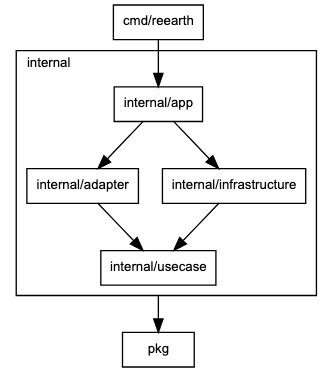
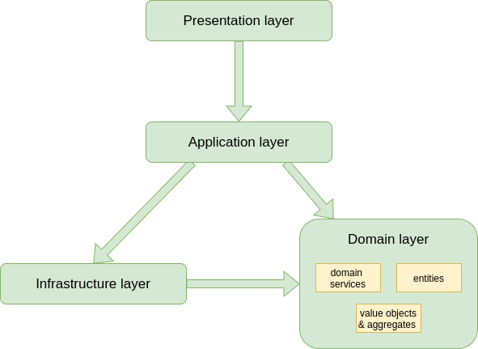

# Back-end architecture
------

## Code Documentation

Refer to the [godoc](https://reearth.github.io/reearth-backend/main/pkg/github.com/reearth/reearth-backend/index.html) to access detailed descriptions of each package, struct, interface, and type as we will not get into that here.

## **Project Layout**



"Domain driven design" (aka DDD) and "Clean Architecture" are adopted, but the project layout is based on Golang's layout convention ([https://github.com/golang-standards/project-layout](https://github.com/golang-standards/project-layout)).

Do not reverse the dependency flow in the diagram.
e.g.: pkg → usecase or infrastructure → adapter is prohibited

- **cmd**: Entrypoint
- **internal**
    - **app**: Web application using [echo](https://echo.labstack.com/)
    - **graphql**: GraphQL resolvers (Plans to unify it into `adapter/graphql`)
    - **adapter**: Presenter, controller
        - **graphql**: GraphQL controllers
        - **http**: HTTP REST API controllers
    - **usecase**: Usecase layer
        - **repo**: External database interfaces
        - **gateway**: External service interfaces (except databases)
        - **interfaces**: Use case interfaces (Plans to unify it together with interactor as **usecase**)
        - **interactor**: Implementation of interfaces (Plans to unify it together with interfaces as **usecase**)
    - **infrastructure**: Implementation of `usecase/repositories` and `usecase/gateways`
- **pkg**: Common packages, domain models, domain services
- **tools**: Utility tools for development

## General topics that Re:Earth developers are aware of

### The Clean Architecture

The Clean Architecture is an approach that separates business rules from technical implementations defining clear boundaries between the system components. System components are connected through ports (interfaces), satisfying the main rule which is that code dependencies can only move from the outer levels inward. More details can be found in [this book](https://www.goodreads.com/book/show/18043011-clean-architecture).


#### Data flow example:

1. The UI calls a controller.
2. The controller runs a use case.
3. The use case will use the entity layer and ask the database to send back the results (through a repository).
4. The database will send back the results of the use case.
5. A presenter will pass the results back to the UI.

## Domain-Driven Design (DDD)

Domain-Driven Design is an approach that centers the development process on a domain model. In other words, DDD treats problems like domains and bases the complex design on models of the domain. The "domain model" in turn means a sphere of knowledge and activity around which the application logic is about. Find more details about DDD [here](https://www.goodreads.com/en/book/show/179133).

**DDD consists of the following layers:**



**Presentation layer**

- Presenting information to the user and interpreting user commands.

**Application layer**

- Handles the application activity. No business logic goes here.

**Domain layer** 

- Contains the domain entities, aggregations, and services.

**Infrastructure layer (data layer)**

- Persistent data in the database or another persistent store.

---

## Q&A

### I'm getting more and more code in the usecase layer, but what do I do?

Consider whether some of the code can be implemented as a domain service in pkg.

Although pkg should not depend on the usecase layer, especially repos, it can be implemented as a domain service by defining a simple type in the domain layer and having the usecase layer use it, as shown below.

```go
// pkg/plugin/processor.go
package plugin

import (
	"context"

	"github.com/reearth/reearth-backend/pkg/id"
)

type Loader func(context.Context, id.PluginID) (*Plugin, error)

type Processer struct {
	Loader Loader
}

func (p Processer) Process() *Plugin {
	// do something
}
```

```go
// internal/usecase/repo/plugin.go
package repo

import (
  "context"

	"github.com/reearth/reearth-backend/pkg/id"
	"github.com/reearth/reearth-backend/pkg/plugin"
)

type Plugin interface {
	// ...
}

// You can add a func returns plugin.Loader from Plugin repo
func LoaderFrom(r Plugin) plugin.Loader {
  return func(ctx context.Context, pid id.PluginID) (*plugin.Plugin, error) {
		return r.FindByID(ctx, pid)
	} 
}
```

```go
// internal/usecase/interactor/plugin.go
package interactor

// ...

func (i *Plugin) Process() {
	// ...

  loader := LoaderFrom(i.pluginRepo) // get Loader
  pl := plugin.Processor{ Loader: loader }.Process() // just call

	// ...
}

```

Note: Rather than turning everything into a domain service, be careful that it is being handled in a way that makes sense for the business. If it is a process that does not involve domain knowledge, then it should only be cut out into a separate function in the use case layer.