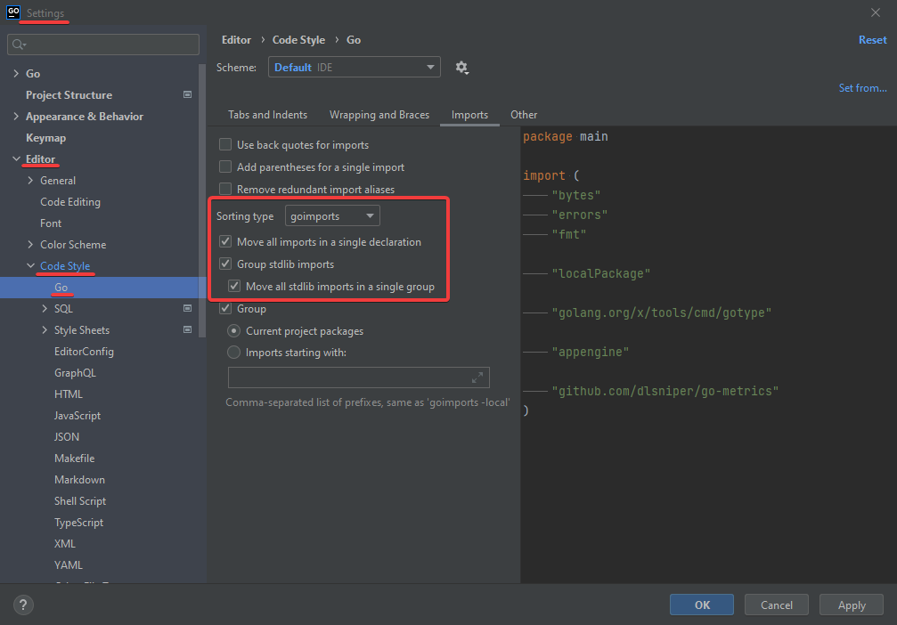

# Getting started
------

## How to start the app

## Installation

To get started, follow these instructions:

- Clone the repository to your local machine with `git clone git@github.com:reearth/reearth-backend.git`.
- Make sure that you have Docker and docker-compose installed. See instructions [here](https://docs.docker.com/get-docker/) and [here](https://docs.docker.com/compose/install/).
    - For MacOS users, you don't need to install docker-compose manually because it will be also installed together Docker for Mac.
- For backend developers
    - Make sure that you have Go v1.16 or later. See instructions [here](https://golang.org/doc/install).
        - For MacOS users, Installing go with Homebrew is a good option.
    - Make sure that you have GolangCI-Lint installed. See instructions [here](https://golangci-lint.run/usage/install/#local-installation).
    - (Windows users) Make sure that you have the ability to run makefiles.

## Set up Auth0

Follow [this article](/developer-guide/intro/setup/how-to-set-up-auth0). 

This step is also required for front-end developers.

In the near future, this step will no longer be necessary.

## Set up environment variables

Follow [this article](/developer-guide/backend/environment-vars) to set up environment variables by putting a `.env` file. That file will be loaded by docker-compose in the next step.

This step is also required for front-end developers.

In the near future, this step will no longer be necessary.

## Building and running the app (for front-end developers)

Run this command to start the back-end application:

```bash
docker-compose up -d
```

## Building and running the app (for back-end developers)

Re:Earth is a Go web application built using the [Echo](https://echo.labstack.com/) framework and MongoDB as a DBMS.

To run the database with docker-compose:

```bash
make run-db
```

This will run the database. Basically, docker-compose will find any containers from previous runs, or create a new container with the same configuration. The MongoDB data will be stored in the `mongo` directory of the repo and will be ignored by git because it is registered in `.gitignore`.

To run the app:

```bash
make run-app
```

This will start the `reearth` app's backend. The default used address and port is `localhost:8080`.

To create a local build:

```bash
make build
```

This will generate an executable `reearth` that you can run by `./reearth`. Note that it's a debug build. To create a release build, it's recommended to build a docker image with `docker build .`, or run the build command manually written in `Dockerfile` .

# Coding style

## Golangci-lint

A fast Go linters runner that will run linters in parallel. It can use caching, has support for yaml config, has integrations with all major IDE and has dozens of linters included. 

### Installation

For local installation please refer to [this website](https://golangci-lint.run/usage/install/).

### Running

To run golangci-lint locally use the following command 

```bash
make lint
```

## Follow go-like code customs (Effective Go)

- **Formatting**: use gofmt to format your code
- **Commentary** : Go provides /* */ for block comments and // for line comments. Every package should have a block comment called "package comment". If the package is simple, the package comment can be brief and line comment can be used.
- **Names**
    - **Package names:** the package name is the base name of its source directory, the name will be used to refer to its contents. The package name should be:
        1. short, concise, evocative
        2. lower case and single-word names
        3. no need for underscores or mixedCaps
    - **Interface names:** one-method interfaces are named by the method name plus an -er suffix like: Reader, Writer, Formatter
    - **MixedCaps:** the convention in Go is to use MixedCaps or mixedCaps rather than underscores to write multiword names.
- **Semicolons:** if the newline comes after a token that could end a statement, insert a semicolon.

```bash
**if assignment-statement; condition {  
}**
```

 Otherwise, don't insert it.

- **Control structures:** please refer to [this](https://golang.org/doc/effective_go#control-structures).

# IDE Settings

## GoLand

1. From the main menu, choose Git | Clone.
2. In the Get from Version Control dialog, choose GitHub on the left.
3. Enter [https://github.com/reearth/reearth-backend.git](https://github.com/reearth/reearth-backend.git) in the repository URL field.
4. Click Clone.

### Linting

- Install the [Go Linter](https://plugins.jetbrains.com/plugin/12496-go-linter) plugin
    - Enable gofmt and goimport from Settings → Tools → Go Linter.
    - Add File Watcher using existing golangci-lint template from Settings → Tools → File Watchers.
- Configure the IDE to sort imports with goimports and to group stdlib imports.



## VSCode

To develop Re:Earth with Visual Studio Code, install the [vscode-go](https://marketplace.visualstudio.com/items?itemName=golang.go) extension and set it up. Then open the cloned git directory. That's all!

Notes:

- Use gopls as the Language Server.
- Workspace settings will be automatically applied as described in  `.vscode/settings.json` .
- You can start debugging by just running "Start Debugging" command with **vscode-go** and **delve** since `.vscode/launch.json` has already been set up. If **delve** is not set up, follow the instructions from **vscode-go** to proceed with the installation.