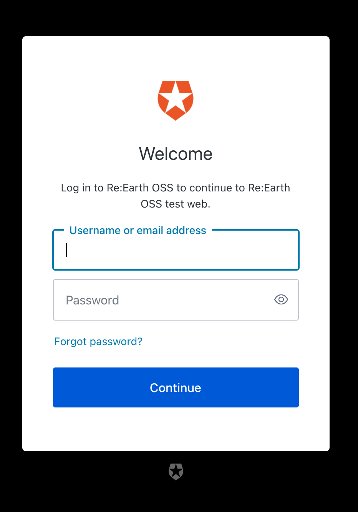

Re:Earth user sessions are authenticated with Auth0, a popular IDaaS provider. 

## How does it work

### Login

When a user visits the Re:Earth page and clicks the login button, the browser is redirected to a login portal hosted by Auth0 where the user can sign in. 



### Success and failure

On success, a JWT(JSON Web Token) will be stored in the localstorage and injected into the Authorization header on all HTTP requests to the back-end.

```tsx
const authLink = setContext(async (_, { headers }) => {
    // get the authentication token from local storage if it exists
    const accessToken = window.REEARTH_E2E_ACCESS_TOKEN || (await getAccessTokenSilently());
    // return the headers to the context so httpLink can read them
    return {
      headers: {
        ...headers,
        ...(accessToken ? { Authorization: `Bearer ${accessToken}` } : {}),
      },
    };
  });
```

 If an error occurs during the initial authorization or when checking the validity of the access token the user will be automatically logged out and will be returned to the Re:Earth login page.

```tsx
const errorLink = onError(({ graphQLErrors, networkError }) => {
  if (!networkError && !graphQLErrors) return;
  const error = networkError?.message ?? graphQLErrors?.map(e => e.message).join(", ");
  store.dispatch(localSlice.actions.set({ error }));
  if (error) reportError(error);
});
```

### API calls

API calls to the back-end are handled through GraphQL queries and mutations managed by Apollo Client. To make sure the user making the call has the correct authorization, a link is made through the apollo-client link setup that injects the JWT into each request. This is where the above to links as well as other links are made. 

```tsx
const client = new ApolloClient({
  uri: endpoint,
  link: ApolloLink.from([errorLink, sentryLink, authLink, uploadLink]),
  cache,
  connectToDevTools: process.env.NODE_ENV === "development",
});
```

See [src/gql](https://github.com/reearth/reearth-web/tree/main/src/gql) for the full setup.