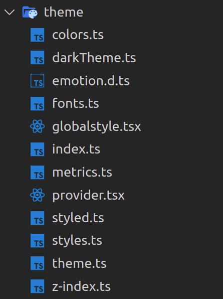
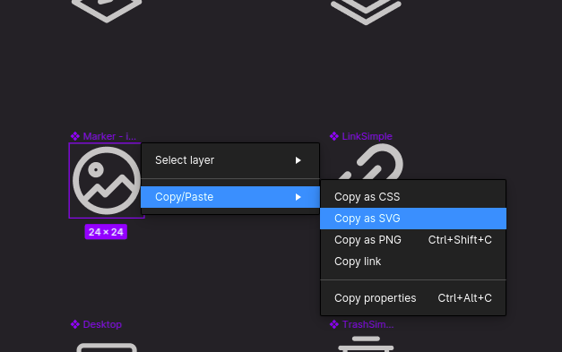

# How to use theme
------

## Styled components

Re:Earth is setup to rely predominantly on [Emotion's styled components](https://emotion.sh/docs/introduction) to style Atom and Molecule components.

### Basic usage

From within your component, just above the main component export declaration, you can declare a new styled component like so:

```tsx
import { styled } from "@reearth/theme";

...
// React component
...

// regular HTML element
const Wrapper = styled.div`
	background: blue;
	display: flex;
`;
// imported React component
const Header = styled(Text)`
	color: white;
`;
// using project defined theme variables and passed props
const Button = styled.button<{active?: boolean}>`
	background: ${({theme, active}) => active ? theme.background.lightBg : theme.background.mediumBg};
`;

export default MyReactComponent;
```

## Global theme

To keep the theme consistent across Re:Earth and up to date with [Figma](https://www.figma.com/file/bdnfDaGXGoNfUws4y7JItl/Re%3AEarth-UI-Gamma?node-id=5845%3A195209), all theme definitions are abstracted and grouped into global objects inside the theme directory.



We will discuss the purpose of each of these files: 

### Colors

Re:earth's color system helps you apply color to your UI in a meaningful way.

Building a consistent system of colors helps to reduce the number of used variables, and eliminates unnecessary duplicates, so in Re:Earth all used colors are stored in an object inside the `colors.ts` file.

### Theme

`theme.ts` has the necessary types to define the colors of components, this type currently is being used by two theme variants `dark` and `light` theme, defined in `darkTheme.ts` and `lightTheme.ts`.

Each of these theme variants use constants from the `colors` object to define the color of each component.

### Metrics

All metrics details are kept inside `mertrics.ts` to keep sizing and spacing consistent throughout Re:Earth.

Common uses of Metrics are:

- Height of main UI components
- Padding, margins, and spaces between components

### Fonts

All font details (font-family, font-size and font-weight) are kept inside `fonts.ts` to keep text consistent as well.

There is a Text component which leverages the theme fonts and is used to format all text in Re:Earth.

**Note:** Never define typographic styles such as font-family, font-size, font-weight, etc in another component. Always use the Text component.

### z-index usage

Managing z-index across large apps can be confusing. CSS is hard to test, so to avoid hiding some important UI by mistake, we use the following approach:

There is a file  `z-index.ts` that contains an object which is dedicated to declaring constants with meaningful names for important UI components that need z-index values.

## Theme switcher

We are using React’s Context API to maintain the state for the theme of the application (dark/light).

This context is defined inside the `provider.tsx` file.

### Theme usage in components

From within your component, if you need to access theme properties, you can either pass theme into your styled component (as shown in the above example) or use the `useTheme` hook to get access to all theme properties inline:

```tsx
import { useTheme } from "@reearth/theme";

const MyReactComponent: React.FC<Props> = ({my, cool, props}) => {
  const theme = useTheme();
  return (
    <Text size="2xs" color={theme.main.text}>
  );
};

export default MyReactComponent;
```

## Icons

To add a new icon to Re:Earth project, follow the following steps:

- Right click on desired icon from [Figma](https://www.figma.com/file/bdnfDaGXGoNfUws4y7JItl/Re%3AEarth-UI-Gamma?node-id=4152%3A54263), then choose `copy as SVG`



- create a `.svg` file in `src/components/atoms/Icon/Icons` with an appropriate name and paste copied content there.
- For most icons (except for logos or icons with complex colors) make sure you change the `fill` of all elements inside the `svg` from the hex color to “`currentColor`”. (This will allow the icon's color to be changed from within the Icon component.)
- Import the icon inside `src/components/atoms/Icon/icons.ts` , then add it to the exported object with a simple but meaningful name.
- Now you can use the `Icon` component like this:

```tsx
import Icon from "@reearth/components/atoms/Icon";

...
// React component
...

//inside JSX
<Icon icon="cancel" />

...
// React component
...
```