:::info
In previous versions of Re:Earth, Auth0 configuration was required, but the current version has a built-in authentication server, so it works without Auth0 configuration.

However, if you intend to run Re:Earth in a production environment, we recommend that you continue to use an IDaaS such as Auth0 for security.
:::

### 1. Create your Auth0 account

Access https://auth0.com/signup and sign up for Auth0.

### 2. Create your tenant

For the first time sign in, you'll see this screen:

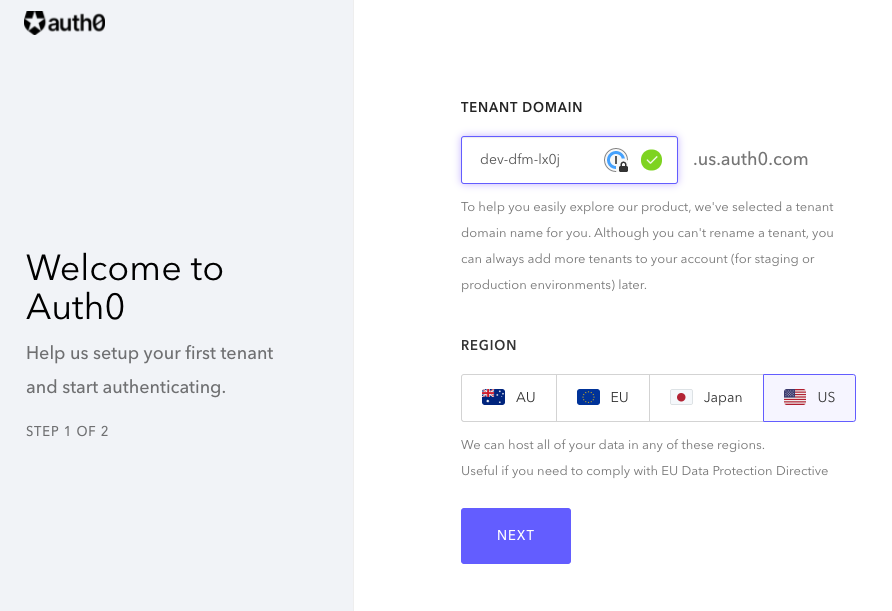

Follow "Create Tenants" and complete setting up a new tenant.

### 3. Add an application

Jump to the applications page and click "Create Application" button.

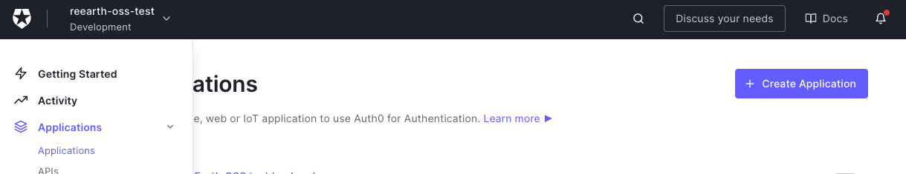

Re:Earth needs 2 application: one is a Single Page Web Application for the front-end, another is a Machine to Machine Application for the back-end.

First, create a new Single Page Web Application, then reopen this dialog and create a new Machine to Machine Application. Any application name is ok, but for example, "Re:Earth frontend" and "Re:Earth backend" are recommended.

After creating a Machine to Machine Application, you may see this modal:

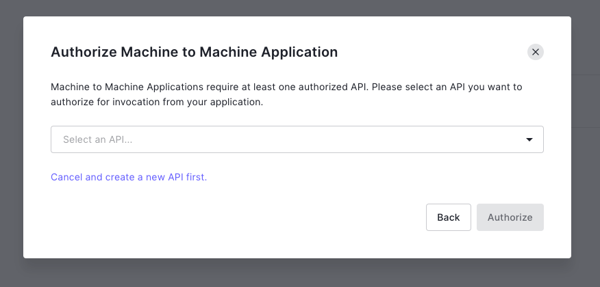

Select "Auth0 Management API" and then select the following permissions: read:users and update:users. And then click "Authorize" to finish the modal.

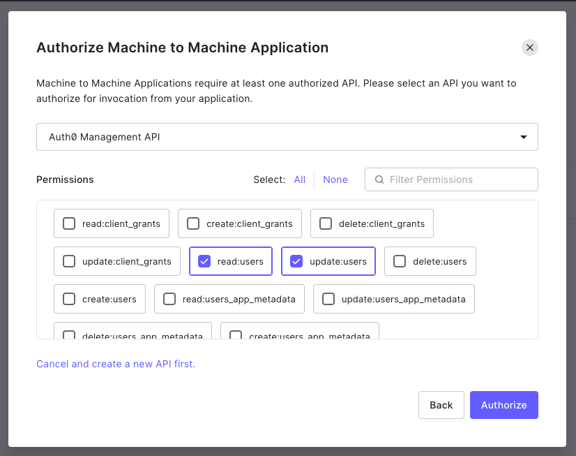

:::info
This is the minimum permissions required at this time. There is no behavioral problem in choosing more permissions than this. From a security point of view, the fewer permissions you allow, the safer the app is.
:::

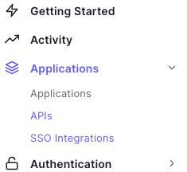

After creation, 2 apps appears:

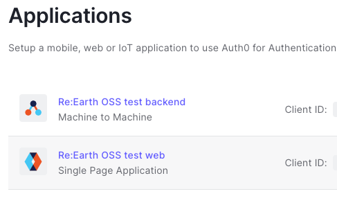

At this point open the Single Page Application settings and change these fields:

- Application URIs
- Application Login URI: Enter your URI you want to deploy Re:Earth (e.g. https://reearth.your-service.com)
  If you want to run Re:Earth locally, you also need to add http://localhost:8080, http://localhost:3000.
- Allowed Callback URLs: should be the same as Application Login URI
- Allowed Logout URLs: should be the same as Application Login URI
- Allowed Origins (CORS): should be the same as Application Login URI
- Refresh Token Rotation
- Rotation: should be "Enabled"
  Note: the Machine to Machine Application doesn't need to any settings modified.

### 4. Add an API

Move to "APIs" and then click the "Create API" button:

- Name: any name is ok
- Identifier: any identifier is ok, but generally it is set to the same string as the Application URI. (e.g. https://reearth.your-service.com)
- Signing Algorithm: RS256

Step 5 is only necessary if you will host Re:Earth in a production environment. If you are only setting up Re:Earth locally, skip step 5 and move on to step 6.

### 5. Set up the tenant

Jump to the tenant settings and change these fields:

- API Authorization Settings
- Default Audience: should be the same as the API Identifier
- Default Directory: select "Username-Password-Authentication"

### 6. Add a custom action to sign up Re:Earth automatically

Jump to the Flows page and select "Post User Registration":

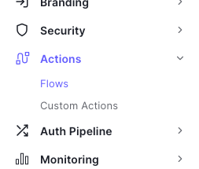

Then click "Create Action" on the right-hand side and create a new action (any name is ok):

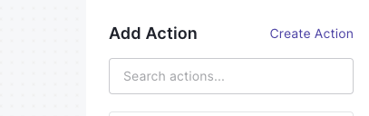

After that, please copy and paste the following code to the text box:

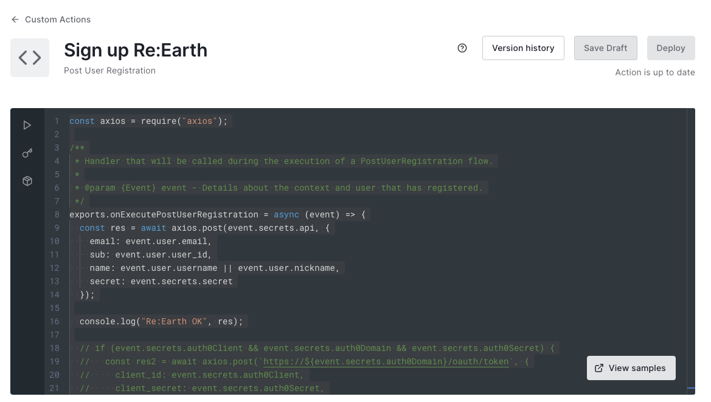

```js
const axios = require("axios");

const url = "https://reearth.example.com";

exports.onExecutePostUserRegistration = async (event) => {
  const res = await axios.post(url + "/api/signup", {
    sub: event.user.user_id,
    email: event.user.email,
    username: event.user.username || event.user.nickname || event.user.email,
  });
};
```

Set the url variable's value in the code to the same as the Application Login URI (without a slash at the end).

Then, add a module: click Modules in the left bar and click "Add Module" button:

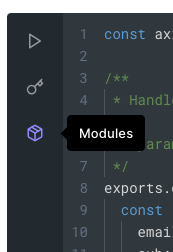

Type axios in Name and click the "Create" button.

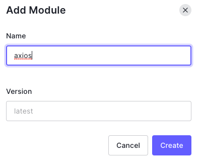

Finally, click the "Deploy" button to finish editing the custom action:

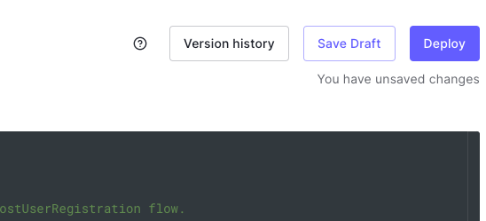

Lastly, move back to the Post User Registration flow page, and drag-and-drop the custom action on the right sidebar you created between "Start" and "Complete":

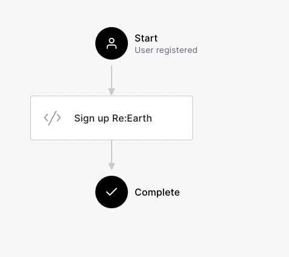

### 7. Sign up your account

Move to Users and click the "Create User" button to create your user. Any email and password is OK but connection should be Username-Password-Authentication.

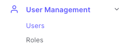

Then, check your email inbox to verify your email address.

### 8. For local setup only: sign up to Re:Earth

This step is only for a local setup (on localhost) and is only necessary to perform once.

At his point you should have an Auth0 account setup, but that doesn't mean your local machine has a Re:Earth account. Therefore, you need to send an HTTP request to the Re:Earth signup API. Make sure reearth-backend is running on localhost:8080 and then in another terminal type:

```bash
curl -H 'Content-Type: application/json' http://localhost:8080/api/signup -d @- << EOF
{
  "sub": "YOUR AUTH0 ACCOUNT ID",
  "email": "YOUR AUTH0 ACCOUNT EMAIL",
  "username": "YOUR AUTH0 ACCOUNT NAME"
}
EOF
```

You can find your Auth0 account id, email, name and secret from your Auth0 dashboard. From User Management in the left navigation, click on Users. Select the user you want to add and scroll until you see Identity Provider Attributes.

### 9. Gather information

Settings are finished! Gather information that you will need in the next steps:

- Audience: the same as the API Identifier (used by REEARTH_AUTH0_AUDIENCE)
- Domain: find it on the Applications page (common to all applications) (used by REEARTH_AUTH0_DOMAIN)
- Front-end application client ID: find it on the Applications page (used by REEARTH_AUTH0_WEBCLIENTID)
- Back-end application client ID: find it on the Applications page (used by REEARTH_AUTH0_CLIENTID)
- Back-end application client secret: find it on the Applications page (used by REEARTH_AUTH0_CLIENTSECRET) Note: In the settings page of an application, you can see Domain, client ID, and Client Secret:

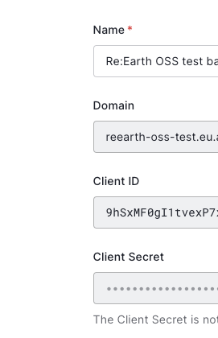

Now you're done with Auth0, so to continue setting up Re:Earth configuration.

### 10. Configure Re:Earth

As mentioned earlier in [this page](config), Re:Earth can be configured in various ways through environment variables. Let's set up Re:Earth with the Auth0 information you have created and obtained.

```text title=".env"
REEARTH_AUTH0_DOMAIN=https://hoge.auth0.com
REEARTH_AUTH0_AUDIENCE=https://hoge.example.com
REEARTH_AUTH0_CLIENTID=YOUR_MACHINE_TO_MACHINE_CLIENT_ID
REEARTH_AUTH0_CLIENTSECRET=YOUR_MACHINE_TO_MACHINE_CLIENT_SECRET
REEARTH_AUTH0_WEBCLIENTID=YOUR_WEB_CLIENT_ID
REEARTH_AUTHSRV_DISABLED=true
```

Finally run Re:Earth and then access the top page of Re:Earth. Then you will be redirected to the Auth0 log in page. You can sign in your Auth0 account and then if the Re:Earth dashboard screen appears successfully, you've succeeded!

## Q&A

### I am logged out immediately after successfully logging in with Auth0.

It may be that the account has not been created on the Re:Earth side; it may also be that the Auth0 hook is not working properly. In the meantime, sign up for your Re:Earth account manually by referring [here](#8-for-local-setup-only-sign-up-to-reearth).
