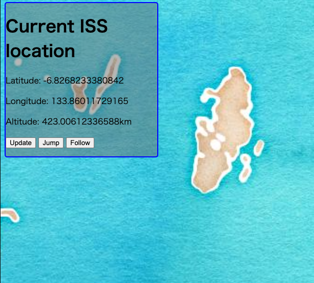
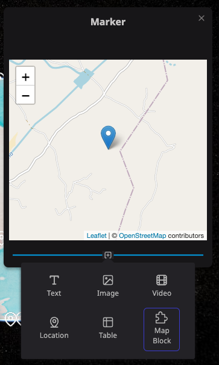

# Introduction
------

Welcome to Re:Earth plugin API!

By developing and using plug-ins, you can extend the functionality of Re:Earth. Using the plug-in, you can display new items in the infobox that appears when you select a marker, or place unusual widgets on the screen that you have never seen before, and publish your own original scenes. In the future, you will also be able to use plug-ins to improve the efficiency of editing scenes and to perform calculations for data processing.

# Plugin types

At present, the following types of functions can be extended with plugins.

## Widget

Displays a widget that floats on the screen. Widgets can be placed freely on the edges and corners of the screen. For example, displays various data or call any action when a button is clicked.

## Block

This plugin is displayed in the infobox that appears when a layer is selected. It allows you to display various data according to the contents of the selected layer.

# Where do we start?

Proceed to [Prerequisites](./prerequisites) to find out what you need to do to develop a plugin.