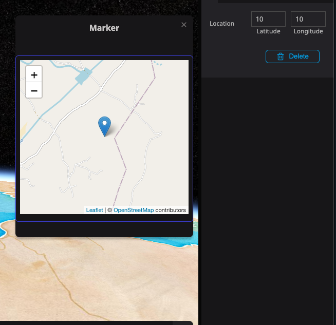

`reearth.yml`

```yaml
id: test
name: test
version: 1.0.0
extensions:
  - id: map
    type: block
    name: Map
    schema:
      groups:
        - id: default
          fields:
            - id: location
              type: latlng
              title: Location
```

`map.js`

```jsx
const html = `
  <link rel="stylesheet" href="https://unpkg.com/leaflet@1.7.1/dist/leaflet.css" />
  <script id="l" src="https://unpkg.com/leaflet@1.7.1/dist/leaflet.js"></script>
  <div id="map" style="width: 100%; height: 300px;"></div>
  <script>
	  document.getElementById("l").addEventListener("load", () => {
	    const map = L.map("map").setView([0, 0], 13);
	    L.tileLayer('https://{s}.tile.openstreetmap.org/{z}/{x}/{y}.png', {
	      attribution: '&copy; <a href="https://www.openstreetmap.org/copyright">OpenStreetMap</a> contributors'
	    }).addTo(map);

	    const marker = L.marker();

	    const cb = (block) => {
	      if (block && block.property && block.property.default && block.property.default.location) {
	        const latlng = [
	          block.property.default.location.lat,
	          block.property.default.location.lng
	        ];
	        map.setView(latlng);
	        marker.setLatLng(latlng).addTo(map);
	      } else {
	        marker.remove();
	      }
	    };

	    addEventListener("message", e => {
	      if (e.source !== parent) return;
	      cb(e.data);
	    });

	    cb(${JSON.stringify(reearth.block)});
	  });
	</script>
`;

reearth.ui.show(html);

reearth.on("update", () => {
  reearth.ui.postMessage(reearth.block);
});
```

Then install this plugin, add a map widget, and select it. You'll see the properties of the map block on the left panel.



Type location, and then a marker will be put on the leaflet map.

For details of plugin manifest, refer to Manifest reference.