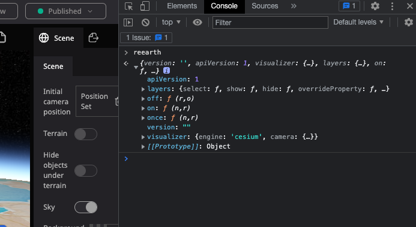

# Trying plugin API without installing any plugins
------

Details of the Plugin API is described in API reference, but you can try plugin API in your web browser.

Open your Re:Earth and your project, and then open developer tools of your web browser. Next, open "console" and exec following JavaScript: `reearth`.

You'll see reearth object is printed. This object is almost same as actual plugin API, with the exception of a few APIs: `reearth.ui.show`, `reearth.ui.postMessage` and so on.

This screenshot is for Google Chrome:

So you can try plugin API handly in console.

For example, searching layers with `reearth.layers.layers` ...

