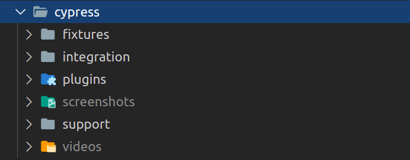
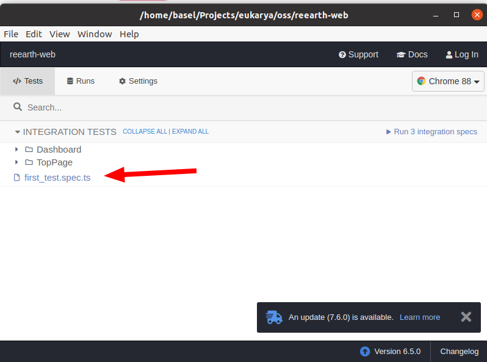

# How to run E2E testing
------

With any Frontend application, End to End (E2E) testing can really improve maintenance and the Software Development Life Cycle (SDLC) of the application. E2E allows you to quickly verify changes, and also works to document features in your application.

There are a few options for E2E frameworks today. [Cypress](https://www.cypress.io/) is the one we chose for building E2E tests in Re:Earth.

## Cypress Directory



The directories and files contain different configurations that we'll use to build E2E with Cypress. They all correspond to:

- `fixtures` is where you build mocks or stubbed responses for your tests
- `integration` is where you place your actual test `.spec.js` files by default.
- `plugins` allow you to extend Cypress behavior
- `screenshots` and `videos` are where the test runner will store visual copies of test runs (more on that in the next sections)
- `support` allows you to define "commands" or boil plate behavior you can reference in your tests to avoid the need to repeat startup tasks like login or similar flows

## Configuration

There is a `cypress.json` configuration file located in your project's folder. This JSON file is used to store any configuration values you supply.

Inside `cypress.json` you can find the following lines:

```json
{
  "projectId": "",
  "baseUrl": "http://localhost:3000",
  "testFiles": "**/*.spec.ts"
}
```

- `projectId` is a 6 character string (empty in our case) that helps to uniquely identify our project.
- `baseUrl` is used as a prefix for `cy.visit()` or `cy.request()` command's URL.
- `testFiles` is a String or Array of glob patterns used to ignore test files that would otherwise be shown in your list of tests.

## Adding tests

Let's write our first test to see the "local" run of this in action.

Go over to the `integrations` folder and create a file `first_test.spec.ts` with the following:

```tsx
describe("First Test", () => {
  it("should visit home page", () => {
    cy.visit("");
  });
});
```

In this first test, we're just visiting the home page of Re:Earth. Once you've created your `first_test.spec.ts` file, go ahead and run `yarn cypress:open` to see your test and run it.



For now, Re:Earth provides some additional commands for Cypress:

- `cy.init()`:  Logs in with the E2E account, and then deletes and creates a user for E2E in the back-end to reproduce the same environment in every test.
- `cy.login()`: Logs in with the E2E account and returns an access token.
- `cy.loginAndVisit(url: string, options?: Partial<Cypress.VisitOptions>)`: Log in and then execute `cy.visit` command.
- `cy.waitForGraphQL()`: Waits for a response from GraphQL.
- `cy.cesiumViewer()`: Returns a Viewer object of Cesium.

## Running tests

Inside `package.json` we have two main scripts to run Cypress tests.

```json
"scripts": {
    "cypress:open": "cypress open",
    "cypress:run": "cypress run"
},
```

- `yarn cypress:open` opens the test runner by itself
- `yarn cypress:run` runs the test runner in CI (headless)

For more details please refer to the [Cypress official documentation](https://docs.cypress.io/).