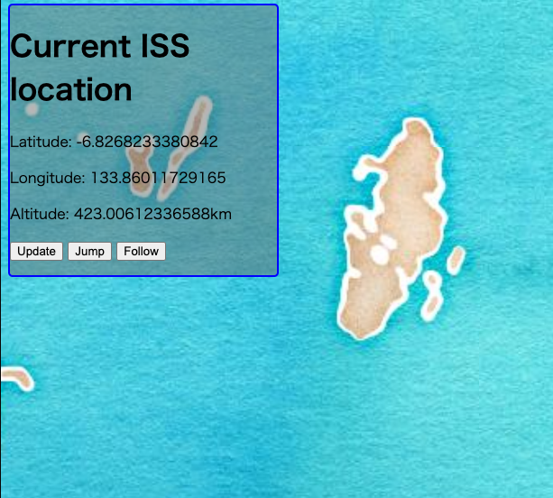
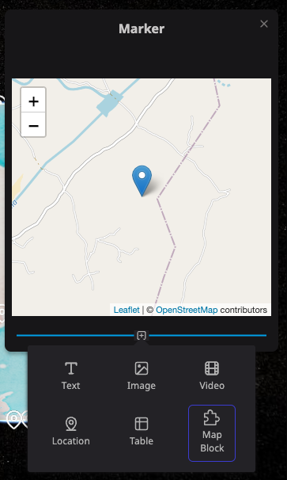

Re:Earth プラグイン API へようこそ！

プラグインを開発・使用することで、Re:Earthの機能を拡張することが可能になります。
プラグインを利用することで、マーカー選択時に表示されるインフォボックスに新しい項目を表示したり、オリジナルのウィジェットを画面上に表示し公開したりすることができます。
また、将来的にはシーン編集の効率化やデータ処理のための計算をプラグインで行えるようになる予定です。

## プラグインの種類

今のところ、以下に記載されている「ウィジェット」と「ブロック（インフォボックス内）」機能がプラグインで拡張可能です。

### ウィジェット

画面上に浮かぶウィジェットを表示することができます。
ウィジェットは、画面の端や隅に自由に配置できます。
ウィジェットでは、ボタンなどを設置することができ、それをクリックすることで、さまざまなデータを表示したり、アクションを呼び出したりすることができます。

### ブロック

このプラグインは、マーカー選択時に表示されるインフォボックスの中に新たなブロックを表示することができます。  
ブロックでは、選択されたマーカーの内容に応じて、さまざまなデータを表示することが可能です。

## はじめ方

[「前もって必要なこと」](./ja/plugin-guide/prerequisites/)ページにすすみ、プラグイン開発を開発するのに必要な項目を確認する。  
合わせて、[プラグインエディター](./ja/plugin-guide/plugin-editor/)についても確認しください。
