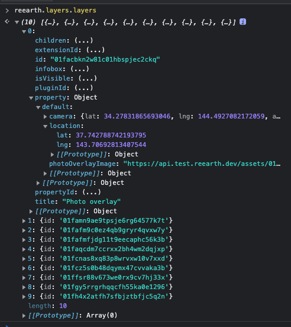

```js
const markerThatTitleIsReearth = reearth.layers.find(
	layer => layer.type === "marker" && layer.title === "Re:Earth"
);

if (markerThatTitleIsReearth) {
	// temporally update marker location
	reearth.layers.overrideProperty(markerThatTitleIsReearth.id, {
		default: {
			location: { lat: 100, lng: 0, height: 0 }
    }
	});
}
```

`reearth.layers.overrideProperty` の結果は保持されないことに注意してください。  
ページを閉じるか再読み込みすると、変更が取り消されます。  

プロパティオブジェクトの詳細はまだドキュメント化されていませんが、開発者ツールのコンソールで `reearth.layers.layers` を実行すると現在のレイヤーのオブジェクトを取得することができます。このオブジェクトのプロパティを読み取ることで、上書き可能なプロパティを確認することができます。



