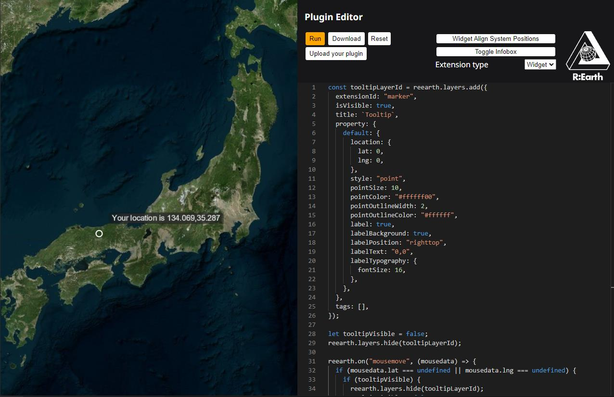

Re:Earthはマウスイベントをサポートしています。以下は簡単な例です。 

## 基本的なマウスイベント

```js
reearth.ui.show(`
  <style>
    html{
      margin: 0;
      width: 300px;
      background: white;
    }
    #wrapper {
      height: 100%;
    }
  </style>

  <div id="wrapper">
    <p>Please left Click On the Earth</p>
    <div>ScreenX: <span id="x"></span></div>
    <div>ScreenY: <span id="y"></span></div>
    <div>Longitude: <span id="lng"></span></div>
    <div>Latitude: <span id="lat"></span></div>
    <div>Height: <span id="height"></span></div>
    <div>LayerId: <span id="layerId"></span></div>
    <div>Mousewheel Delta: <span id="delta"></span></div>
  </div>

  <script>
    const setValue = (id, value) => {
      document.getElementById(id).innerHTML = value ?? '';
    }
    addEventListener("message", e => {
      if (e.source !== parent) return;
      if (e.data.type === 'mousedata') {
        setValue('x', e.data.payload.x);
        setValue('y', e.data.payload.y);
        setValue('lng', e.data.payload.lng);
        setValue('lat', e.data.payload.lat);
        setValue('height', e.data.payload.height);
        setValue('layerId', e.data.payload.layerId);
        setValue('delta', e.data.payload.delta);
      }
    })
  </script>
`);

reearth.on('click',(mousedata) => {
  reearth.ui.postMessage({ 
    type: "mousedata",
    payload: mousedata
  }, "*");
});

reearth.on('wheel',(mousedata) => {
  reearth.ui.postMessage({ 
    type: "mousedata",
    payload: mousedata
  }, "*");
});
```

## マウス追従

レイヤーがカーソルに追従する方法を示す例を次に示します。これにより、プラグインを開発する可能性が広がります。



```js
const tooltipLayerId = reearth.layers.add({
  extensionId: "marker",
  isVisible: true,
  title: "Tooltip",
  property: {
    default: {
      location: {
        lat: 0,
        lng: 0,
      },
      style: "point",
      pointSize: 10,
      pointColor: "#ffffff00",
      pointOutlineWidth: 2,
      pointOutlineColor: "#ffffff",
      label: true,
      labelBackground: true,
      labelPosition: "righttop",
      labelText: "",
      labelTypography: {
        fontSize: 16,
      },
    },
  },
  tags: [],
});

let tooltipVisible = false;
reearth.layers.hide(tooltipLayerId);

reearth.on("mousemove", (mousedata) => {
  if (mousedata.lat === undefined || mousedata.lng === undefined) {
    if (tooltipVisible) {
      reearth.layers.hide(tooltipLayerId);
      tooltipVisible = false;
    }
    return;
  }

  reearth.layers.overrideProperty(tooltipLayerId, {
    default: {
      location: {
        lat: mousedata.lat,
        lng: mousedata.lng,
      },
      labelText: `Your location is ${parseInt(mousedata.lng * 1000) / 1000},${
        parseInt(mousedata.lat * 1000) / 1000
      }`,
    },
  });

  if (!tooltipVisible) {
    reearth.layers.show(tooltipLayerId);
    tooltipVisible = true;
  }
});
```
