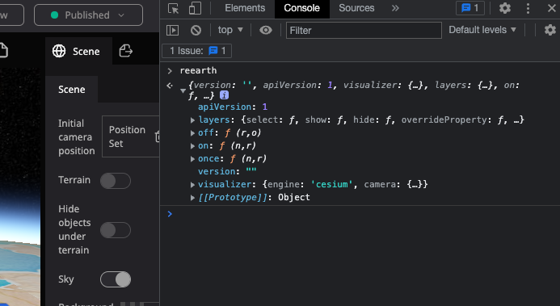
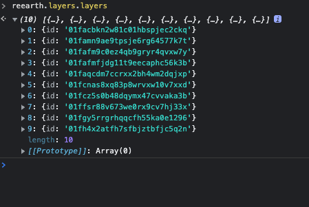

プラグインAPIの詳細はRe:Earth APIで説明しますが、ここではwebブラウザでプラグインAPIを試す方法を説明します。

Re:Earthを開きプロジェクトへ移動します。  
そしてブラウザで開発者ツールを開いてください。  
次に、コンソールを開いて次のJavaScriptを実行します： `reearth`  

Re:Earthオブジェクトが表示されます。これらのオブジェクトは、`reearth.ui.show`、`reearth.ui.postMessage` などのいくつかのAPIを除いて、実際のプラグインAPIとほぼ同じです。

このスクリーンショットはGoogle Chrome用です：

コンソールでプラグインAPIを手軽に試してみることができます。

例えば `reearth.layers.layers`でレイヤーを検索すると...

