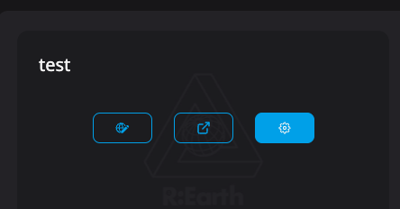
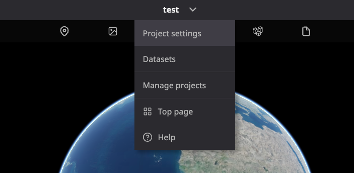
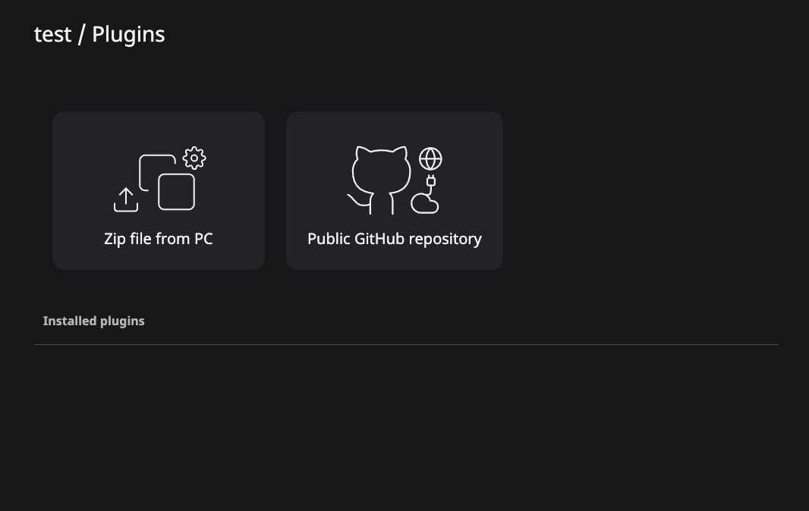
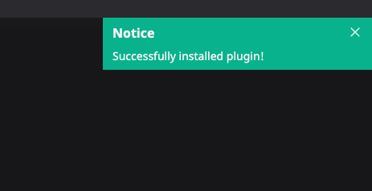
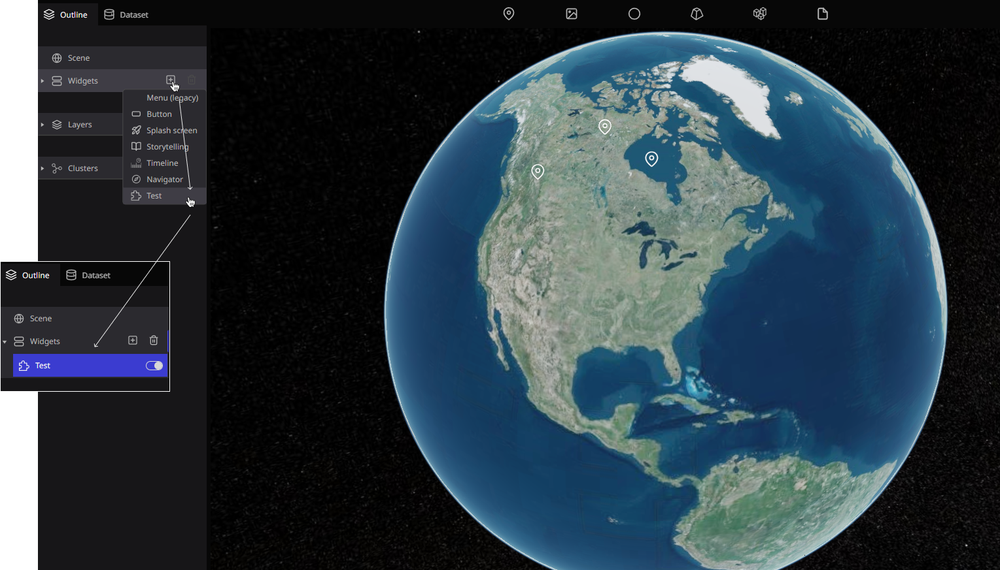
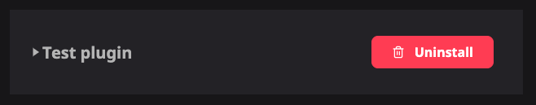

ここでは、簡単なプラグインを一緒に開発することで、プラグイン開発の一連の手順を説明します。


## 1. プロジェクトフォルダを作成する

任意の場所に、フォルダを作成してください。ここにプラグインコードを配置します。  

フォルダの名前は、何でも大丈夫です。ここでは、`test-plugin`と名付けます。

## 2. プラグインのマニフェストを記述する

マニフェストは、作成しようとしているプラグインのメタデータです。  
つまり、プラグインのIDと名前、プラグインが拡張する機能、およびユーザーに提供される構成アイテムです。

`reearth.yml` という名前でファイルを作成し、以下のように記述します：


```yaml title="reearth.yml"
id: test-plugin
name: Test plugin
version: 1.0.0
extensions:
  - id: test-widget
    type: widget
    name: Test
```
:::caution
- ``id`` は大文字では設定できません  
- 改行やスペースなどを間違えのないように注意してください  
:::

## 3. 最初の拡張機能を実装する

実はプラグインは、拡張機能と呼ばれる単位のコレクションです。  
プラグインは、一つの拡張機能だけでなく複数の拡張機能を持つことができます。  


それでは、最初に簡単な拡張機能を実装してみましょう。  
先ほどのステップのマニュフェストに説明したように、これから実装する拡張機能のIDは`test-widget`です。  
このIDに拡張子`.js` を付け足して`test-widget.js`という名前のファイルを作成します。  

:::caution
このファイル名を間違えると、プラグインは動作しませんのでご注意ください。拡張子以外のファイル名は、IDと完全に一致する必要があります。
:::

次にJSファイルを編集します：

```js title="test-widget.js"
console.log("Hello world");

reearth.ui.show(`<h1 style="color:red;background:black">Hello world</h1>`);
```

これで、簡単なプラグインが完成しました！
ファイル構造は次のとおりです：

```console title="file structure"
test-plugin
│   reearth.yml
│   test-widget.js    
```

## 4. プラグインを圧縮する

それでは、プラグインをRe:Earthにインストールしてみましょう！  
その前に、インストールするするためにプラグインを圧縮しましょう。  
この記事の中では、zipファイルに圧縮しアップロードする方法を説明します。  

1番最初の手順で作成したフォルダを選択し、それをzipファイルへと圧縮します。  
zipファイルへの圧縮方法は、OSによって異なります。  
MacOSの場合：Finderでフォルダを右クリック→「~を圧縮」を選択  
Windowの場合：エクスプローラーでフォルダを右クリック→「送る」を選択し、「圧縮 (zip形式) フォルダー」を選択

ここでのzipファイルのファイル名は、これからの手順に何にも影響はないので、気にしないで大丈夫です。

## 5. プラグインをアップロードする

Re:Earthにログインし、プロジェクトの設定ページを開きます。(まだプロジェクトを作成していない場合は、作成してください)  
ダッシュボードのこのボタンから、プロジェクトの設定ページを開くことができます：  



または、編集画面の一番上のメニューにある「プラグイン」からも開くことができます：  




そして、左側のメニューにある「プラグイン」を選択：  
そうすると、次の画面が表示されます  



次は、「個人インストール済み」タブに移動し「PCからZipファイルをアップロード」を選択し、前の手順で生成したzipファイルを選択します。  

少し待ってから「プラグインがインストールされました。」というメッセージが表示されれば、プラグインは正常にインストールされています！




もしここでエラーメッセージが表示された場合は、次のいずれかの理由が考えられます：

- `reearth.yml`のフォーマットに誤りがあります。もう一度`reearth.yml`を確認してください。
- 同じIDを持ったプラグインが既にインストールされている。アンインストールして、もう一度インストールしてみてください。
- zipファイルの中に`reearth.yml`が存在していない、もしくはルートに複数のフォルダがある。`reearth.yml` を含む 1 つのフォルダ、もしくは`reearth.yml`を含む複数のファイルのグループを圧縮してください。
- zipファイルを生成するアプリケーションによっては、不正な形式のzipファイルが出力される場合があります。他の方法でファイルを圧縮してみてください。

## 6. プラグインによって拡張されたウィジェットの使用

編集画面に戻り、左パネル内のウィジェットを開いてください。
そうすると、実装した新たなウィジェットが表示されます。それを選択してください。



画面上に、ウィジェットが表示されます！


ウィジェットが表示されない場合は、JavaScriptのファイル名が間違っている、もしくはJavaScriptが正確に実装されていない可能性があります。
エラーが起こったら場合、webブラウザーの開発者ツール内コンソールで確認することができます。

## ヒント1: プラグインをアンインストールする

ここでは、プラグインのアンインストール方法について説明します。

プラグイン設定ページ（手順5と同様のページ）で、プラグインのボタンをクリックします。



プラグインの名前が表示されているカラムの右側にあるボタンをクリックすると、プラグインをアンインストールすることができます。

削除するプラグインによって追加されていたウィジェットやブロックは、シーンから削除されます。  
また、このプラグインを使用したプロジェクトを公開していた場合は、公開プロジェクトでプラグインは機能しなくなります。  

プラグイン開発では、実装を進めたあとにプラグインをインストールして動作を確認し、次回の実装後に再度インストールすることが多いと思います。  
その際、毎回プラグインをアンインストールする必要があります。  

## Tip 2: GitHub からプラグインをインストールする

GitHubレポジトリからもプラグインをインストールすることができます。現在は、公開レポジトリのみサポートされています。  
プラグイン設定ページ（手順5と同様のページ）で、「GitHubパブリックレポジトリ」を選択しGitHubレポジトリのURLを入力します。  


大丈夫な例：

- `https://github.com/USER/REPO` (`main` ブランチが使用されます)
- `https://github.com/USER/REPO.git` (`main` ブランチが使用されます)
- `https://github.com/USER/REPO/tree/BRANCH_NAME` (ブランチを指定)
- `https://github.com/USER/REPO/archive/XXX.zip` (ブランチ名でアーカイブを指定する)
- `https://github.com/USER/REPO/archive/refs/head/XXX.zip` (refでアーカイブを指定する)
- `https://github.com/USER/REPO/archive/refs/tags/XXX.zip` (タグでアーカイブを指定する)

ダメな例：

- `ssh://git@github.com:USER/REPO.git` (代わりに `https://~` を使用してください)

## 次のステップ

これまで、どのようにプラグインを開発するかを学んできました。  
独自のプラグインを開発するには、より高度なトピックを参照してください。

- [やり方](./recipes/):さまざまな一般的なユースケースのプラグインを実装する方法について説明します
- [プラグインの仕組み](./how-plugins-work/):プラグインが内部でどのように機能するかをよりよく理解する
- [プラグインマニフェスト](./manifest-reference/) :プラグインマニフェストの全てのフィールドについて説明します(./manifest-reference/) 
- [APIリファレンス](./api-reference/):プラグインで利用可能なすべての機能について学ぶ
- [今後のプラグイン](./future-plans/):プラグインAPIはまだ初期段階です。今後、どのような追加機能が検討されているかを確認してください(./future-plans/) 
