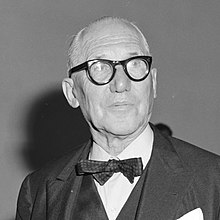

# チュートリアルについて
------

## 概要
ル・コルビジェ（1887〜1965）は、モダニズム建築の巨匠として、主にフランスで活躍したスイス人建築家です。その作品群は、「ル・コルビュジエの建築作品-近代建築運動への顕著な貢献-」として、世界遺産に登録されています。
今回のチュートリアルでは、この作品群と経歴のデジタルアーカイブを制作します

## 流れ
ル・コルビジェの建築作品と経歴をマッピングする。

1. マーカーを配置する
2. フォトオーバーレイを設定する
3. ストーリーテリングを設定する
4. 背景地図を変更する
5. 公開設定を行う

## 素材
世界遺産『ル・コルビュジエの建築作品-近代建築運動への顕著な貢献-』
https://docs.google.com/spreadsheets/d/1p3JKhLPQ-Vjnqb5NVsVcp7sDCUybnUEbBBnf76IbJYo/edit?usp=sharing