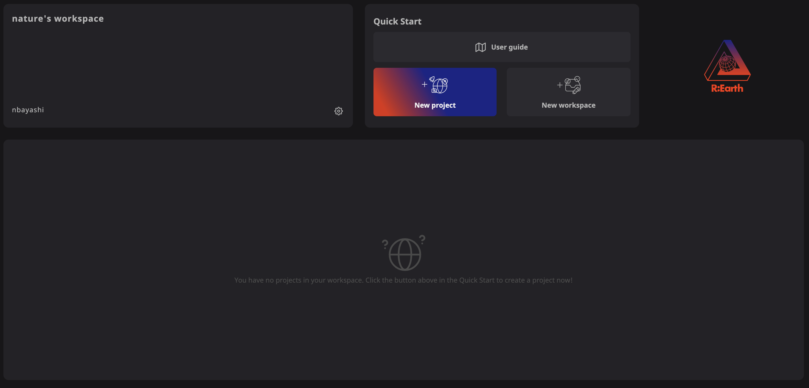
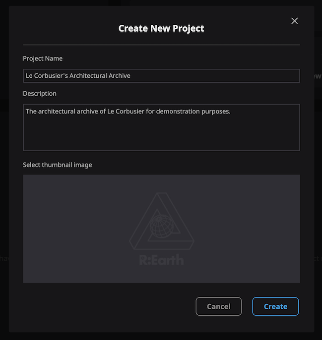
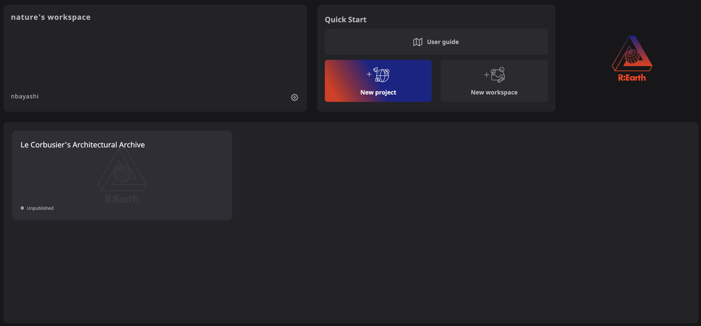
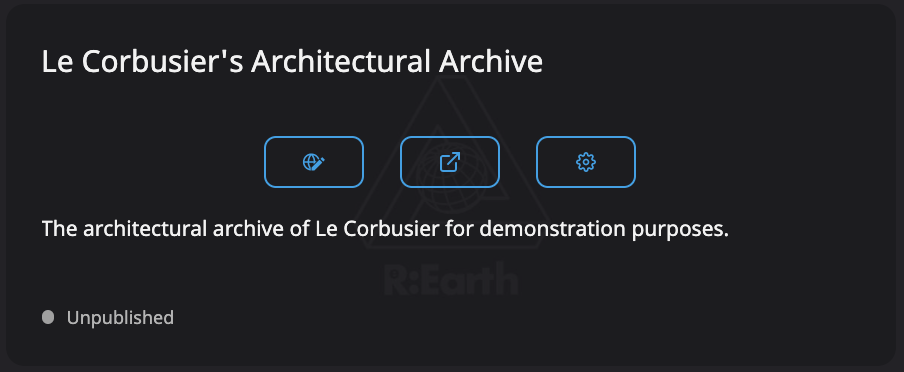
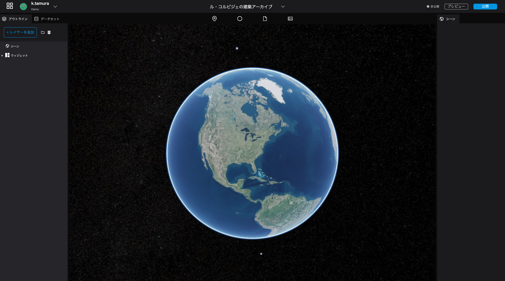

# 新規プロジェクトの作成
---

## トップページを開く

[https://app.reearth.io/](https://app.reearth.io/)からトップページを開き、`新規プロジェクト`のボタンをクリックしてください。

## 新規プロジェクトの作成

プロジェクト名とプロジェクト概要を入力してください。  
 
> プロジェクト名：ル・コルビジェの建築アーカイブ  
> プロジェクト概要：デモ用として、ル・コルビジェの建築アーカイブを作成します。

入力が完了したら、`作成`ボタンをクリックしてください。

作成した新規プロジェクトは、プロジェクト一覧に追加されます。

## アプリケーションを開いてみましょう

さきほど作成した、新規プロジェクトのカードから、一番左のアイコンをクリックしてください。 

すると、編集画面が開きます。この画面から、データの作成と編集を行っていきます。 

