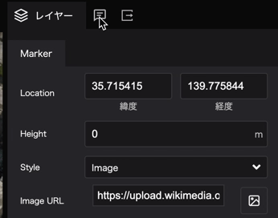

# マーカーのインフォボックスを作成
------

## タブ変更
右パネル上部のタブを、現在の`レイヤー`から真ん中の`インフォボックス`へ切り替えます。



## 新規インフォボックスの作成
`新規インフォボックス`ボタンをクリックすると、選択しているマーカーにインフォボックスが追加されます。


## インフォボックスのコンテンツを設定
表示されたインフォボックスの`＋`ボタンから、インフォボックスに埋め込むコンテンツを選ぶことができます。 


コンテンツ形式は、次の5種類から適切なものを選択してください。  
- Text: テキスト
- Image: 画像
- Video: 動画
- Location: 地図
- Table: 表  

今回は、`Image`→`Text`→`Text`の順で選びましょう。  

## 画像コンテンツの設定
インフォボックス内の画像アイコンをクリックすると、画像のアップロード等を行うウィンドウが表示されます。  
`画像`に、表示させたい画像のURLを貼り付けてください。  

コルビュジェの画像URL: 

[https://upload.wikimedia.org/wikipedia/commons/9/9d/National_museum_of_western_art05s3200.jpg](https://upload.wikimedia.org/wikipedia/commons/9/9d/National_museum_of_western_art05s3200.jpg)


- フルサイズ: 画像フレームを横幅最大で表示します。
- 画像サイズ: 画像のサイズを設定します。`カバー`ではフレームにあわせて画像がトリミングされます。`含む`では画像の比率そのままに、画像フレームに収まるよう拡大・縮小が行われます。
- 水平位置: 画像の水平方向への配置を設定します。左寄せ・中央寄せ・右寄せを選ぶことができます。  
- 垂直位置: 画像の垂直方向への配置を設定します。上寄せ・中央寄せ・下寄せを選ぶことができます。 

## テキストコンテンツの設定
インフォボックス内のテキストブロックをクリックすると、右パネルからテキストの設定が行えます。  
今回は、2つのテキスト情報を入力しましょう。  


- 概要    

>国立西洋美術館（1955年）は、東京都台東区に残る美術館で、ル・コルビュジエが基本設計を担当した。
日本に残る唯一のル・コルビュジエの建築というだけでなく、東アジアでも唯一である。  
国立西洋美術館は、フランスから松方コレクションが寄贈返還されるにあたり、その受け入れ先となる美術館の建設が必要となったことから実現した。
ル・コルビュジエが指名された詳細な経緯は不明だが、1953年12月に日本で発足した「仮称フランス美術館設置準備協議会」では、フランス側の心証を良くするためにフランスの著名な建築家を起用することや、この機会に世界的建築家の作品を日本で実現したいといった意見が出ていたという。  
ル・コルビュジエが契約していたのは美術館の基本設計のみで、具体的な寸法なども含めた実施設計は日本の坂倉準三、前川國男、吉阪隆正の3人が担当した。ル・コルビュジエは生涯でただ一度となる日本訪問（1955年11月）を踏まえて、基本設計を行なった。
- 出典 

```
出典：Wikipedia
```

## インフォボックスのデザイン
`インフォボックス`内のテキストや画像ブロック以外の範囲をクリックすると、右パネルでインフォボックス自体の大きさや背景色などを設定することができます。 

