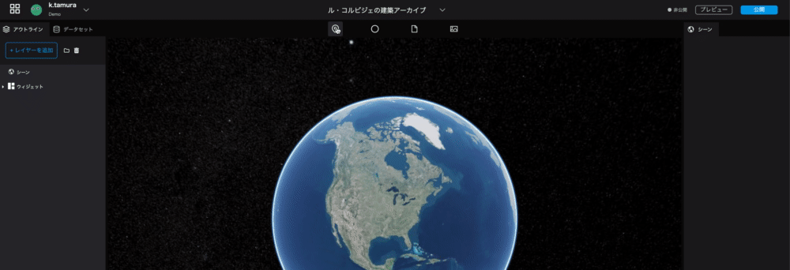
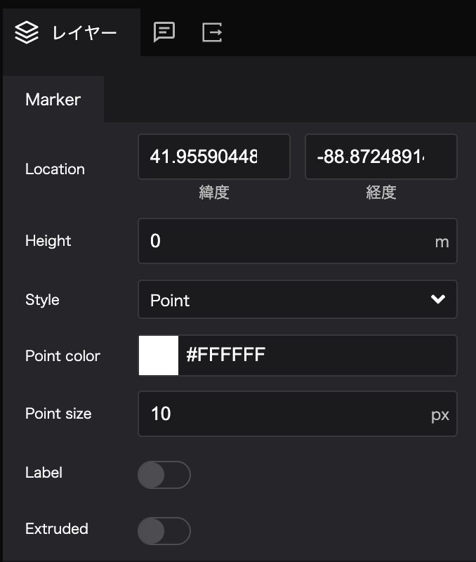
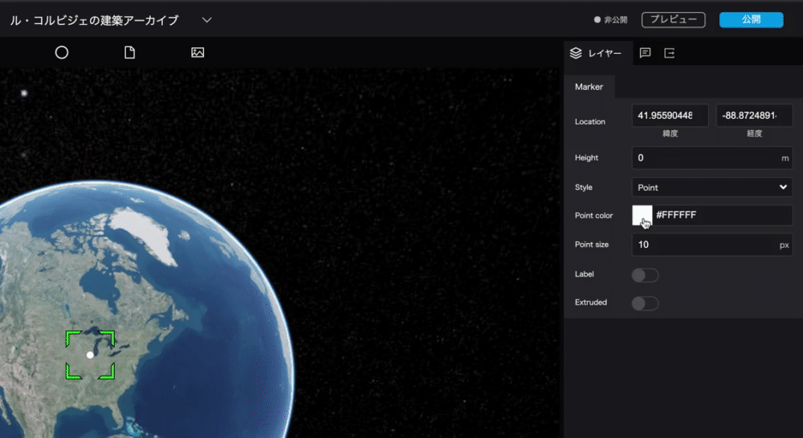
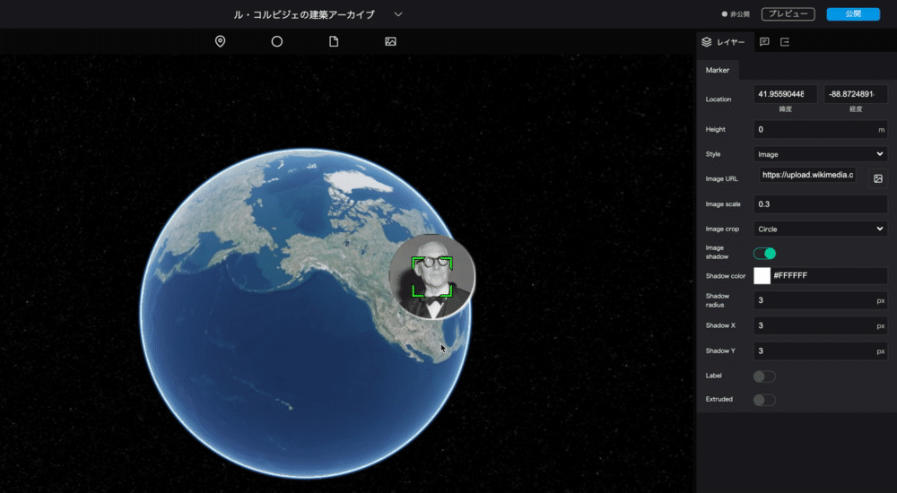

# マーカーのデザイン
------

## マーカーを地図の上に載せる
上部バー左側にある`マーカー`のアイコンを、地図上にドラッグ＆ドロップしてください。 
 
  

## マーカーを編集する

 

右パネル左端の`レイヤー`タブ内`マーカー`から、マーカーの設定を編集することができます。 

- 位置: マーカーの場所を緯度経度で設定できます。
- 高度: マーカーの高さを設定できます。
- 表示方法: ポイントマーク/画像アイコンの切り替えができます。
- ポイント色: ポイントマークの色を設定できます。
- ポイントサイズ: ポイントマークの大きさを設定できます。
- ラベル: ポイントマークにラベルを設定することができます。
- 地面から線を伸ばす: 高度を設定している場合、地表からポイントマークまでの線を表示することができます。

ポイントの色とサイズを変更してみます。  

## マーカーを画像アイコンにする
マーカーを画像アイコンにする

Image URL: [https://upload.wikimedia.org/wikipedia/commons/thumb/c/c8/Le_Corbusier_%281964%29.jpg/480px-Le_Corbusier_%281964%29.jpg](https://upload.wikimedia.org/wikipedia/commons/thumb/c/c8/Le_Corbusier_%281964%29.jpg/480px-Le_Corbusier_%281964%29.jpg)

`表示方法: アイコン`を選択すると以下の項目が表示されます。

- 画像URL: 画像をアップロードすることができます。
- 画像サイズ: 画像のサイズを設定できます。
- 切り抜き: 画像をそのまま表示するか、丸く切り抜くかが選択できます。
- シャドウ: 画像アイコンに影を付与できます。ONにするとシャドウの設定項目が表示されます。
- シャドウ色: 影の色を設定できます。
- シャドウ半径: 影の大きさを設定できます。
- シャドウX: 影の、縦方向の位置を設定できます。
- シャドウY: 影の、横方向の位置を設定できます。

## マーカーの位置を移動させる
`位置`を設定して、マーカーを国立西洋美術館の位置に移動させましょう。

国立西洋美術館の緯度経度  
>緯度: 35.715415
>経度: 139.775844

## マーカーの名前設定
Re:Earthでは、マーカー・フォトオーバーレイ・球体ツールなどで作成したデータををまとめて「レイヤー」と呼びます。  
左側パネルは、このレイヤーを管理する部分と、シーンやウィジェットを管理する部分にわかれています。

デフォルトでは`マーカー`となっている表示名を、わかりやすいように、「国立西洋美術館」へ変更しましょう。

> マーカー → 国立西洋美術館

## ラベルの追加
先ほど名前を変更した国立西洋美術館のマーカーに、ラベルを追加します。 
左パネルで設定したマーカー名は編集時の名前ですが、ラベルはアーカイブ公開時に表示される名前になります。

`ラベル`をONにすると、ラベルの設定項目が表示されます。  
表示された`ラベル文字`の欄に「国立西洋美術館」と入力してください。

- ラベル: マーカーにラベルを付与できます。ONにするとラベルの設定項目が表示されます。
- ラベル文字: ラベル名の設定ができます。
- ラベルフォント: フォント・行揃え・太字・斜体・下線の設定ができます。  