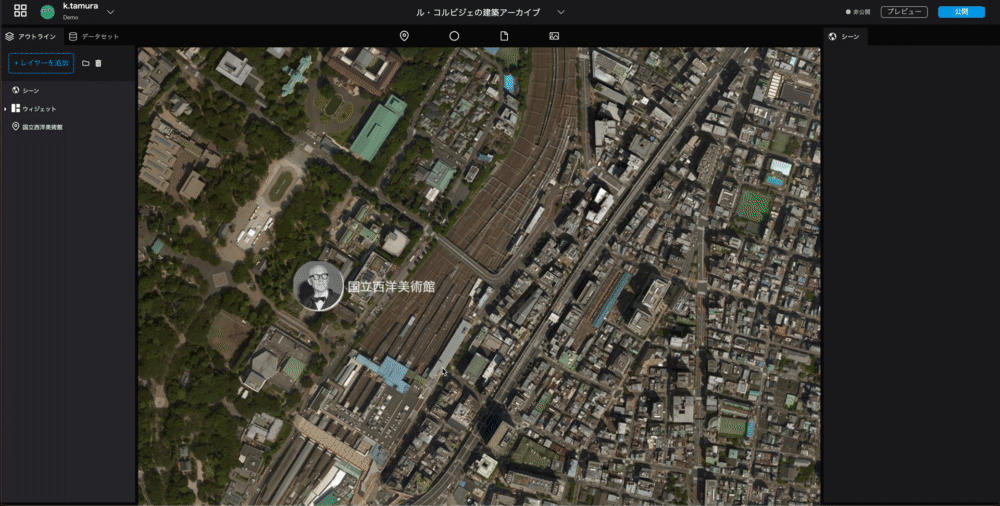

# デジタルアースの設定と公開
------

## 標高データの設定
左パネル上部の`シーン`を選択すると、デジタルアースに関する設定が行えます。  
今回は、標高データをオンにし、デジタルアースに地形の起伏を反映させてみましょう。 

  

1. キーボードのControlキーを押しながら、マウスもしくはトラックパッドで操作すると、デジタルアースの傾きを変更できます。
2. 左パネル上部の`シーン`を選択してください。
3. 右パネルに表示される`シーン`から、デジタルアースの設定ができるようになります。
4. `シーン`内`地形`のスイッチをクリックし、ONにしてください。標高データが読み込まれ、地形の起伏が表現されます。

## カメラの設定
プロジェクトを公開した際、最初に表示されるカメラの位置を設定します。  

     

1. 右パネル`シーン`にある`カメラ初期位置`をクリックします。
2. 地球儀を操作して、最初に表示させたいカメラの位置を探します。
3. カメラ位置が決まったら`キャプチャ`ボタンを押してください。その位置が、プロジェクト公開時の最初のカメラ位置となります。

## 公開設定
いよいよ公開です。  
右上の`公開`ボタンをクリックし、右下の`公開`ボタンを押してください。
公開用のURLから、完成したアーカイブを確認することができます。

  

  

## データ追加
以下のスプレットシート内の建築一覧ファイルに、ル・コルビジェの他の建築物のデータが入っています。  
ぜひ、他のデータ追加も行ってみてください。  
スプレットシートURL: [https://docs.google.com/spreadsheets/d/1p3JKhLPQ-Vjnqb5NVsVcp7sDCUybnUEbBBnf76IbJYo/edit?usp=sharing](https://docs.google.com/spreadsheets/d/1p3JKhLPQ-Vjnqb5NVsVcp7sDCUybnUEbBBnf76IbJYo/edit?usp=sharing)

## 今後の予告
今回は、マーカーの配置・表現までを行いました。  
Re:Earthには、他にも様々な機能があります。  
次回は、**フォトオーバーレイ、ストーリーテリング、CSVデータの一括読み込みと編集**の3つを行っていきます。 