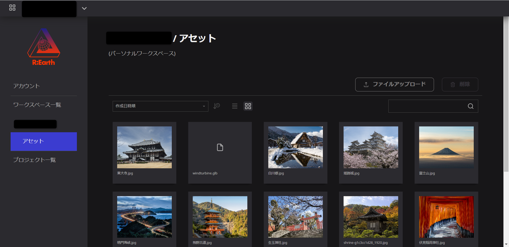
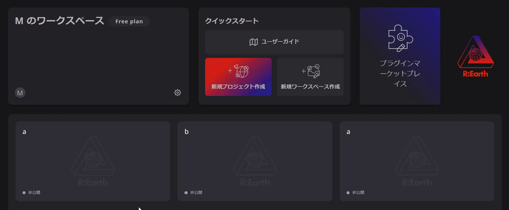

# アセットについて

## アセットプレビュー

## アセットとは？

Re:Earthでは、ユーザーの履歴を残すために利用できるあらゆるリソースを指します。画像、建物、設備、書類など、さまざまなものが含まれます。

Re-Earthで使用する画像やファイルはアセットとなります。

### アセットの概念

アセットとは、アセットがワークスペースに紐づくことで、プロジェクト間で共有・利用できるようにする、というものです。

### 画像アセットとして使用できるもの：

- プロジェクトのサムネイル
- インフォボックスのイメージブロック画像
- フォトオーバーレイ画像
- レイヤーアイコン（該当する場合）
- プロフィール画像

### アセットへのアクセス方法：

アカウント設定→ワークスペース→アセットの他、使用されているアセットモーダルからもアクセスできます。

