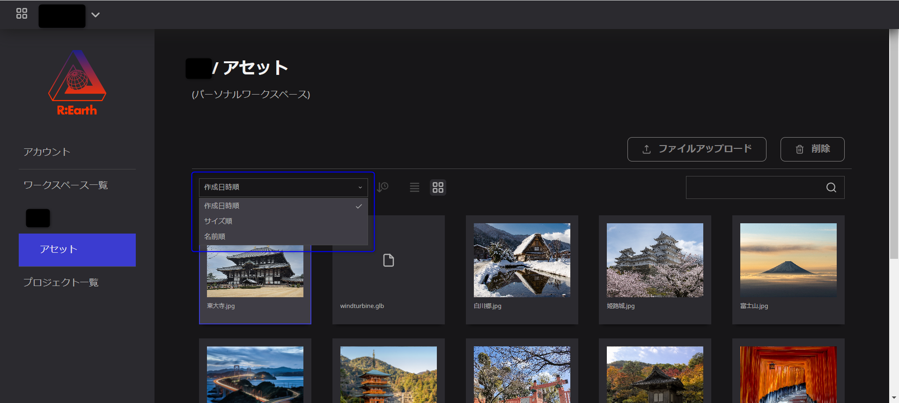
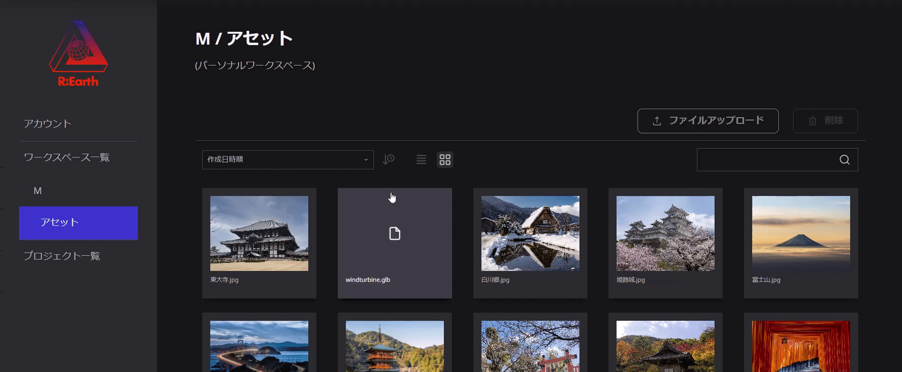
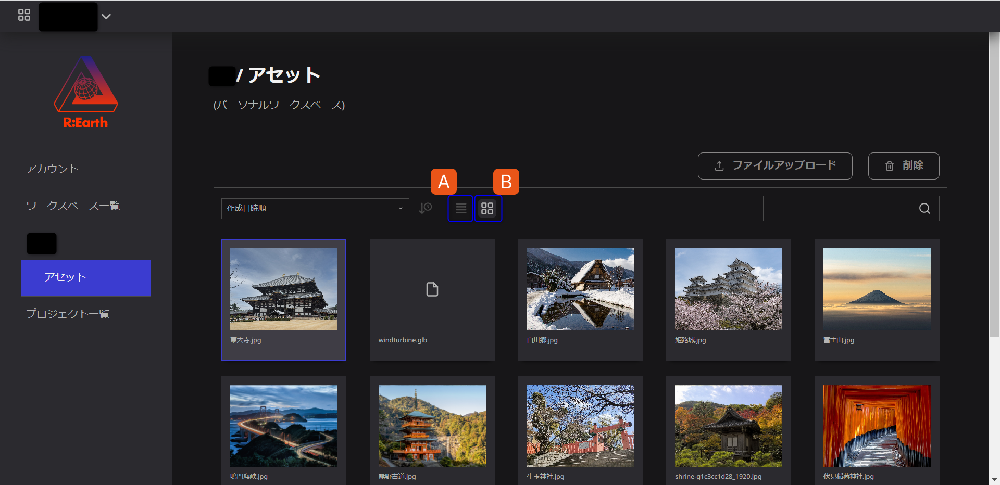
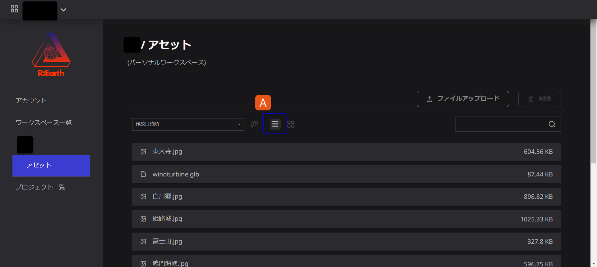
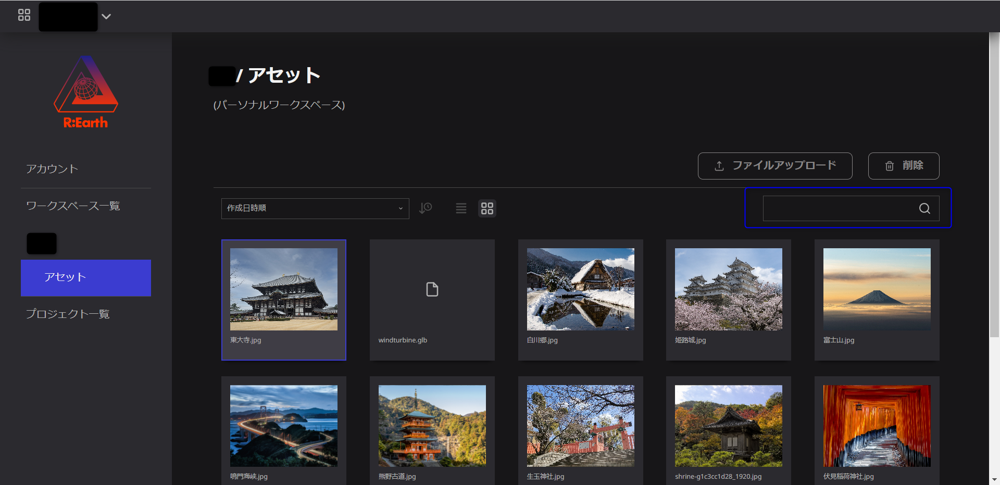

# アセットの管理

「アセットの管理」については、以下のようなことが可能です：

## アセットを削除

アセットを削除するにはまず、「アカウント設定」→「ワークスペース」→「アセット」の順にページを開いてください。

削除したい画像を選択し、マウスを右上に移動すると、削除ボタンが表示されますので、それをクリックして削除することができます。

## アセットの並びの変更

ユーザーは、モーダルのソートメニューからアセットの順序を変更することができます。日付順が、デフォルトの順序です。

ユーザーは、以下の3つの順序から選択することができます。

- 作成**日時順**：ファイルが追加された日時順で表示
- **サイズ順**：ファイルサイズ順で表示
- 名前**順**：ファイル名をアルファベット順に表示

プルダウンメニューの横にある時計のアイコンをクリックすると、昇順・降順を変更することができます

## 表示形式の変更

モーダル中央のアイコンは、アセットの表示形式を変更することができます。

アセットの表示形式は、以下の2種類から選択することができます。

**A.リスト形式**

**B.ラガー形式**

## 検索

モーダルの右側にある検索バーでは、ファイル名でアセットを検索することができます。

## ファイル名の変更

Re:Earth上では、アセットのファイル名を変更することはできません。

ファイル名を変更する必要がある場合は、データのファイル名を編集してからアップロードし、変更後に再度アセットとしてアップロードしてください。