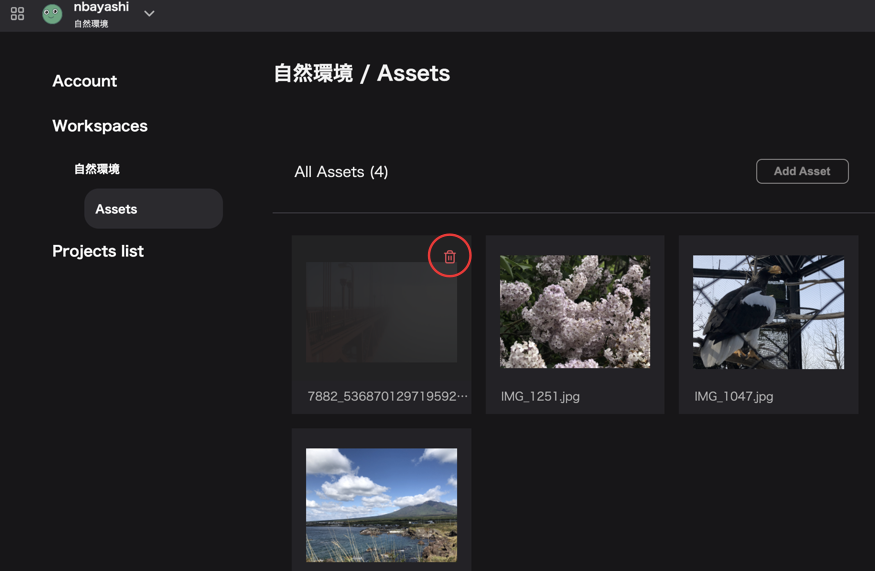
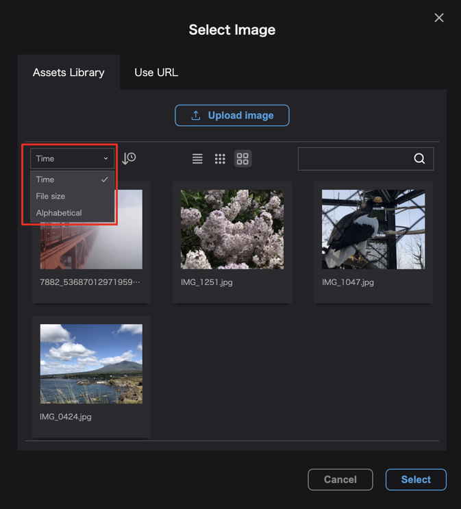
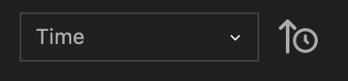
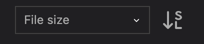
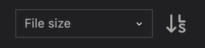
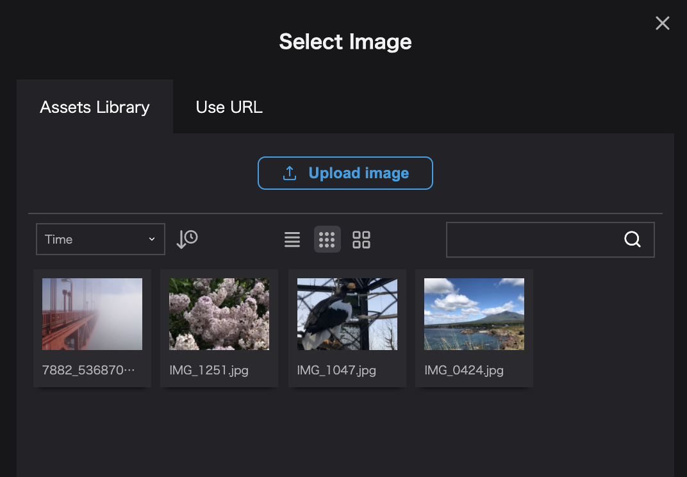
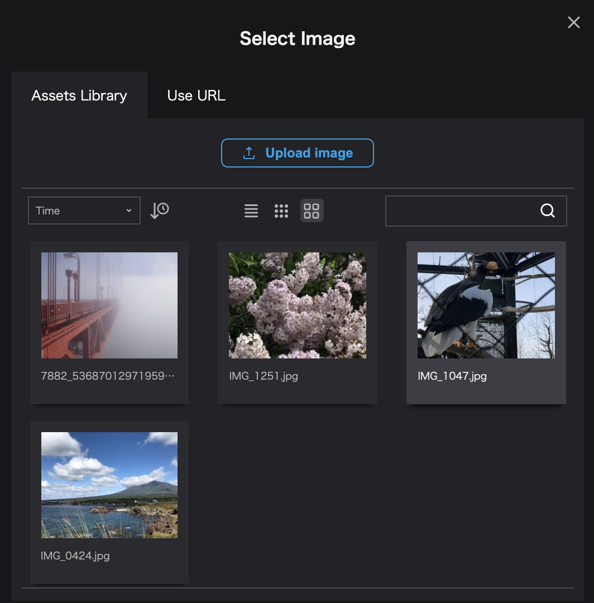

## アセットの削除

`アカウント設定`→`ワークスペース`→ `アセット`を開きます。

画像をマウスオーバーした際に右上に表示される"ゴミ箱アイコン"をクリックすると、画像を削除することができます。

## アセットの並び順の変更

モーダル内のソートメニューからアセットの並びを変更することができます。

並び順は以下の３つから選択することができます。

- `Time`：追加した日付順
- `File size`：ファイルサイズ順
- `Alphabetical`：ファイル名順

プルダウンメニューの横にある時計アイコンをクリックすると昇順/降順を変更することができます。

- `Time`

`時計↓アイコン`：日付が新しい順

`時計↑アイコン`：日付が古い順

- `File size`

`SLアイコン`：ファイルサイズが小さい順

`LSアイコン`：ファイルサイズが大きい順

- `Alphabetical`

`AZアイコン`：アルファベット昇順

`ZAアイコン`：アルファベット降順

## 表示形式の変更

モーダル内中央部のアイコンでは、アセットの表示形式を変更することができます。

アセットの表示形式は以下の3つから選択することができます。

- リスト形式

- アイコン(小)形式

- アイコン(大)形式

## 検索

モーダル右側の検索バーではアセットをファイル名から検索することができます。

## ファイル名の変更

Re:Earth上ではアセットのファイル名を変更することができません。

ファイル名の変更が必要な場合は、アップロード前のデータのファイル名を編集し、再度アセットとしてアップロードしてください。