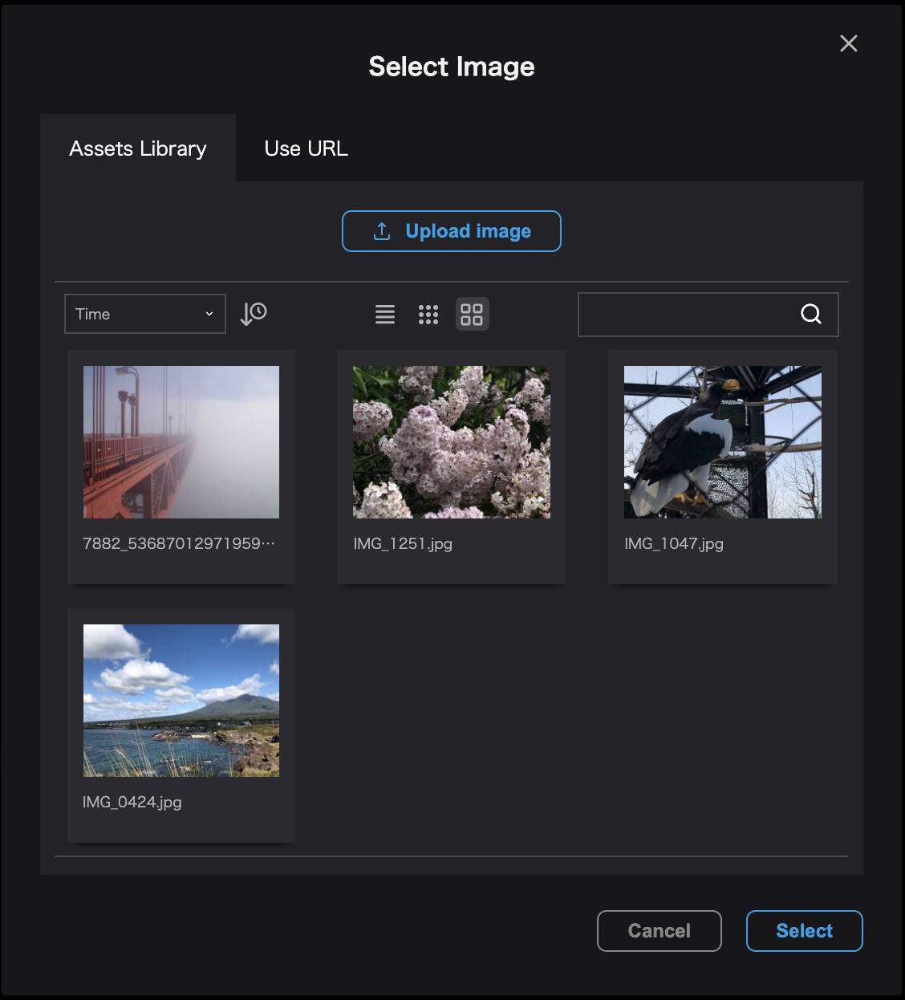
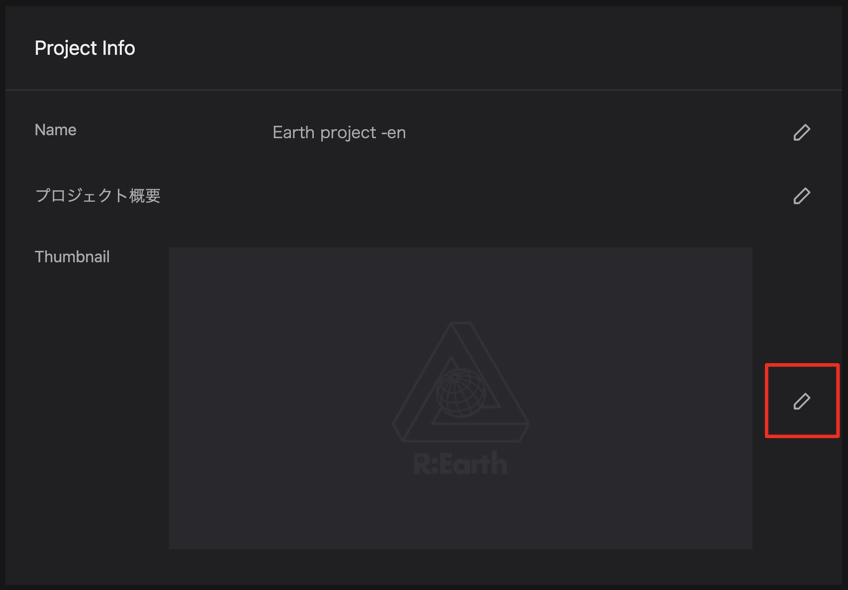
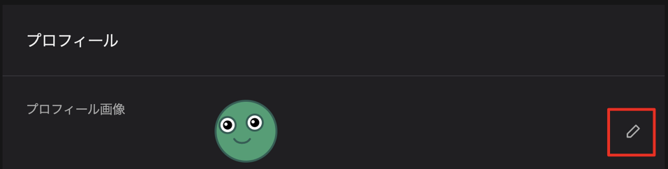
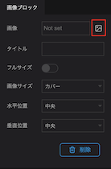
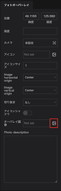
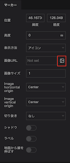
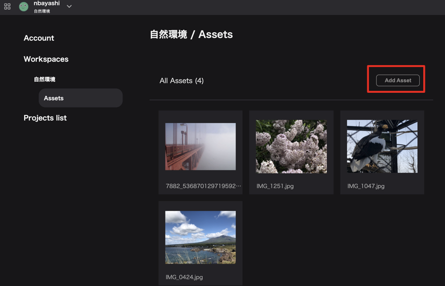

アセットの追加は以下の手法で行うことができます。

- 1枚ずつ追加する
- まとめて複数の画像を追加する

## 1枚ずつ追加する

以下の設定時に適宜アセットを追加することができます。

- プロジェクトのサムネイル
- infobox/画像ブロックの画像
- フォトオーバーレイ画像
- スプラッシュスクリーン画像
- マーカーのアイコン
- プロフィール画像

ローカル上の画像をアップロードすることでアセットとして追加され、Re:Earth上で使用することができます。

### プロジェクトのサムネイル、プロフィール画像

プロジェクト作成時及び編集画面、プロフィール編集画面で画像の編集ボタンをクリックすることでアセットモーダルが表示されます。

(プロジェクトの作成については[こちら](/user-manual/project-and-workspace/project/create-a-new-project)をご覧ください)

### **infobox画像ブロックの画像、フォトオーバーレイ画像、スプラッシュスクリーン画像、マーカーのアイコン**

それぞれのプロパティ設定時の画像アイコンをクリックすることでアセットモーダルが表示されます。

インフォボックスのプロパティ
(インフォボックスの設定については[こちら](/user-manual/infobox/set-up-infobox-properties)をご覧ください)

フォトオーバーレイのプロパティ

マーカーのプロパティ

モーダル内の`画像`ボタンを押します。

デバイスに入っている画像の中から、アップロードしたい画像を選択し、「開く」ボタンを押します。

## まとめて複数の画像を追加する

### アカウント設定画面を開く

`アカウント設定`→`ワークスペース`→ `アセット`を開きます。

アセット一覧の右側にある、`追加`ボタンを押します。

デバイス上から画像を選択（複数選択可能）し、「開く」ボタンをクリックすることでアセットがアップロードされ、Re:Earthのプロジェクト内で使用することが可能になります。

