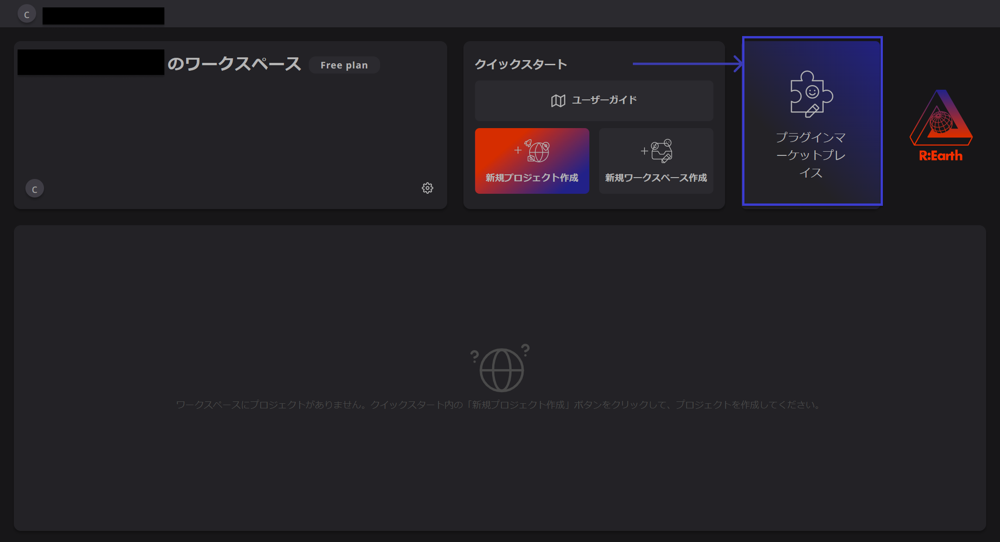
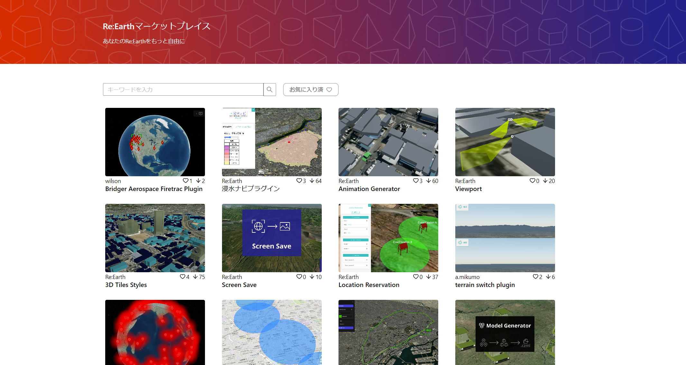
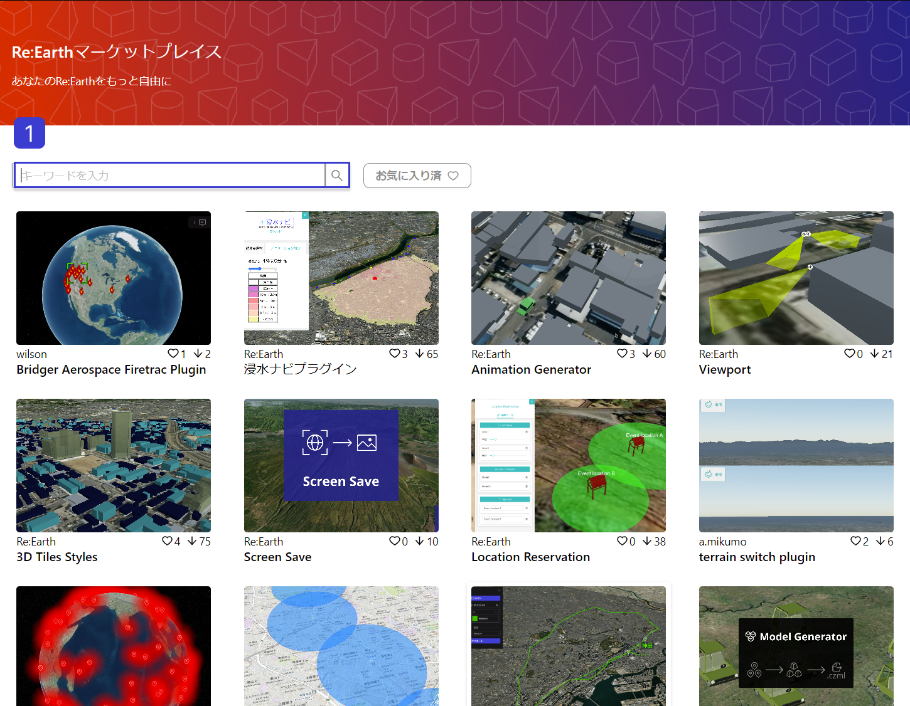
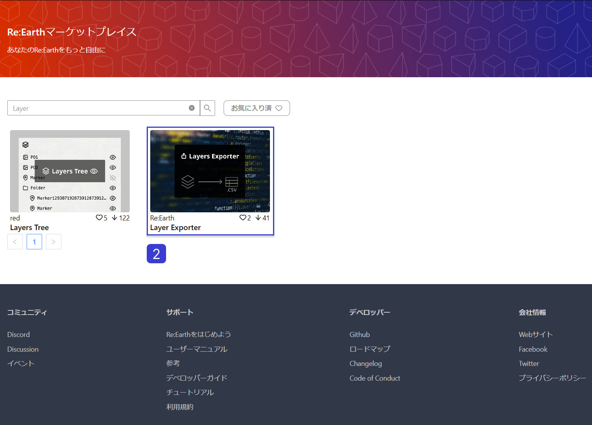
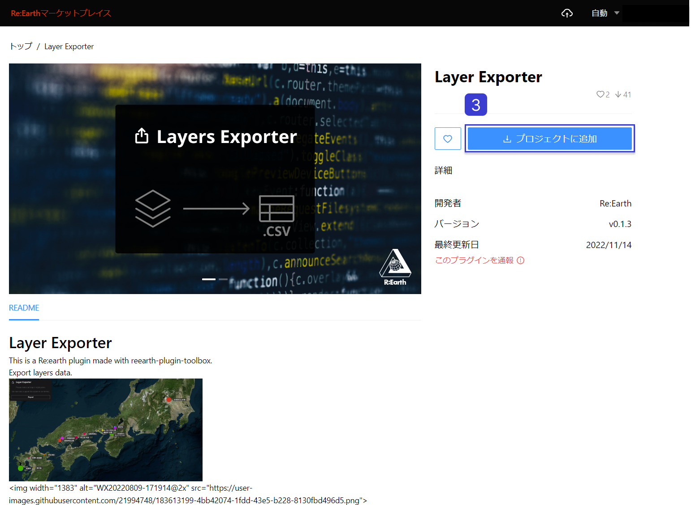
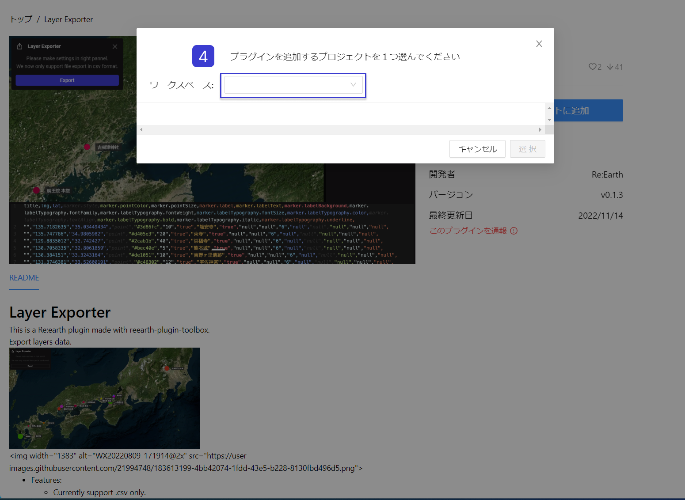
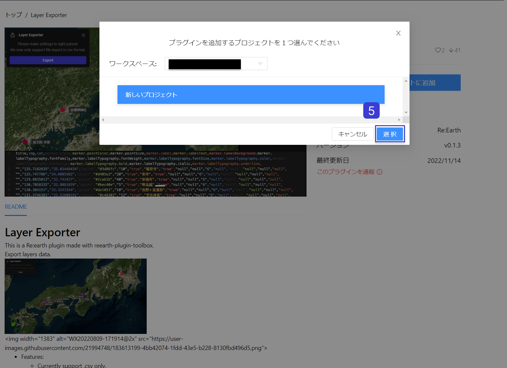
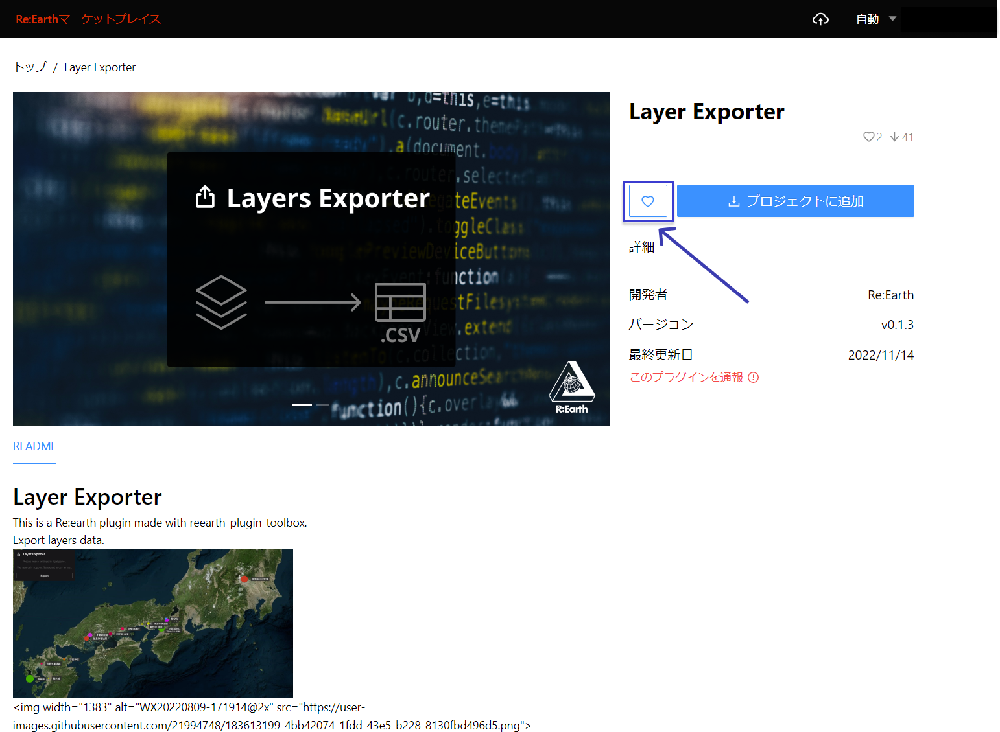
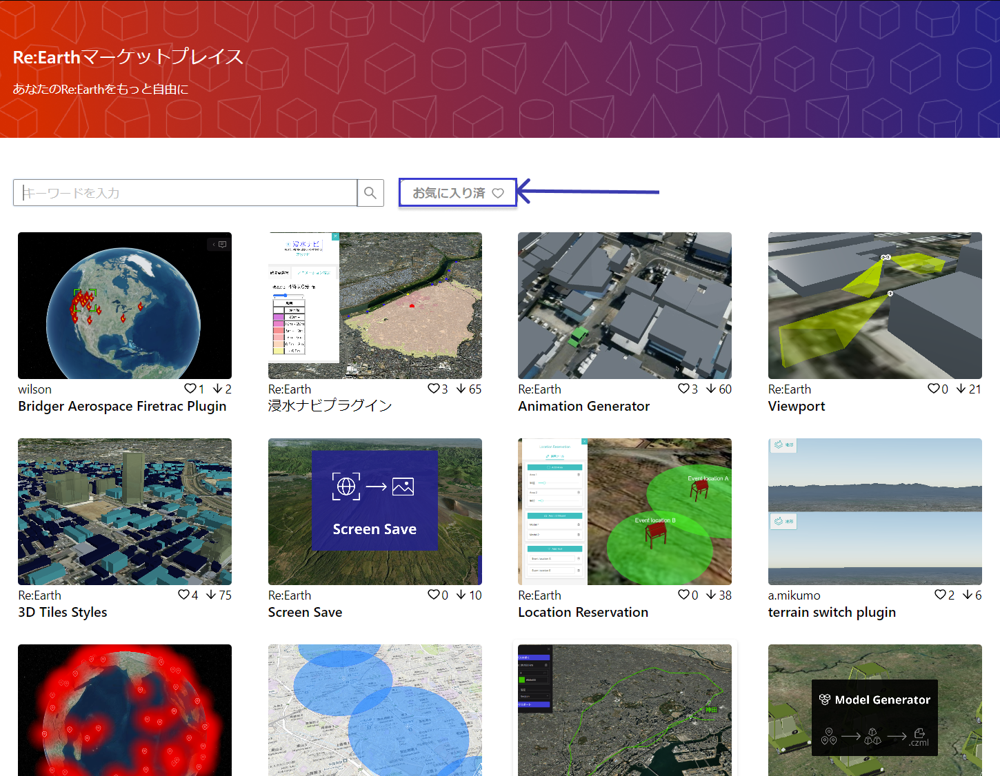
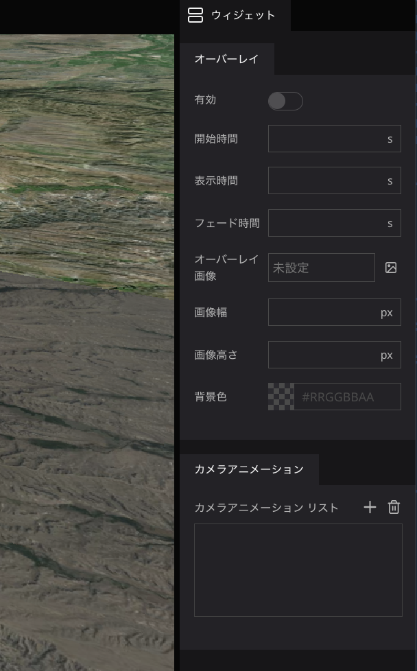

# マーケットプレイス

マーケットプレイスとは、プラグインの共有プラットフォームです。ユーザーの皆さんが作成したプラグインが公開されています。自身のプロジェクトで活用したいプラグインを検索することができます。

- [https://marketplace.reearth.io/](https://marketplace.reearth.io/)

## マーケットプレイスへのアクセス

ダッシュボードにアクセスし、「プラグインマーケットプレイス」をクリックします。

新しいタブに「Re:Earthマーケットプレイス」が開きます。

## プラグインの追加方法

①検索窓にキーワードを入力し、プラグインを検索します。

②表示されたプラグインをクリックすると、詳細ページにアクセスできます。

③プロジェクトに追加ボタンをクリックします。

④ワークスペースを選択し、プラグインを追加するプロジェクトを選択します。

⑤選択ボタンをクリックします。

以上でプラグインの追加が完了しました。

また、プラグインページのハートボタンをクリックすると、お気に入り登録が可能です。

お気に入り登録したプラグインは、ホーム画面の「お気に入り済」ボタンからアクセスできます。

## プラグイン考案のヒント

- こんなことできるといいなを考える
- ウィジェット、インフォボックスにどんな情報を表示させると良いかを考える
- 設定項目（右パネルの項目）として何を用意すると良いかを考える
    
    
    
- プラグインAPIで何ができるのか、コンソールやプラグインエディターでAPIを実行しながら、やりたいことを実現するにはどうのようなコードが必要かを考える
- マーケットプレイスに公開されているプラグインから着想を得る