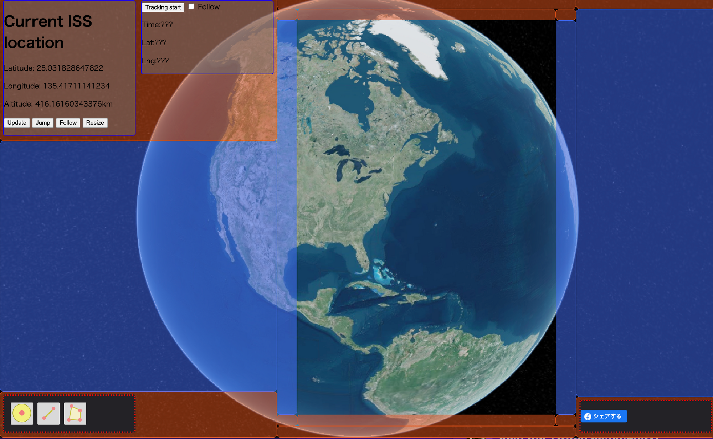
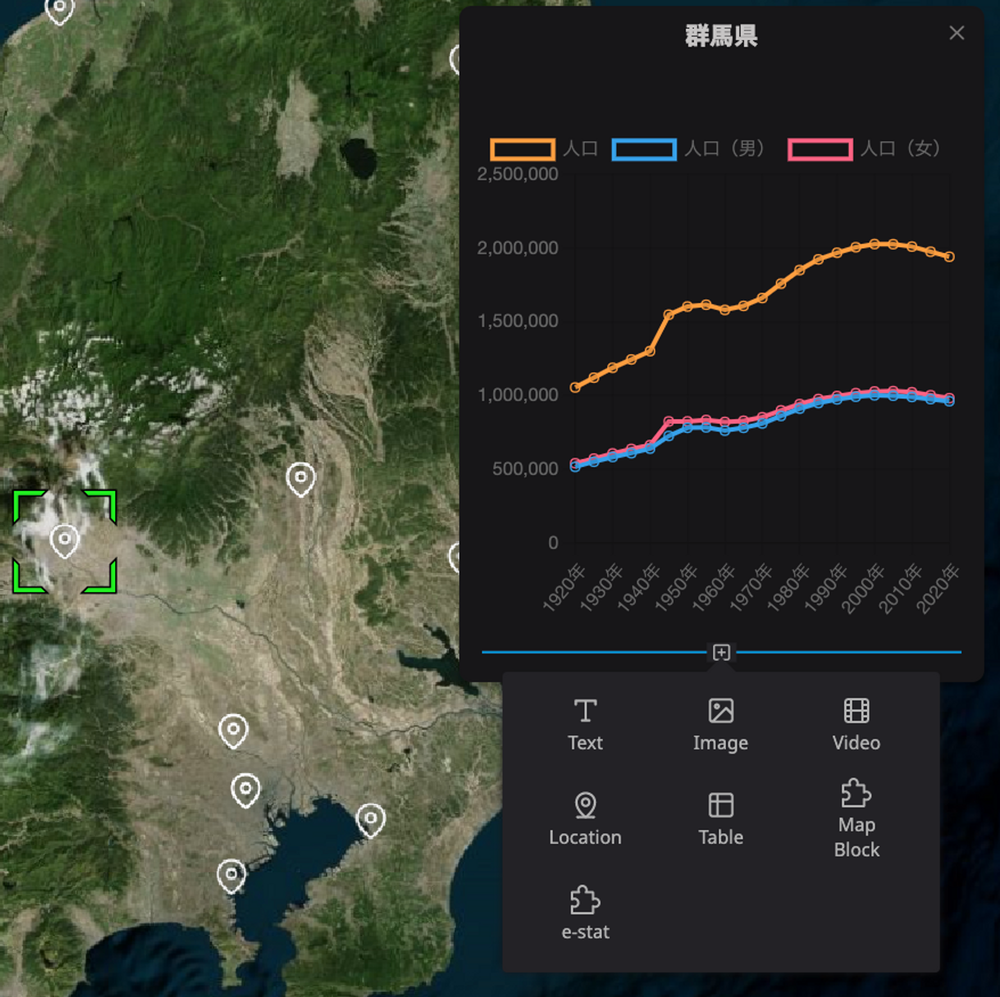
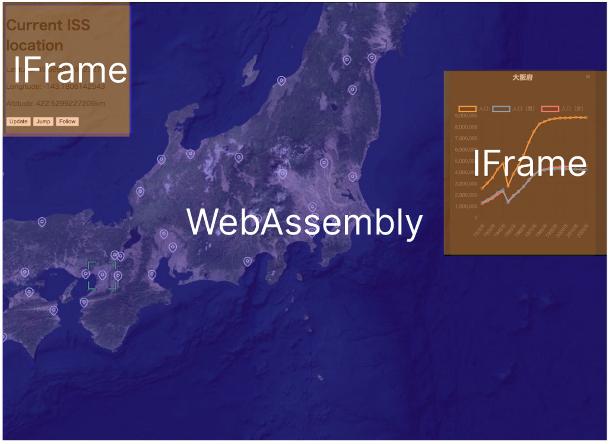

# プラグインの種類

Re:Earth上で扱うプラグインには２種類あります。「ウィジェットプラグイン」と「インフォボックスプラグイン」です。

### ウィジェットプラグイン

ウィジェットプラグインとは、プラグインの内容が画面上に表示されるタイプのプラグインです。

ウィジェットは、画面の端や隅に自由に配置することができます。例えば、様々なデータの表示/非表示を切り替えたり、Re:Earthに表示中の任意のレイヤーにアクションを実行することができます。

### インフォボックスプラグイン

インフォボックスプラグインとは、レイヤーを選択した際に表示されるインフォボックスに表示されるプラグインです。

選択されたレイヤーの内容に応じて、様々なデータを表示させることができます。

## プラグインの仕組み

Re:Earthのプラグインを作成する際には、地図が表示されている実行環境「WebAssembly」とウィジェットやインフォボックスなどプラグインとして表示される実行環境「IFrame)」を意識する必要があります。

### **WebAssembly**

WebAssemblyではコードを同期して高速に実行でき、Re:Earthのデータにもアクセスできます。しかし、WebブラウザがサポートするAPIやHTMLでのUIを使うことができません。

WebAssemblyでは、以下のことを実行することができます。

- Re:Earthのシーンやレイヤーなどの情報を取得する
- Re:Earthの操作を実行するプラグインAPIを利用する
- `reearth.ui.postMessage`でIFrame側にデータを送り、`reearth.on("message", () => {})`でIFrame側からデータを受信する

### IFrame

ウィジェットやインフォボックスを構成するのはIFrame（HTMLの埋め込み要素）なので、WebブラウザがサポートするあらゆるAPIの使用やHTMLの表示が可能です。しかし、Re:Earthのデータに直接アクセスすることはできません。

IFrameでは、以下のことを実行することができます。

通常のHTMLページと同じようにHTMLのレンダリングを行う

- 通常のHTMLページと同様に、Webブラウザが提供するあらゆるAPIを利用する
- `parent.postMessage` と `window.addEventListener("message", () => {})` でWebAssembly側と通信を行う