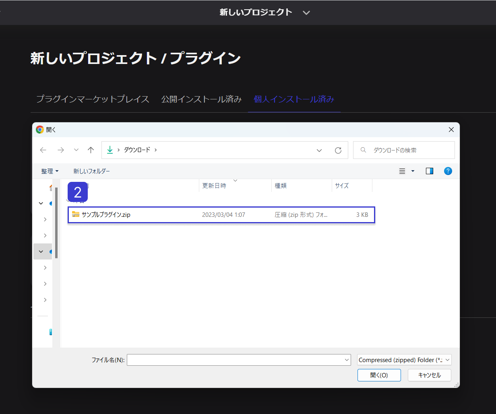
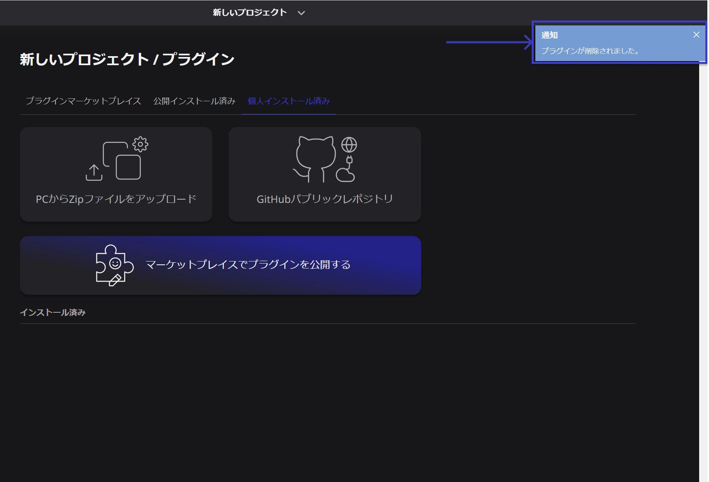

# プラグインのインストールと削除

プラグインのインストールと削除の方法について解説します。

## プラグインライブラリへのアクセス

①ダッシュボード画面の`設定ボタン`から、プロジェクト設定画面を開きます。

②左側のメニューから「プラグイン」を選択します。

③「個人インストール済み」をクリックすると、プラグインライブラリへアクセスできます。

## プラグインのインストール

プラグインのインストールには、2つの方法があります。

「PCからZipファイルをアップロード」では、自身のPCからzipファイルを選択してプラグインをインストールします。「GitHubパブリックレポジトリ」では、GitHubから直接プラグインをインストールします。

### PCからZipファイルをアップロード

①プラグインライブラリにアクセスし、「PCからZipファイルをアップロード」を選択します。

②Zipファイルを選択します。

③しばらく待って通知が表示されれば、プラグインは正常にインストールされています。

ここでエラーが発生した場合、以下のような原因が考えられます。

- reearth.ymlの形式に誤りがあります。
- 同じIDのプラグインが既にインストールされています。既存のプラグインを削除して、再度インストールを実行してください。
- ZIPファイルに reearth.yml が含まれていないか、ルートに複数のディレクトリが存在しています。reearth.yml を含む単一のフォルダ、または reearth.yml を含む複数のファイルを圧縮してください。
- ZIPファイルを生成するアプリケーションによっては、不正なZIPファイルが出力されることがあります。他のアプリケーションを利用して圧縮してください。

### GitHubパブリックレポジトリ

①プラグインライブラリにアクセスし、「GitHubパブリックレポジトリ」を選択します。

②GitHubリポジトリのURLを入力します。

③「続ける」ボタンをクリックします。

④しばらく待って通知が表示されれば、プラグインは正常にインストールされています。

## プラグインの削除

①プラグインライブラリにアクセスし、プラグイン名が表示されている列の右側にある`インストール済み`ボタンにカーソルをあてます。

②「インストール済み」ボタンの表記が「アンインストール」に変わったら、`アンインストール`ボタンをクリックします。

③表示されたポップアップの`アンインストール`ボタンをクリックします。

④しばらく待って通知が表示されれば、プラグインは正常に削除されています。

なお、プラグインを削除すると、追加されたウィジェットやブロックはシーンから削除されます。削除したプラグインを使ったシーンをすでに公開している場合は、公開したシーンでウィジェットやブロックが動作しなくなります。

[プラグインの種類](../Type%20of%20plugin/Type%20of%20plugin.md)