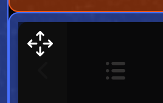
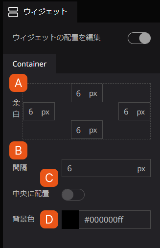
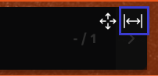
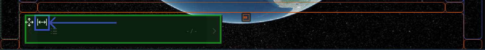
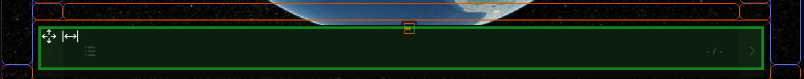

# 垂直と水平方向に整列

## 操作方法

「ウィジェットの配置を編集」を有効化すると、拡張されたレイアウトにてウィジェットの配置の編集が可能になります。

## 移動

色付きの領域では、ウィジェットをドラッグ＆ドロップして、ウィジェットの場所を変更することができます。

ウィジェットにカーソルを合わせると、右パネルにそのウィジェット固有の設定ウインドウが表示されます。

A. 余白：領域内の余白を指定します。

B. 間隔：領域内のウィジェット同士の間隔を指定します。

C. 中央に配置：有効化すると、ウィジェットが領域内の中央に配置されます。

D. 背景色：ウィジェットの背景色を指定します。

## サイズ変更

ウィジェットによって、垂直方向、水平方向、またはその両方を拡大することができます。2本の矢印が外を向いているアイコンが表示されている場合、そのウィジェットは拡張可能です。

デフォルトでインストールされている「ストーリーテリング」がその良い例です。「ストーリーテリング」ウィジェットを下部の中央に移動させ、`矢印ボタン`をクリックすると、ウィジェットが幅いっぱいまで水平に拡張されます。

- 変更前

- 変更後

## 配置

角以外のエリアでは、領域内のウィジェットの配置を変更することができます。

領域内にウィジェットが追加されると、中央あたりに下記のアイコン、またはそれに相当する横長のアイコンが表示されます。これをクリックすると、そのエリアのウィジェットの配置が変更されます。

