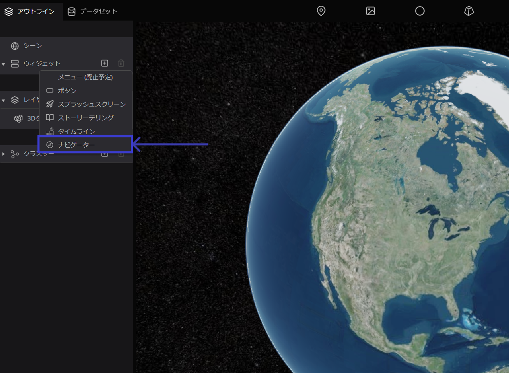

# ナビゲーター

ナビゲーターとは、地球上の場所の探索に役立つ機能です。簡単な操作で地球上の様々な場所や情報にアクセスすることができます。

## 設定方法 

左パネルのアウトラインタブから`ウィジェット`をクリックし、`+アイコン`から、`ナビゲーター`をクリックしてください。

画面右上に、ナビゲーターが表示されます。

## デフォルト項目の設定

画面右パネルには、タイムラインに関する設定ウインドウが表示されます。

- 表示：表示形式を指定します。

## 機能の詳細

A. 中央の矢印ボタンの操作によって、地球儀を上下左右に動かすことができます。また、方角ボタンの操作によって、地球儀を東西南北を動かすことができます。

B. `＋ボタン`、`－ボタン`をクリックするすることで、地球儀の拡大・縮小が可能です。