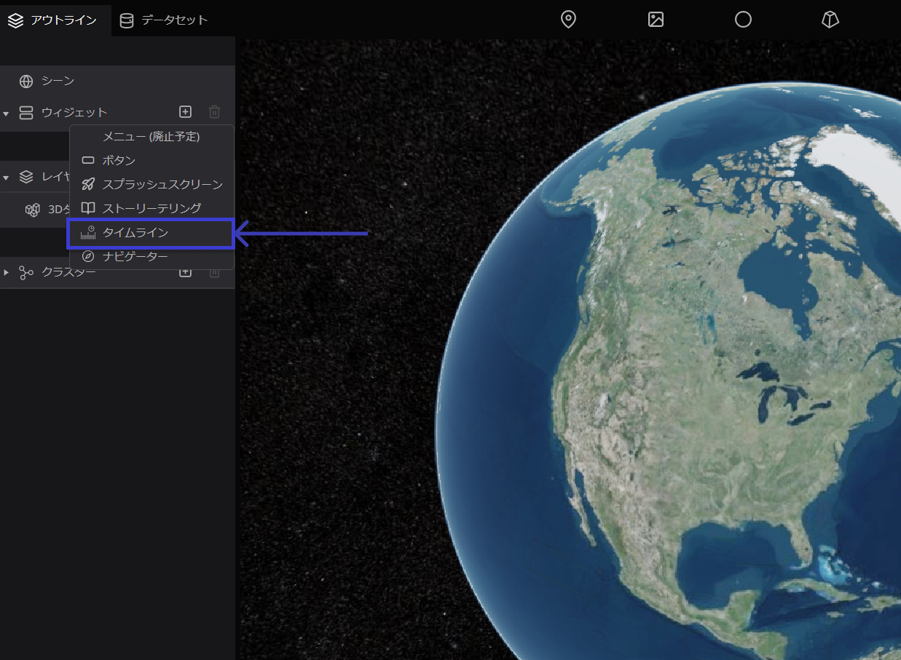

# タイムライン

タイムラインとは、時間に応じてデータの表示を切り替える機能です。

タイムライン機能は、地理空間データをより効果的に分析し理解するのに役立ちます。また、地球上の特定の領域や地点に関する時間的なパターンを簡単に把握することができます。

## 設定方法 

左パネルのアウトラインタブから`ウィジェット`をクリックし、`+アイコン`から、`タイムライン`をクリックしてください。

画面左下に、タイムラインが表示されます。

## デフォルト項目の設定

画面右パネルには、タイムラインに関する設定ウインドウが表示されます。

- 表示：表示形式を指定します。

## 機能の詳細

A. 時間の経過速度を制御します。

B. スクロールバーを使用して、特定の時間範囲を指定することができます。また、スライダーによって、地図上に表示される時間範囲を簡単に変更することができます。