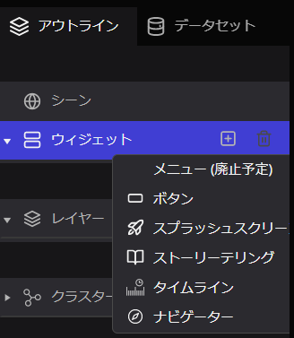

# 概要

ウィジェットでは、ウインドウ上に配置される機能の設定が可能です。現在Re:Earthが公式に提供するウィジェットには以下のものがあります。

- ボタン：任意のイベント（カメラ移動・外部サイトへのリンクなど）を動作させる
- スプラッシュスクリーン：テキストプロジェクトを起動した際に表示される画面を設定する
- ストーリーテリング：プロジェクト上のレイヤーを順序立てて移動させることができる
- タイムライン：時間に応じてデータの表示を切り替えることができる
- ナビゲーター：簡単な操作で地球上の場所を探索できる

