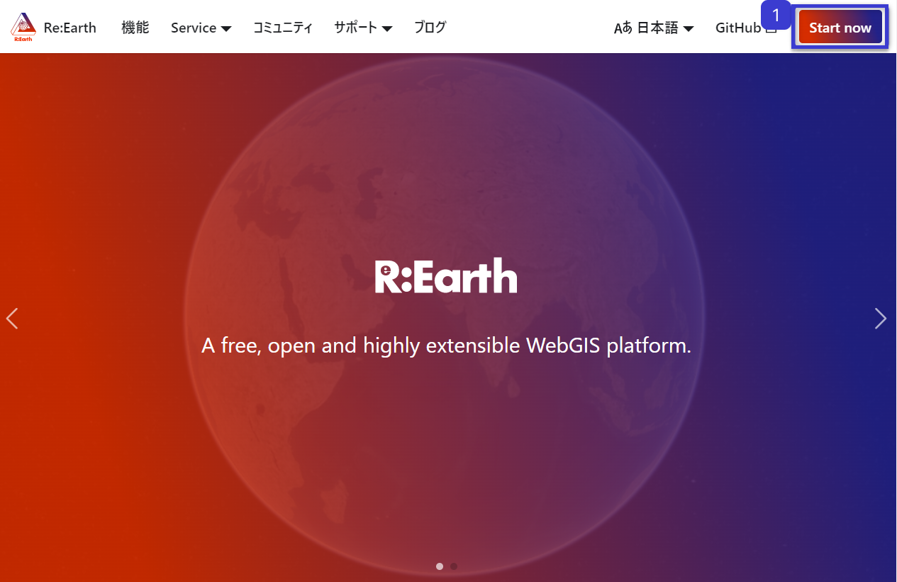
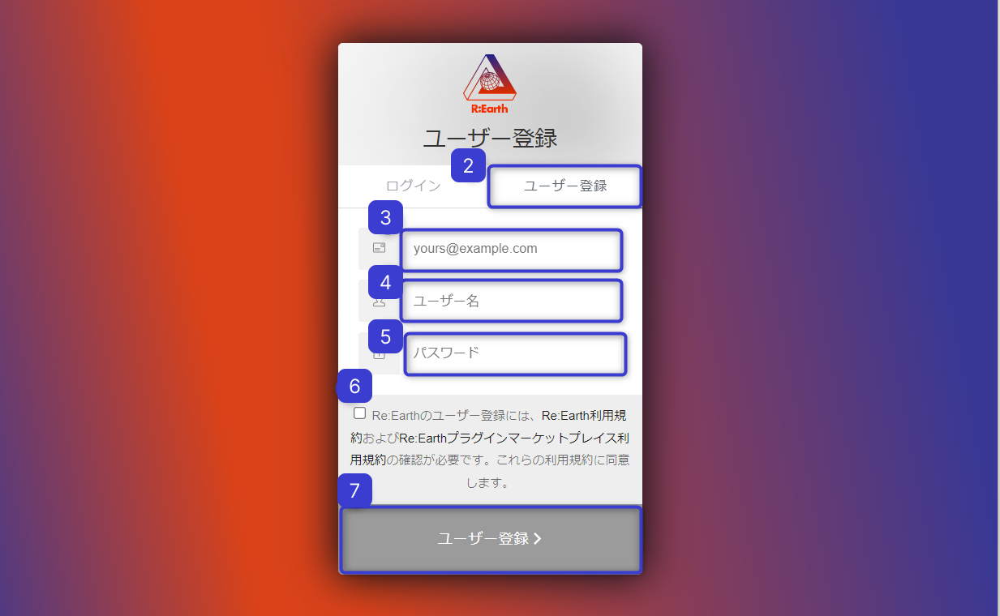
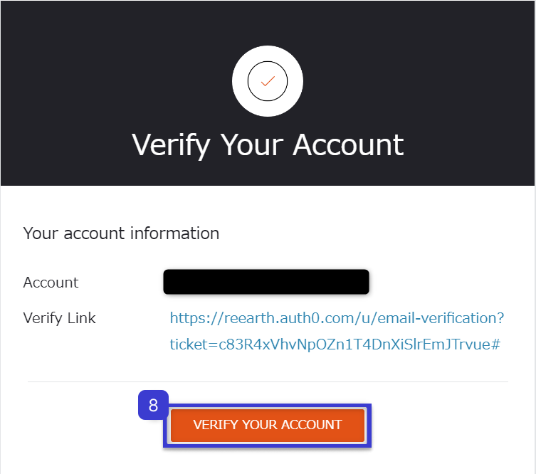
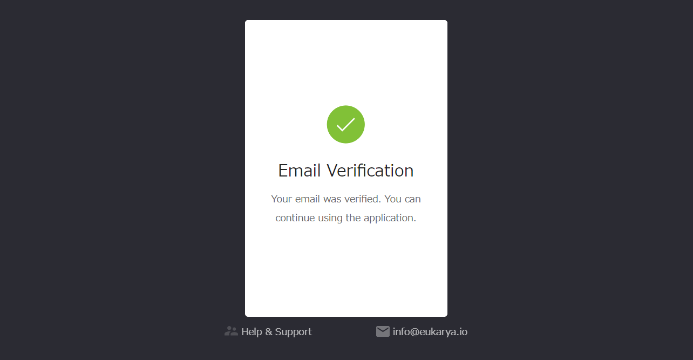
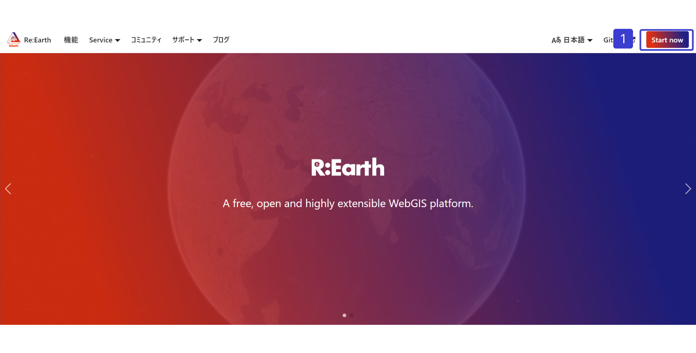
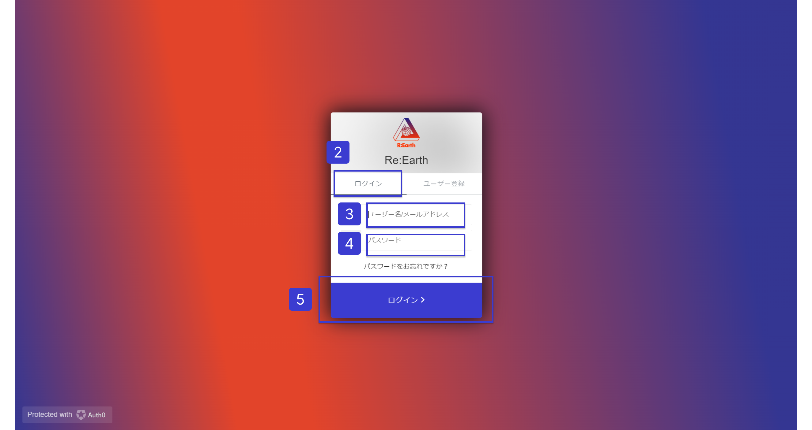
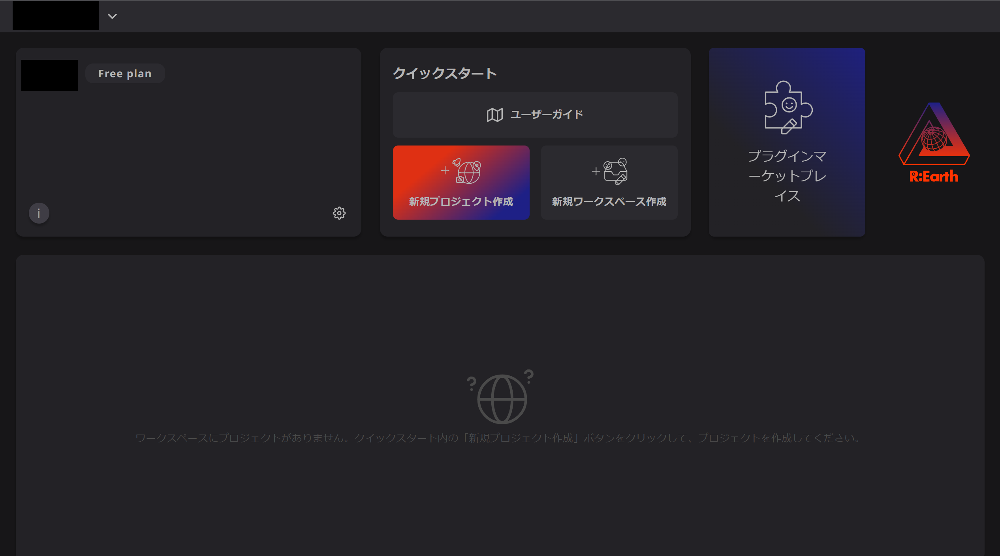

# 最初のプロジェクトを作成

1. アカウント発行

https://app.reearth.io/を開き、画面右上の「Start now」をクリック

ユーザー登録画面に遷移してください

1. ユーザー登録をクリック
2. メールアドレスを入力
3. ユーザー名を設定
4. パスワードを設定
5. チェックボックスを選択
6. ユーザー登録をクリック

設定したメールアドレスに、認証メールが届きます。

1. 「VERYFY YOUR ACCOUNT」をクリック

認証が完了したら、アカウントの発行手続きは完了です。

[プレビューページ/公開ページ](./preview-page/public-page.md) <!-- v2.0: work in prgress  -->

## ログイン

再度 https://reearth.io/ja/ を開きます。

1. 「Start now」を押します。

1. 上部のログインを押します。
2. 登録したユーザー名またはメールアドレスを入力します。
3. パスワードを入力します。
4. 下部のログインを押します。

ログインに成功しました。