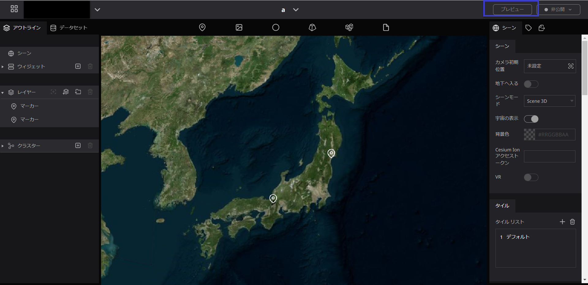
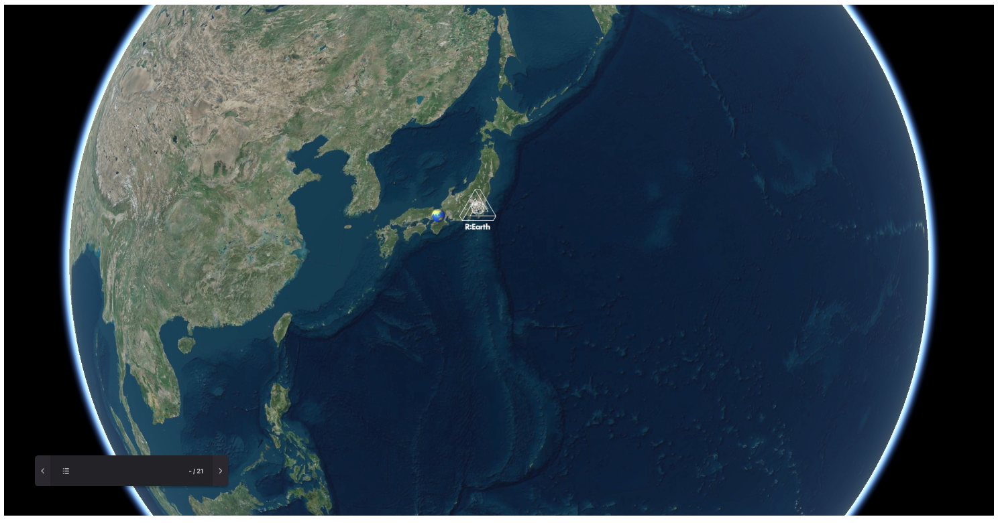
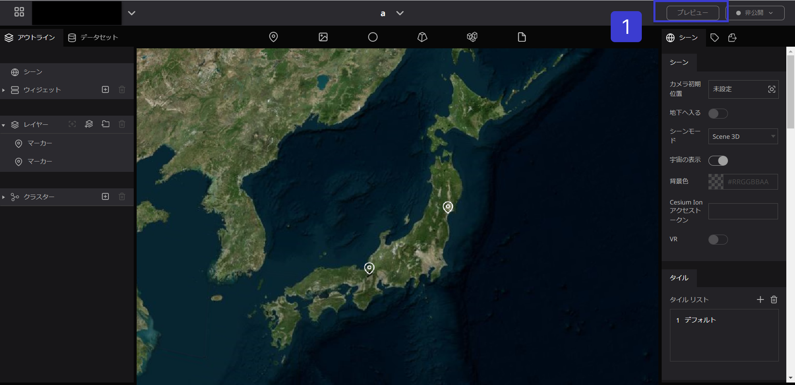
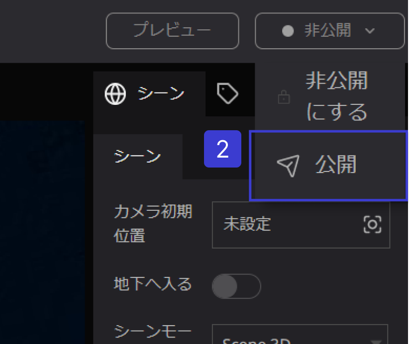
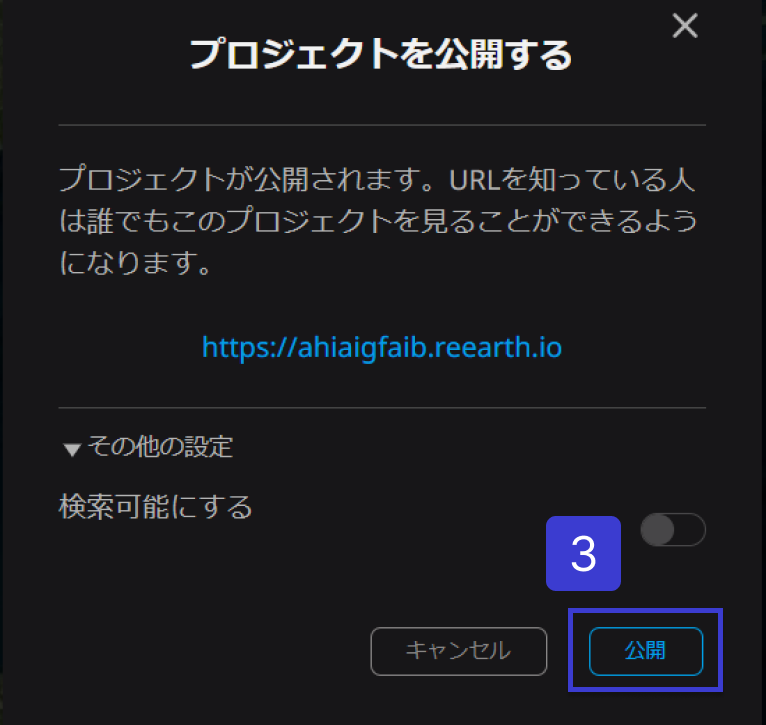
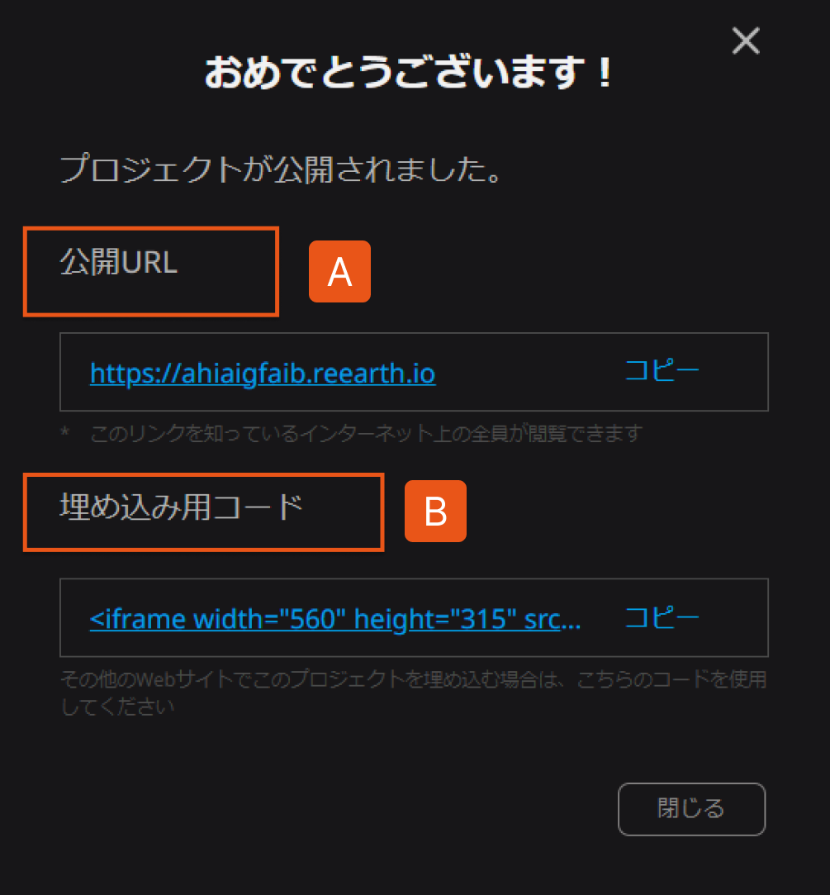
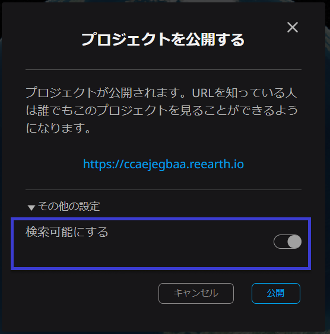

# プレビューページ/公開ページ

## プレビューページ

プレビューでは、現在編集中のデジタルアースが公開後どのように表示されるかを確認することができます。

プレビューを確認するには画面右上の`プレビュー`をクリックします。

プレビューではそれまで編集した内容が反映されます。

（既に公開しているプロジェクトについては再度公開を実行しない限り編集内容は反映されません。）

プレビューはブラウザの新規タブで表示されます。

## 公開ページ

### **プロジェクトを公開する**

1. プロジェクト編集画面の右上の`公開メニュー`をクリックします。

2. `公開`を選択します。

3. 画面中央に確認画面が表示されます。`公開`をクリックします。

A. `公開URL`：リンクを知っているインターネット上の全員が閲覧できます。

B. `埋め込み用コード`：その他のwebサイトでプロジェクトを埋め込む場合は、埋め込み用コードをお使いください。

### **プロジェクトをGoogleの検索結果に表示させる**

公開時の確認画面で、`その他の設定`から、`検索可能にする`のトグルボタンをオンにすることで、Googleの検索結果への表示が可能になります
