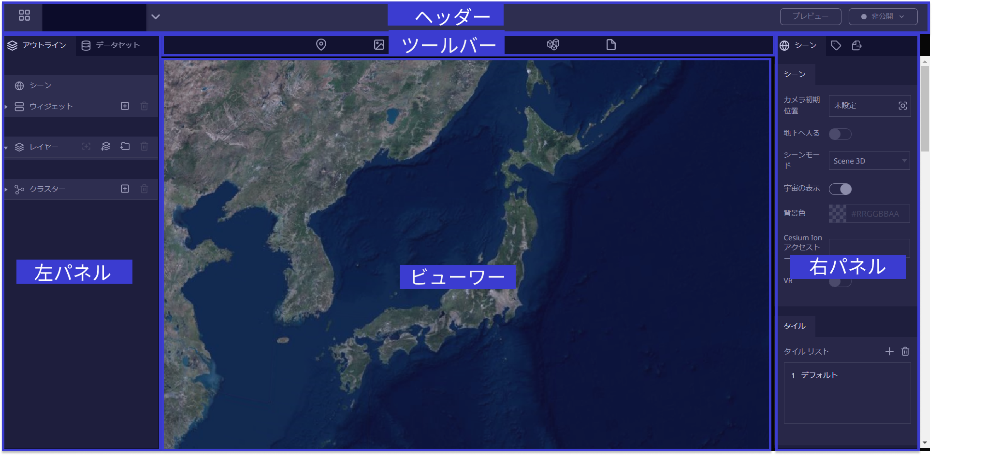
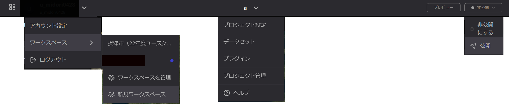
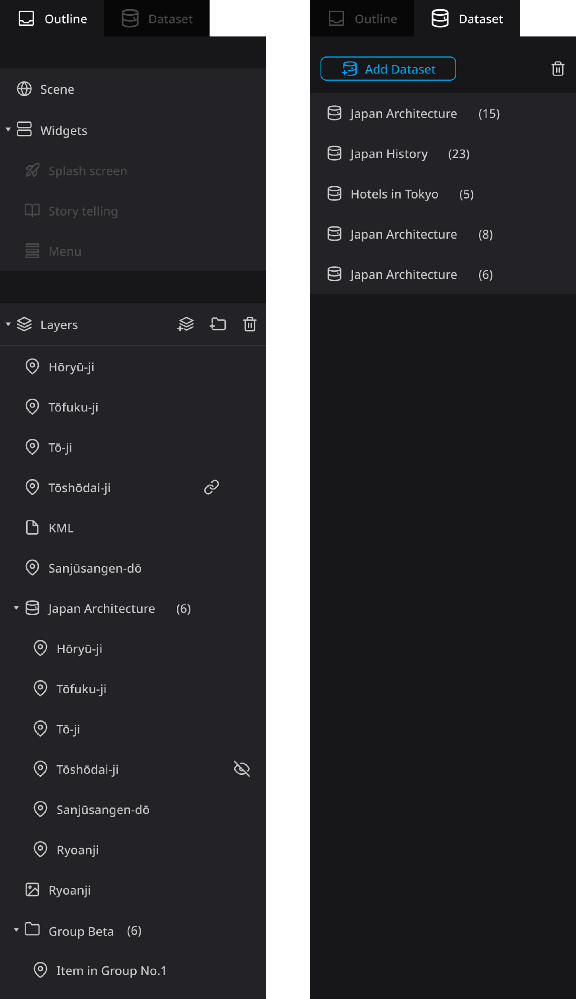
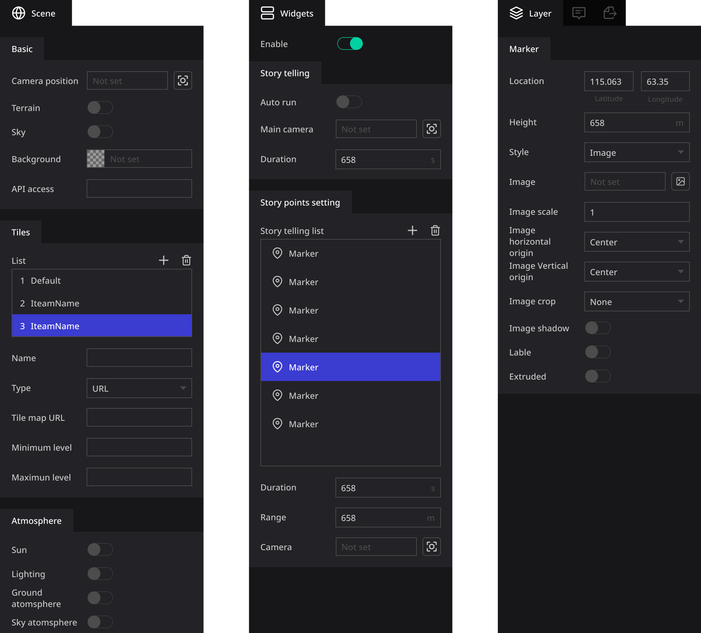
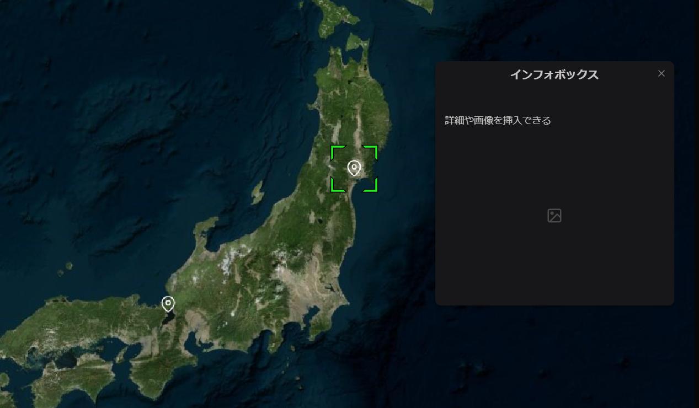

# 編集ページ

編集ページは、プロジェクトを編集するためのメイン画面です。可能な限りシンプルでわかりやすいものを目指しています。

編集ページは 5 つの編集エリアで構成されています。

- **ヘッダー**
- **ツールバー**
- **左パネル**
- **ビューワー**
- **右パネル**

基本的な構成として、左パネルはコンテンツリストです。操作するオブジェクトを選択するために使用します。

右パネルは、選択されているレイヤーのプロパティパネルです。プロパティを変更する際に使用します。

中央に位置するビューワーは、プロジェクトの表示ウィンドウです。レイヤの選択や編集を行うこともできます。

## ヘッダー

ヘッダーでは、ナビゲーション・ワークスペースやプロジェクトの作成・プロジェクトの公開設定を行うことができます。

アカウント名やプロジェクト名横の∨をクリックするとメニューが表示されます。

右上にあるプレビューや公開状態のボタンは、プロジェクトを素早くプレビューする・または公開設定を行うために使用します。公開機能については、[こちら](https://www.notion.so/f4e86c6329dd4db4916206c4e2b23fd6?pvs=21)もご覧ください。

## 左パネル

左パネルは、プロジェクトに含まれるすべてのコンテンツを表示し、管理するためのものです。 このパネルには、**アウトライン**と**データセット**という、2つのタブがあります。

- **アウトライン**
    
    アウトラインでは主に、シーン・ウィジェット・レイヤーを管理します。
    
    - 'シーン'を選択すると、シーンに関する設定を変更することができます。詳しくはシーンの設定方法をご参照ください。
    - 'ウィジェット'を選択すると、スプラッシュスクリーン・ストーリーテリング・メニューボタンに関する設定や、 プロジェクトのプラグインに関する表示・管理ができます。
    - 'レイヤー'では、プロジェクト内の全てのレイヤーを確認し、管理することができます。

- **データセット**
    
    'データセット'は、プロジェクト内のデータセットを管理するために使用します
    

## ツールバー

ツールバーには基本的な操作セットが用意されています。「マーカ」・「フォトオーバーレイ」・「球体」・「３Dモデル」・「３Dタイル」・「ファイル」を、新しいレイヤーとしてプロジェクトに追加することができます。
## 右パネル

右パネルでは、左パネルで選択した項目に対応するプロパティが表示されます。

## ビューワー

画面中央に位置するビューワーは、デジタルアースの表示・操作を行うエリアです。インフォボックスの編集・カメラ設定・プロジェクトのプレビューなど、様々な操作に使用します。

現在、Re:Earthでは[セシウムエンジン](https://cesium.com/platform/cesiumjs/)をデフォルト使用しています。

### ビューワーの基本操作 

- パンビュー：左クリック＋ドラッグ
- ズーム表示：右クリック＋ドラッグ、またはマウスホイールによるスクロール
- デジタルアースの自由回転：マウスホイールをクリック＋ドラッグ、またはCTRL＋左クリック＋ドラッグ