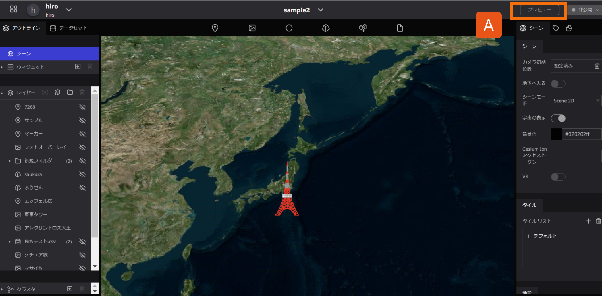
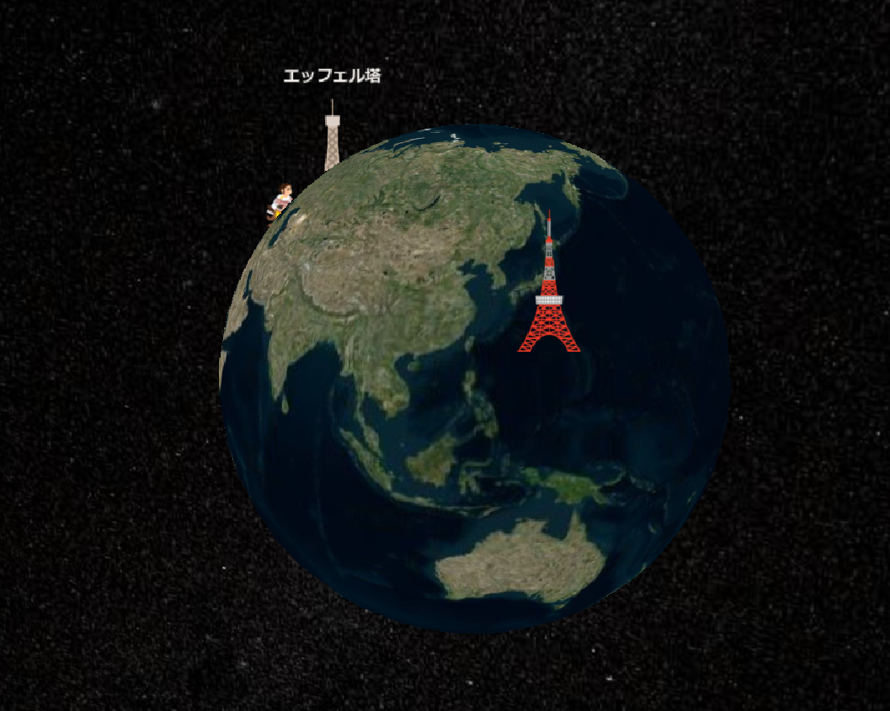

# プレビュー

プレビュー機能を使えば、現在編集中のプロジェクトが公開された際にどのように表示されるかを確認することができます。

A：画面右上のプレビューをクリックします。

このように、プレビュー機能を使うことで、現在編集中のプロジェクトが公開された際にどのように表示されるかを確認することができます。

※ただし、プロジェクトが既に発行（公開）されている場合、再度発行するまで、編集内容は発行済みプロジェクトに反映されません。そのため、プレビュー機能を使って可能な限り確認し、問題がないことを確認してから発行（公開）するようにしてください。