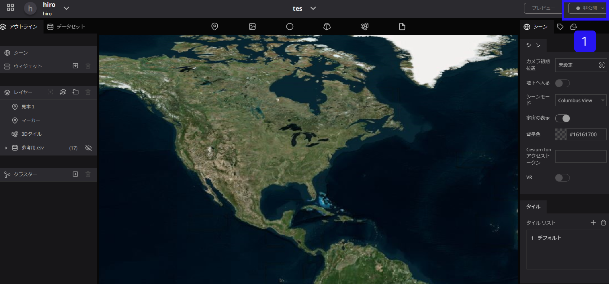
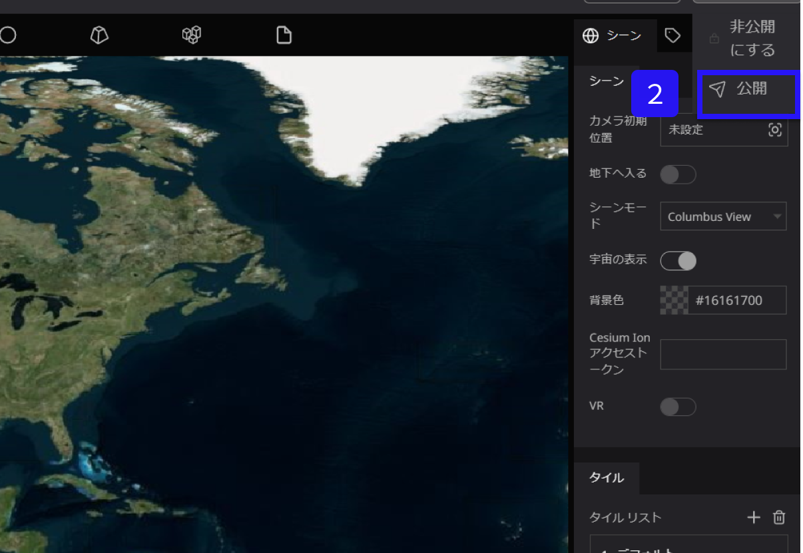
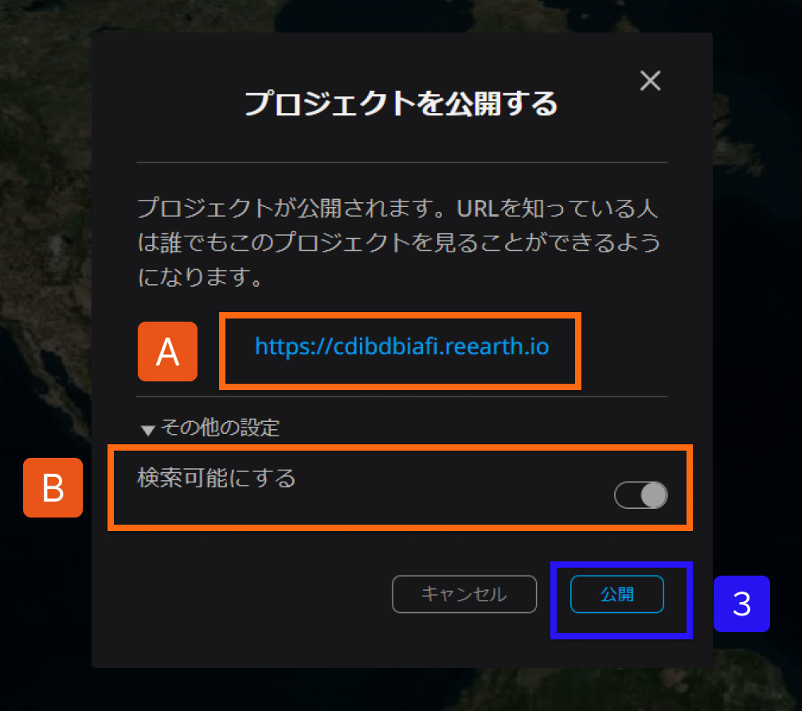
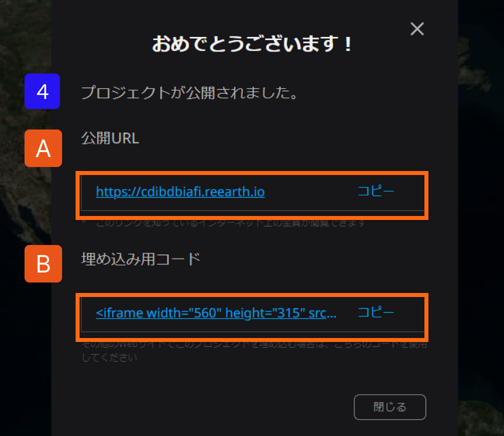

# プロジェクトの公開

①画面右上の公開メニューをクリックします。

②公開をクリックします。

③画面中央に公開確認画面が出力されます。

下記の公開範囲を確認のうえ、公開をクリックします。

A：公開確認画面が出力されたら、リンクをコピーして共有することができます。

公開リンクは、誰でも閲覧可能になるため、注意してURLを共有してください。

B：WEBブラウザ上にてプロジェクト検索を可能にするにはONにしてください。

④プロジェクトが公開されましたと、確認画面が出力されます。

A：URLを把握しているユーザーが閲覧できます。

B：サイトにプロジェクトを掲載したい場合は、埋め込み用コードをご利用ください。

　　※埋め込み用コードは次の項目で説明いたします
