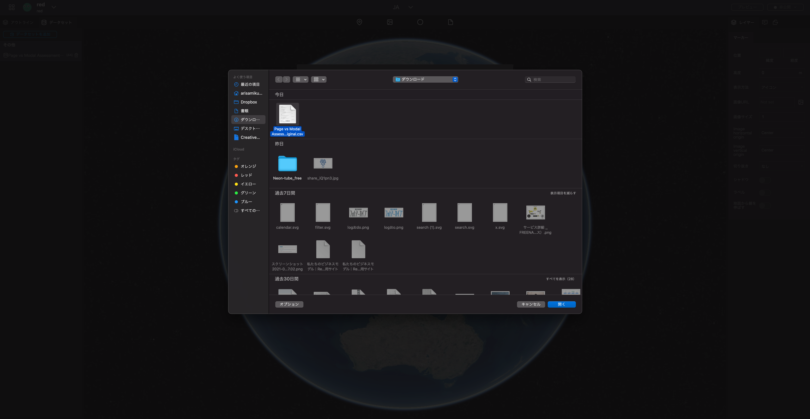

## CSV・JSON・GISデータをデータセットとしてインポートする

データセットとしてインポートすることで、インポートしたデータの値をプロパティの設定などに利用することが可能になります。

<!-- （データセットの値をプロパティに設定する方法は[こちら](../property/link-a-dataset-to-property-field)をご覧ください） -->

### プロジェクトを開きます

`データセット`タブを開き、`データセットを追加`ボタンをクリックします。

表示されたモーダルから、`アップロード`をクリックします。

お使いのデバイスに保存されているCSV・JSON・GISファイルの中から、アップロードしたいファイル選択し、「開く」ボタンをクリックします。

`データセットを追加`をクリックします。

`データセット`にアップロードしたファイルが表示されるので、ファイルを地球にドラッグ&ドロップすると、レイヤとして追加することができます。

