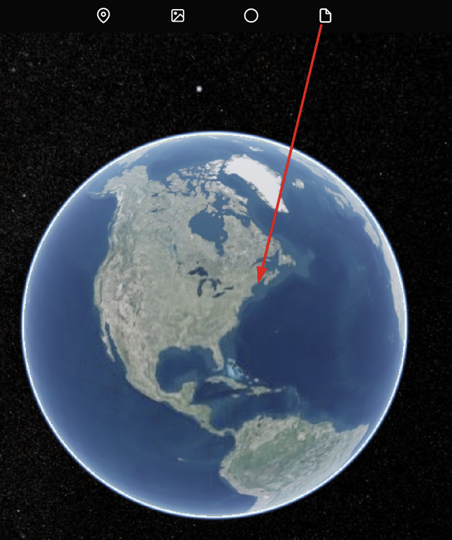
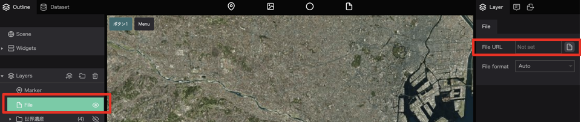
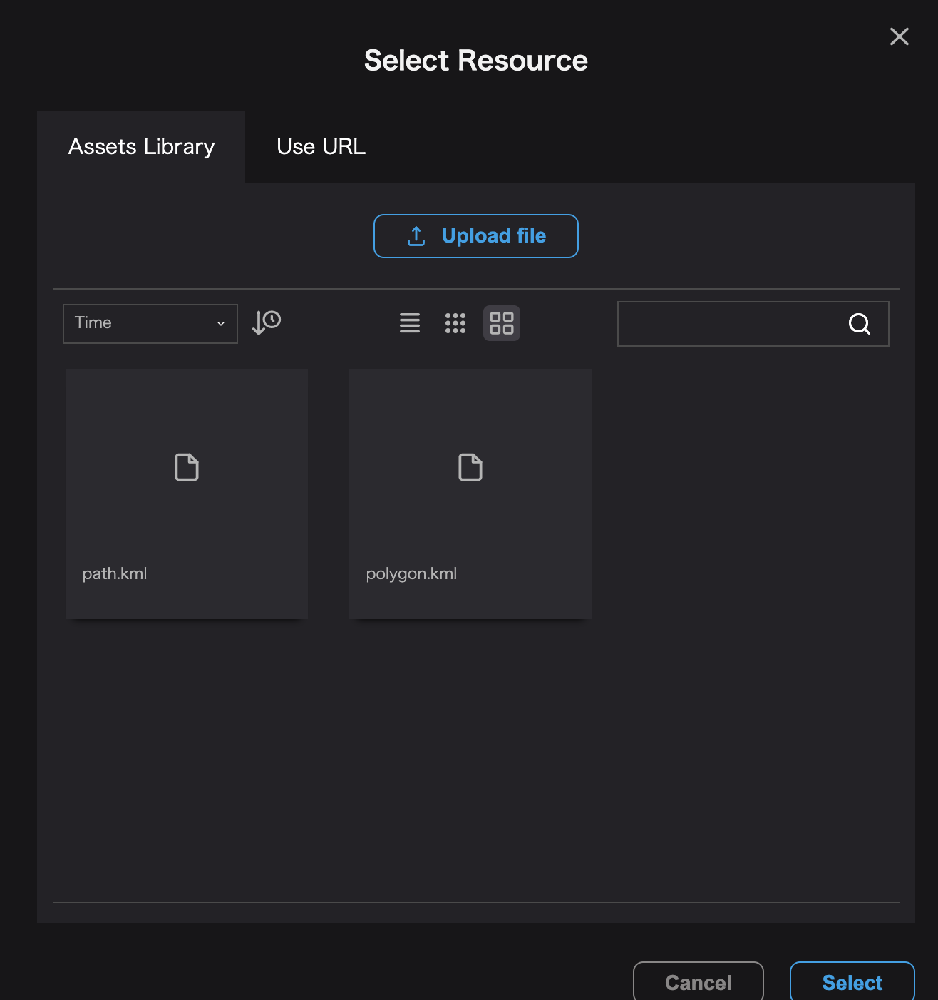

`ファイルアイコン`を地図上にドラッグ＆ドロップします。

新しく`file`という名前のレイヤが追加されます。

ファイルのプロパティからFile URLをクリックして、データのインポート画面を表示します。

`Upload file`をクリックするとお使いのデバイスに保存してあるファイルを読み込むことができます。

インポートするファイルを選択して、`Select`をクリックするとファイルをインポートすることができます。

