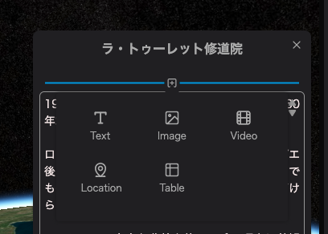
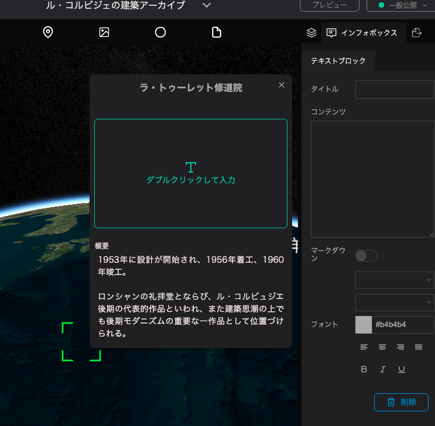

To add a new block, click on the `+` button in the infobox.

Click on the type of block you want to add from the dropdown.

The selected block will be added.

・Text:　Add text to the infobox.

・Image: Add an image to the infobox.

・Video: Add a linked video to the infobox.

・Location: Add a map with a specific location to the infobox.

・Table: Add tabled information to the infobox.