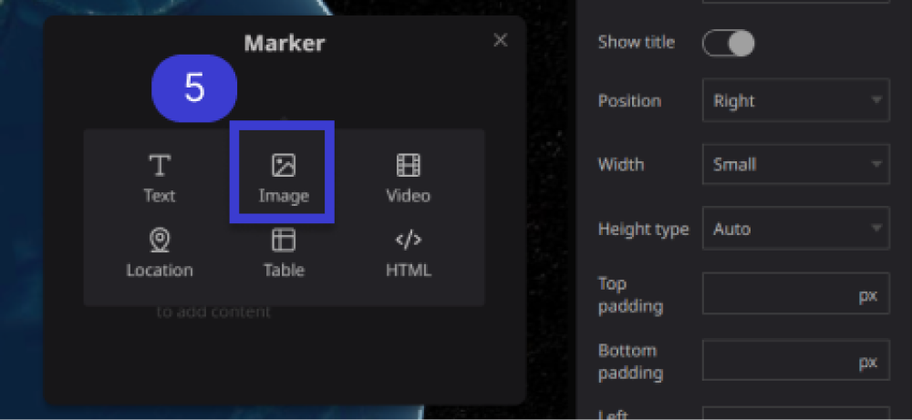
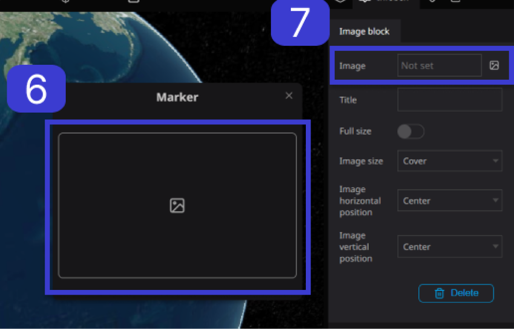
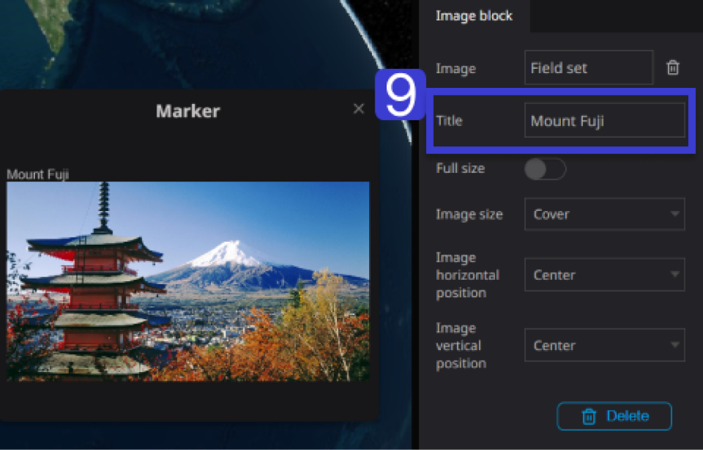
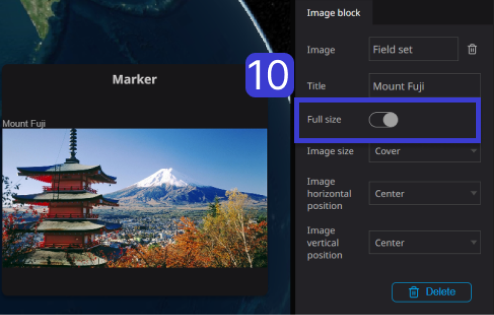
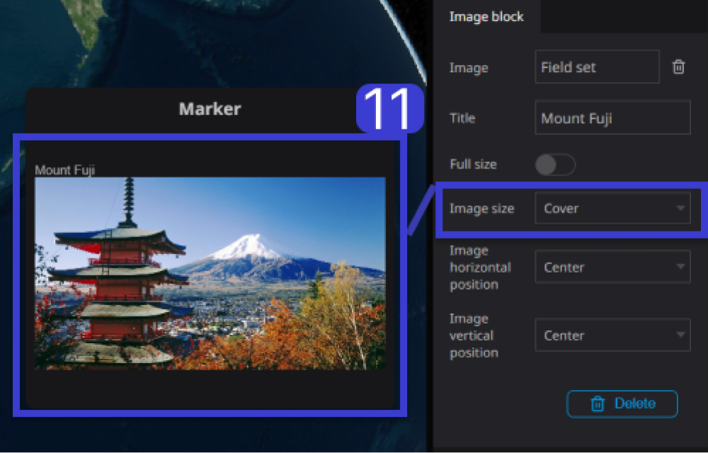
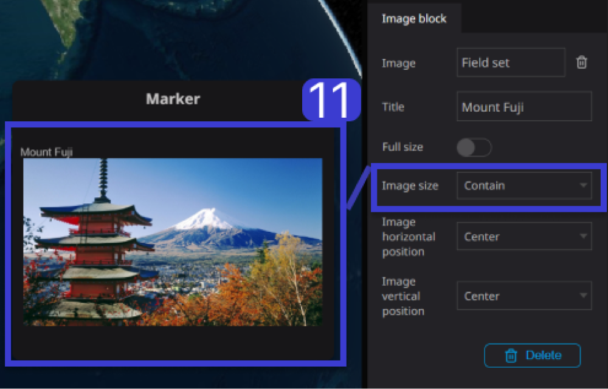
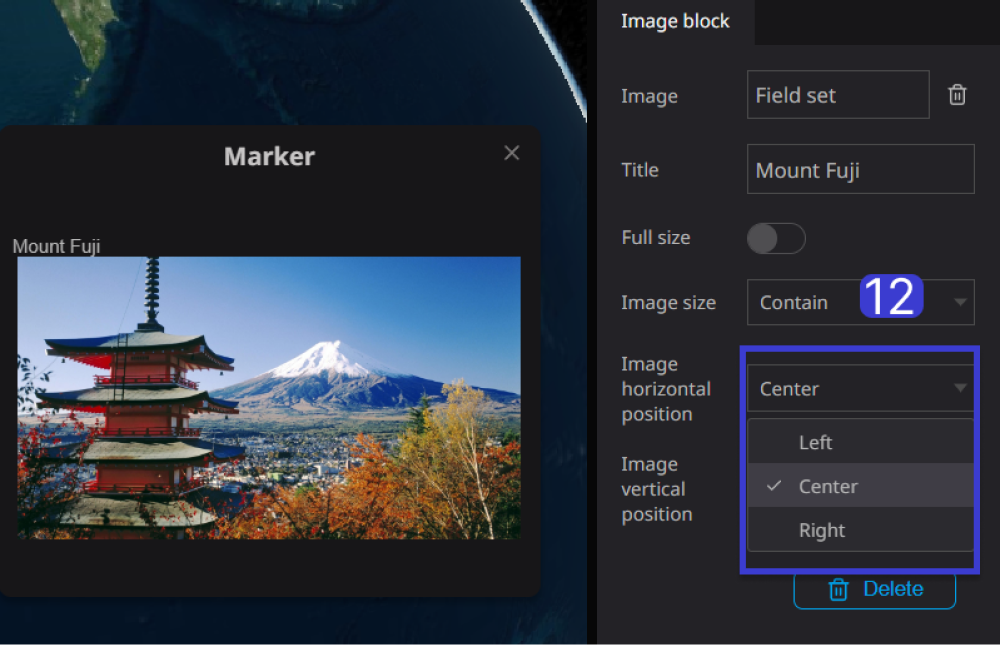
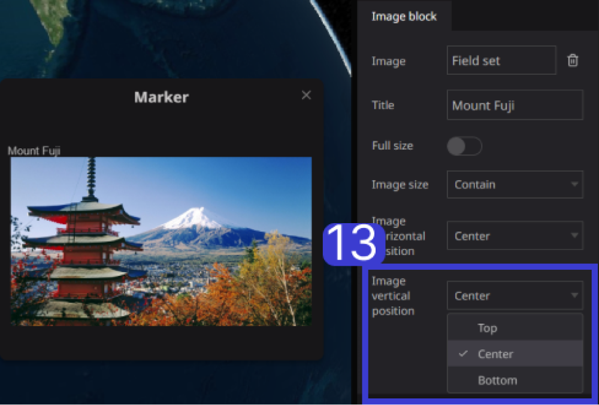

# Image Block

The Image Block is a component within an Infobox used for adding photos or images. It enhances the visual appeal of the Infobox and makes it more engaging.

**Step 1**. To set the text for a specific layer, choose the desired layer from the left panel.

**Step 2.** Choose the Infobox tab on the right panel.

.png)

**Step 3.** Click on “Create Infobox”.

.png)

**Step 4.** When the cursor is placed in the Infobox, a “+” sign appears and click on it.

_(1).png)

**Step 5.** After clicking plus sign and click on "Image” Icon.

**Step 6.** Click on the “Image” Icon in the left panel. 

**Step 7.** Then click on the “Image” box in the right panel.

**Step 8.** Select the option to add an image from the available assets or insert an image using a URL.

.png)

.png)

**Step 9**: If you wish to include a title, enter the desired text in the provided field and add it. 
(Example: Mount Fuji)

**Step 10.** Turning on “Full size” will spread the image to fill the Infobox.。

**Step 11.** To adjust the image display, choose "Cover/Contain" for the image size

**Cover:** The image is displayed with the center portion enlarged.

**Contain:** The image is automatically adjusted to fit and display the entire image.

**Step 12:** You can adjust the horizontal position of the image to the left, center, or right.

**Step 13.** The vertical position can be adjusted to top, center, or bottom of the image.

