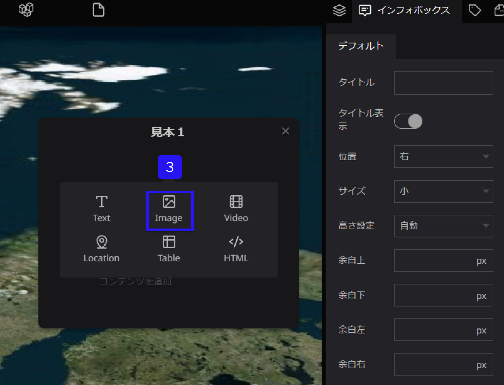
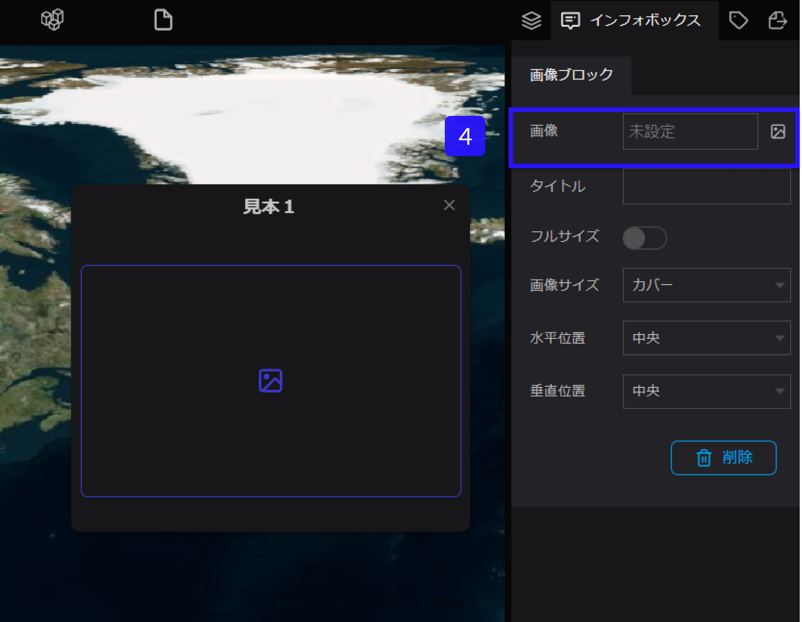
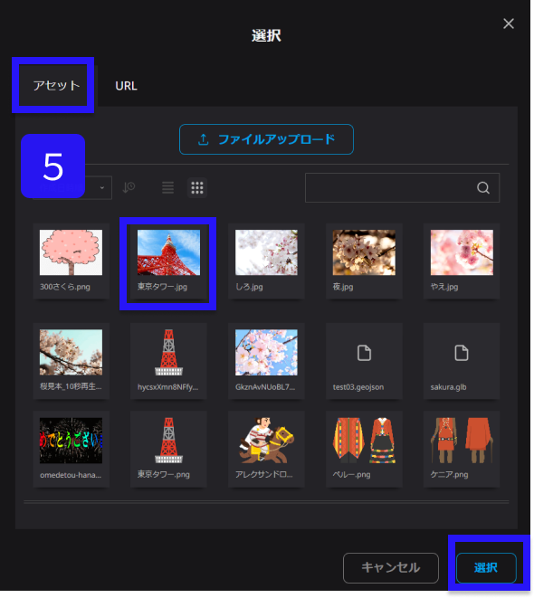
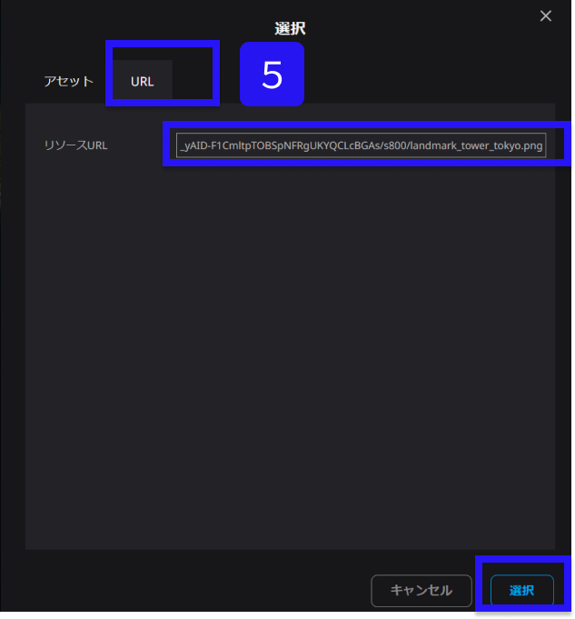
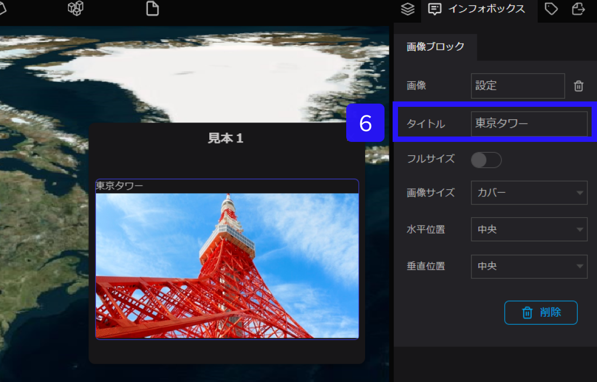
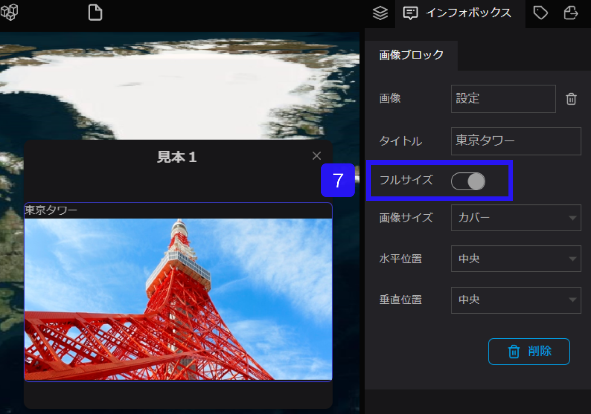
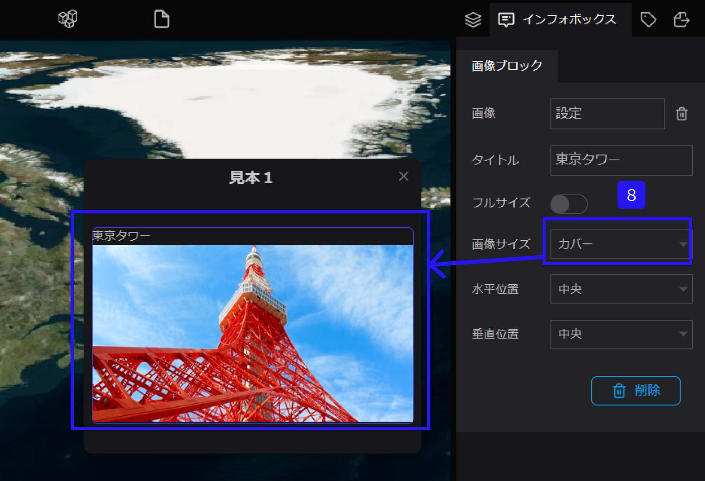
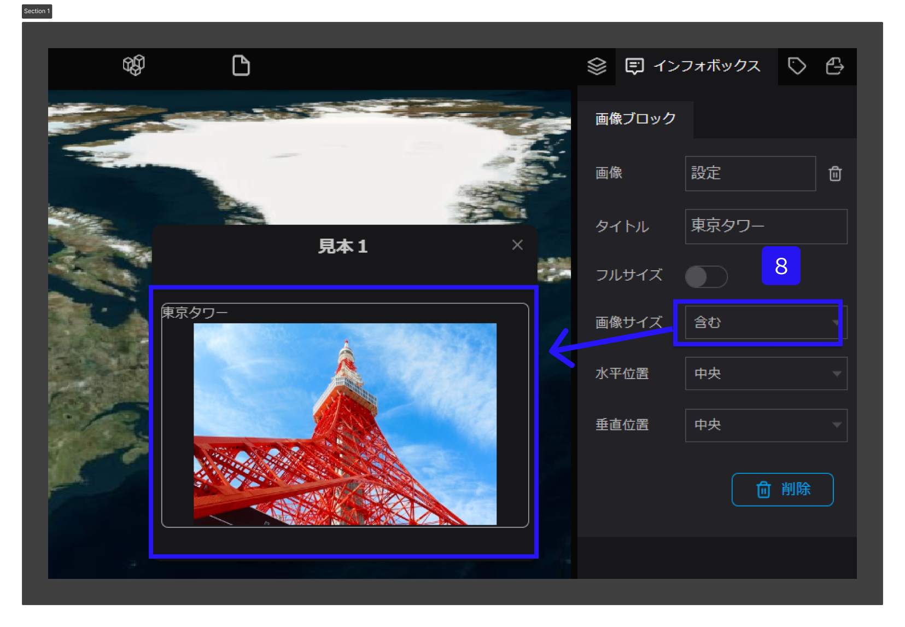
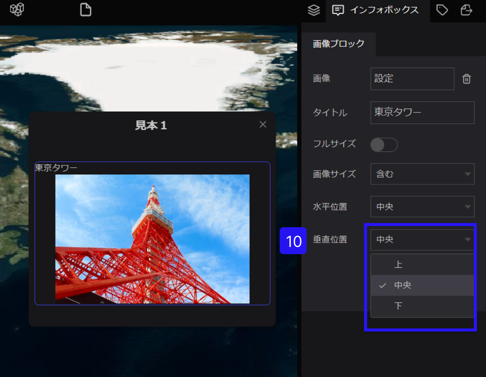

# 画像ブロック

画像ブロックは、インフォボックスに写真や画像を追加するためのツールです。

①左側パネルからテキストを設定したいレイヤーを選択します。

②右側パネルのインフォボックスタブを選択します。

③インフォボックス内にカーソルをおくと、＋が表示されます。併せて、＋をクリックし、Imageを選択します。

④右パネルの画像をクリックします。

⑤アセットから画像を追加する。または、URLから画像を挿入するのどちらかを選択します。

⑥タイトルを追加したい場合は、ここにテキストを入力し、追加します。（例：東京タワー）

⑦フルサイズをONにすると、インフォボックスいっぱいに画像が広がります。

⑧画像サイズをカバー/含むを選択し、表示を調整することができます。

カバー：中心部に向かって大きく画像が表示されます。

含む：画像全体が表示するように自動で調整してくれます

⑨水平位置は画像を、左/中央/右　に調節することができます。

.png)

⑩垂直位置は画像を、上/中央/下　に調節することができます。

