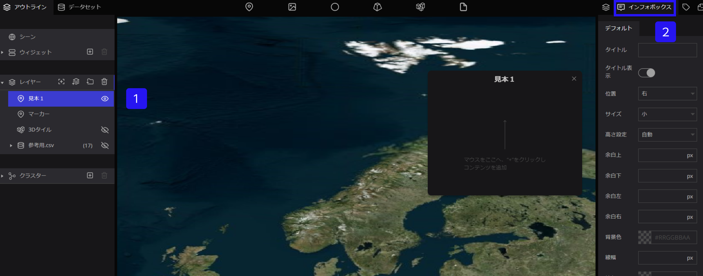

# ロケーションブロック

ロケーションブロックは、インフォボックス内にマップを追加することができます。

①左側パネルからテキストを設定したいレイヤーを選択します。

②右側パネルのインフォボックスタブを選択します。

③インフォボックス内にカーソルをおくと、＋が表示されます。併せて、＋をクリックし、Locationを選択します。

④位置情報に、緯度と経度を入力すると、インフォボックスにマップが反映されます。

⑤タイトルを入力すると、インフォボックス動画上に入力したタイトルが表示されます。

⑥フルサイズをONにすると、インフォボックスいっぱいにマップが表示されます。

