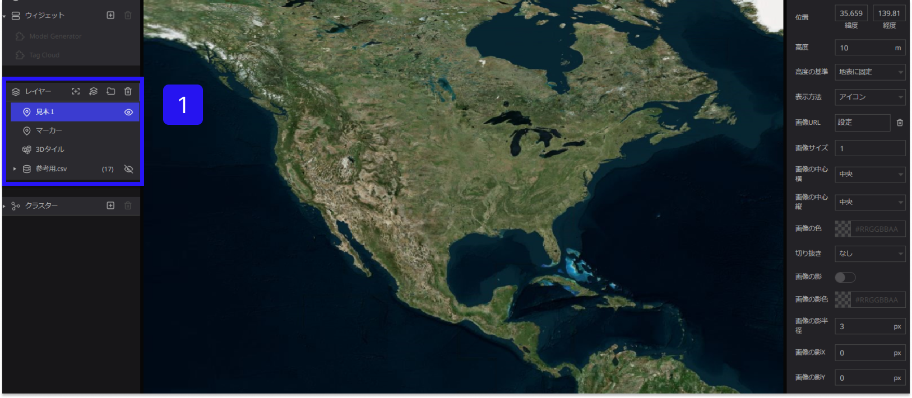
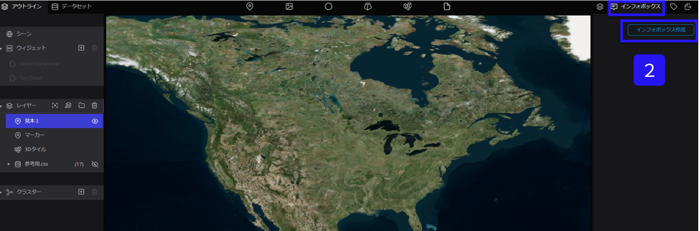
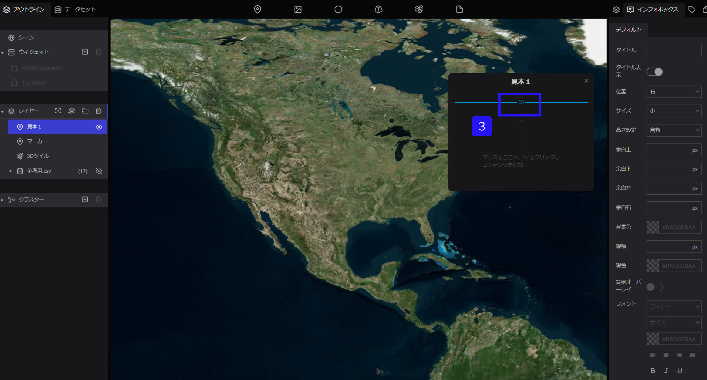
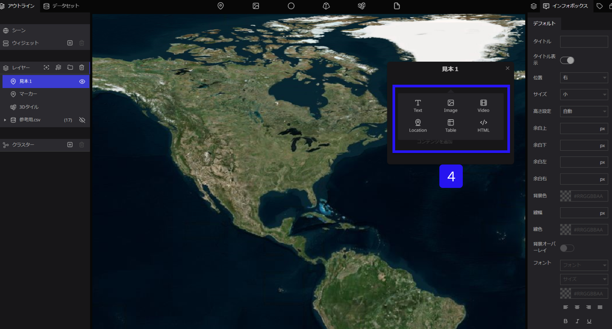

# インフォボックスの作成

①インフォボックスを作成したいレイヤーを左側パネルから選択します。

②右側パネルにある インフォボックス を選択し、インフォボックス作成をクリックします。

③インフォボックス内、画面にカーソルを当てると＋が表示されます。

併せて＋をクリックします

④下記の追加したいコンテンツを選択します。

・Textブロック（文章）

・Imageブロック（写真などの画像）

・Videoブロック（動画）

・Locationブロック（マップ）

・Tableブロック（表）

