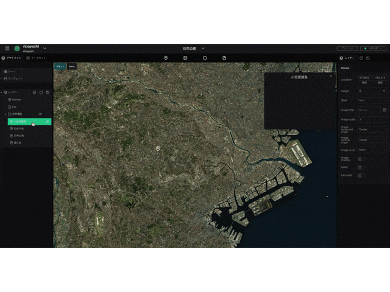
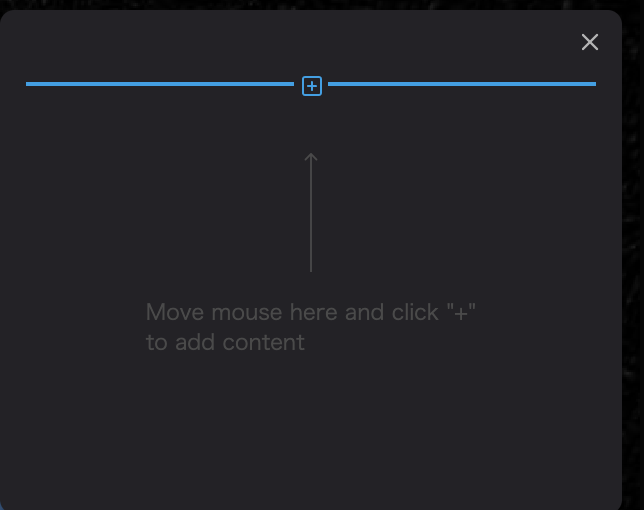

インフォボックスを作成するには、右パネルの上部のタブの中央の`インフォボックス`に切り替えます。

`インフォボックス作成`をクリックすると、選択しているマーカーにインフォボックスが追加されます。

表示されたインフォボックスの`＋`から、インフォボックスに埋め込むコンテンツを選ぶことができます。　

コンテンツ形式は以下の5つから選択することができます。

- Text：テキスト
- Image：画像
- Video：動画
- Location：地図
- Table：表