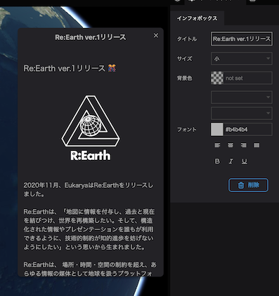
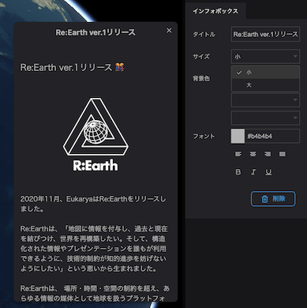
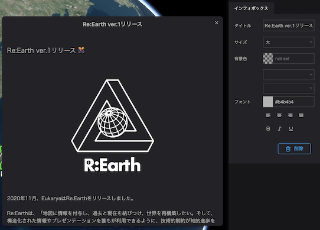
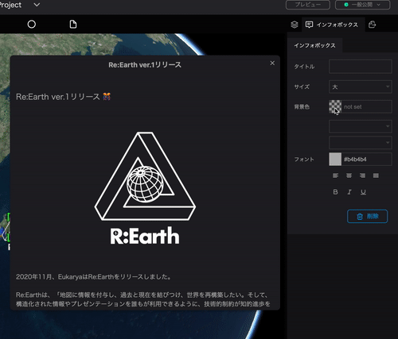
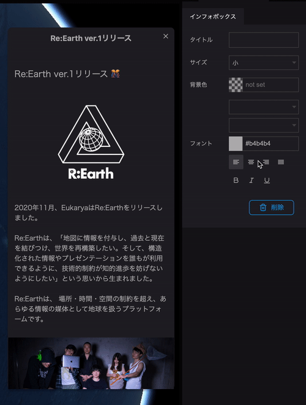

インフォボックスの設定でできることは、以下の通りです。

- タイトル ：インフォボックス内のタイトルを決めることができます。

- サイズ：インフォボックスの大きさを変えることができます。

サイズ小

サイズ大

- 背景色：インフォボックスの色を決めることができます。

- フォント:フォントサイズ、書体、色を決めることができます。

- フォントのレイアウト：左　中央　右　両端行揃え・太字・斜体・下線の設定ができます。
