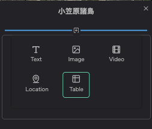
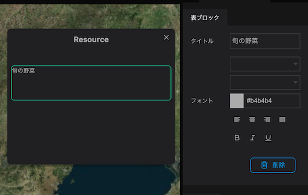
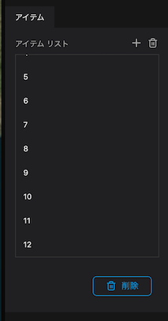
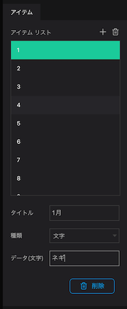
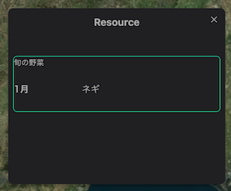
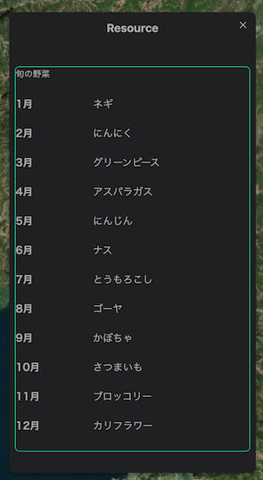

テーブルブロックではインフォボックス内にテーブルを追加することができます。

インフォボックスの`＋`から`Table`を選択します

`テーブルブロック`のプロパティ内のタイトルに文字を入力します。

`アイテム`の`アイテムリスト`の右側にある`+`ボタンを押します。

`アイテムリスト`の中のアイテムを選択します。

- タイトルにテキスト入力します。
- 種類は、プルダウンメニューを押して`文字`・`数字`のどちらかを選択します。
- データ(文字)に文字テキストを入力します。(数字を選択した場合は数字を入力)

テーブルに値が表示されます。

同様にアイテムの値を入力することで表形式で表示することができます。

