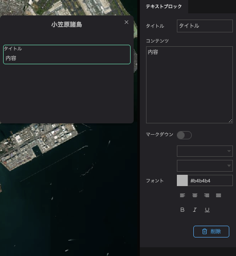

The text block allows you to insert text into the infobox.

In the text block properties, you can enter the following:

- Title: Enter the title of the text.
- Content: Enter the content of the text.
- Markdown: Check this box if you want to write the text in markdown format.
- Font: Allows you to change the font size, typeface, and color of the text.