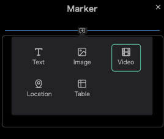
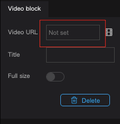
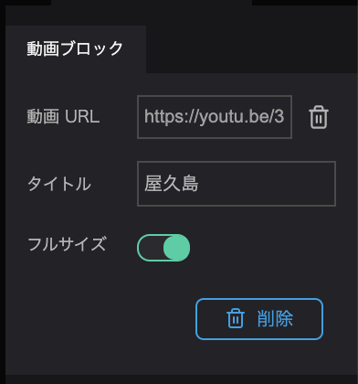

動画ブロックでは動画を追加を追加することができます。

インフォボックスの`＋ボタン`をクリックします。

`Videoボタン`を選択します。

動画ブロックのプロパティから動画URLをクリックし、動画のURLを入力します

動画のURLの取得については、各種動画サービスを参照ください。

(Youtubeでの動画リンクの取得方法は、動画ページの共有から行うことができます。)

タイトルには、動画のタイトルを入力することができます。

フルサイズをオン（緑色の状態）にすると、インフォボックス内で動画を最大化します。

