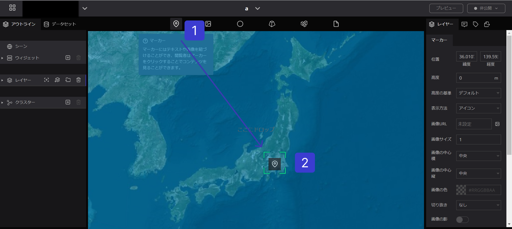

# レイヤーの追加と削除

Re:Earthでは、地図に素材を追加することができます。デジタルアース上に表示できる全てのアイテム ( [マーカー](../reearth-layers/marker/marker.md), [3Dモデル](../reearth-layers/3D%20Model/3D%20Model.md), [フォトオーバレイ](../reearth-layers/photo-overlay/photo-overlay.md)など) はすべてレイヤーとして管理されています。

## **マーカーレイヤーの追加**

<!--V2.0: this link below for toolbar is not implemented  -->
1. [ツールバー](https://www.notion.so/983b11cca7b5455d88adf964296d52e3?pvs=21)から「マーカー」ボタンをクリックします。
2. マーカーアイコンを地図上の配置したい場所にドラッグする
3. 左側のパネル内のレイヤーリストに、マーカーという新しいレイヤーが作成されます。

## **レイヤーのプロパティを変更する**

レイヤーを選択することで、そのレイヤーの様々なプロパティを変更し、以下の例のように状態や形状を変化させることができます。

### **ポジション変更**

レイヤーをクリックした後、地球儀上のアイコンにマウスを合わせて、手の形になるまで左クリックを１秒以上長押します。その状態でドラック＆ドロップすると位置を移動させることができます。

### **外観の変更**

このマーカーレイヤーのスタイル、サイズ、色などを変更することができます。

### **ラベルの追加**

また、マーカーレイヤーにラベルを追加し、フォントの種類を調整することなども可能です。

マーカレイヤーについては、カスタマイズ可能な多くのアイテムを用意していますので、[こちら](../reearth-layers/marker/marker.md)
 をご覧ください。レイヤーの種類によって、それぞれ異なるパラメータや機能があり、レイヤーのプロパティにて詳細の設定が可能です。

他のレイヤーの設定を変更することで、異なる効果が得られます。

## **レイヤーの削除**

左パネルの”レイヤー”内の削除したいレイヤーをクリックし、青く選択されている状態にして、”ごみ箱”マークを押すと削除されます。