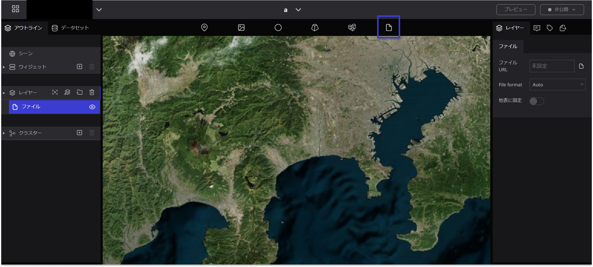
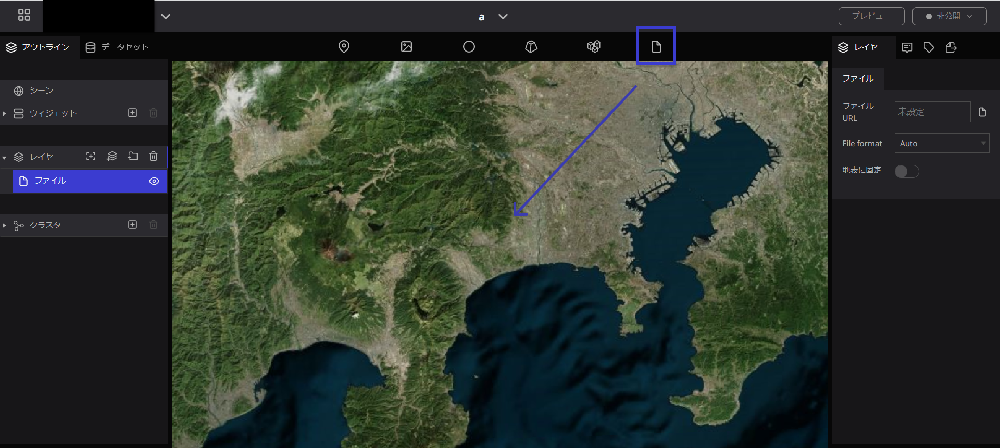
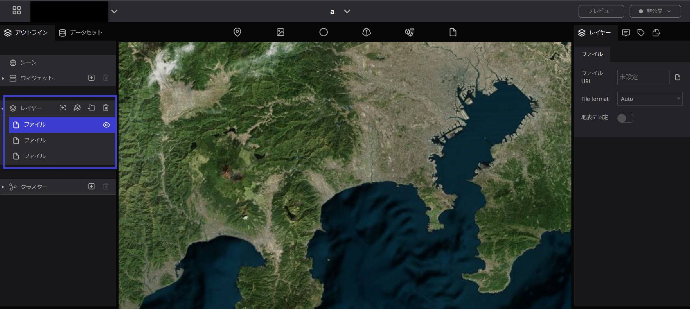
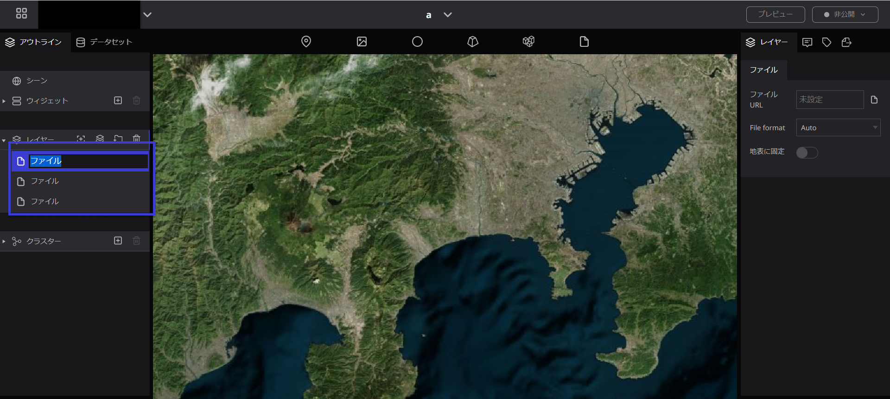
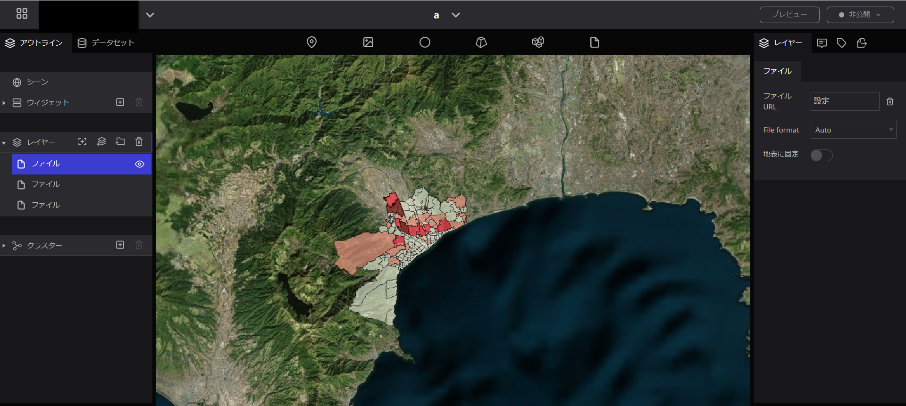
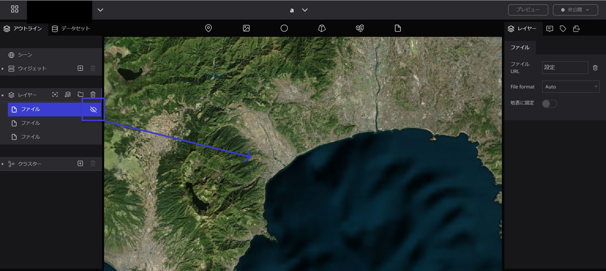
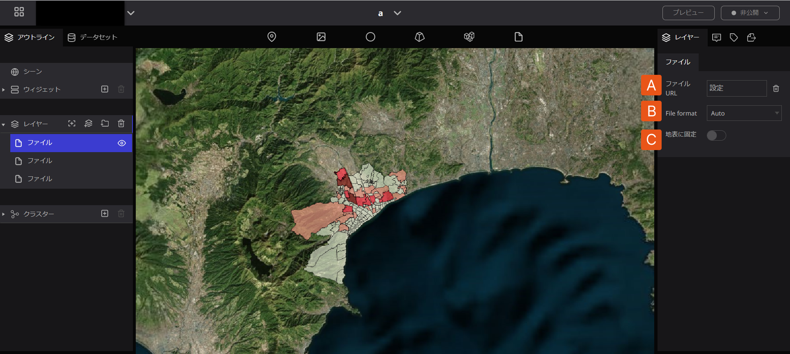
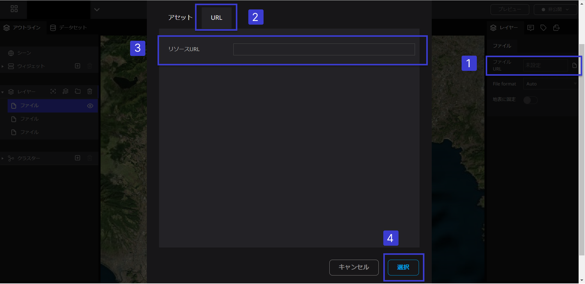

# ファイル

## ファイルとは

外部からファイルをインポートすることができます。

URLを指定することで外部データが読み込まれます。

## ファイルの使い方

### ファイルの追加

- 地球儀上で、任意の場所にファイルのアイコンをドラッグ＆ドロップします。（ドラック＆ドロップした時点では何もマークは表示されません。）

- ファイルを地球儀上に落とすと、左パネルのレイヤーの中に青色で記された”ファイル”の文字が表示されます。これは地球儀上に落としたファイルのことです。また、ファイルのアイコンを落としていくとレイヤーの中に3Dタイルが増えていきます。

### ファイルの名前変更

レイヤーの中で名前を変更したいファイルの文字の上をダブルクリックすると、変更できるようになるので名前を入力します。

### ファイルを非表示にする

左パネルのファイルの右横の目のマークをクリックすると、地球儀上の3D部分が消えます。

### ファイルの削除

表示されているファイルを削除したい場合は、左パネルのレイヤーの中で、削除したいファイルをクリックし、青く選択されている状態にしてから、レイヤーの右横にある”ごみ箱”のマークを押すと削除されます。

## ファイルのプロパティ

ファイルのプロパティでは、以下の項目を設定することができます。

A. ファイルURL：ファイルURLを指定することでファイルデータをアップロードすることができます。

1.  URL入力欄をクリックするとアセットモーダルが表示されます。
2. セットモーダル内のURLのタブを選択します。
3. URLを入力することが可能です。
4. 右下の選択ボタンをクリックします。

B. File format：ファイル形式を（Auto・KML・GeoJSON/TopoJSON・CZML）から選択できます。

C. 地表に固定：ONにすることで地表の凸凹に沿うようにポリゴンなどのデータを表示することができます。