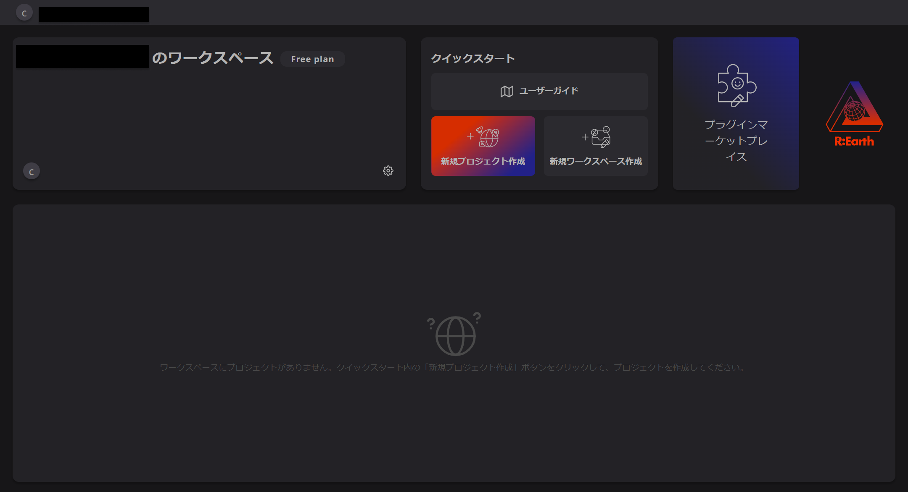
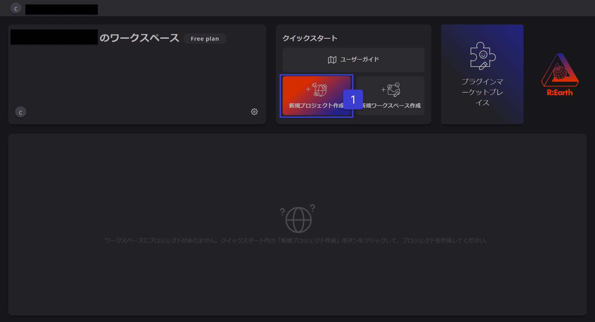
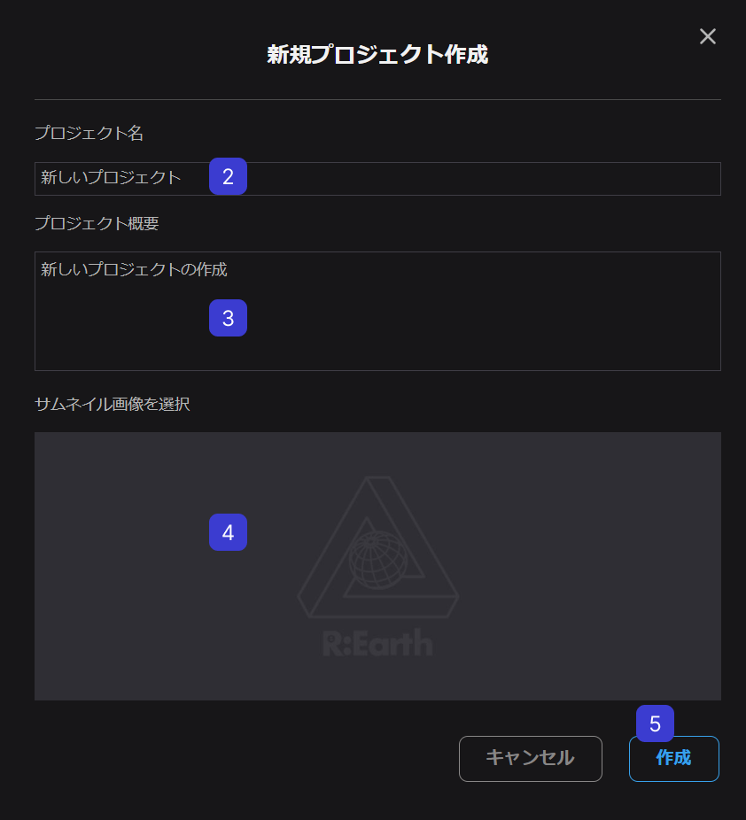
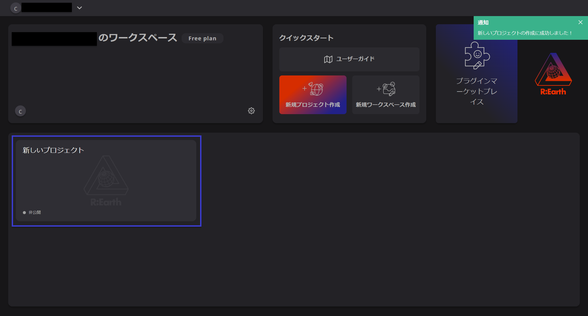
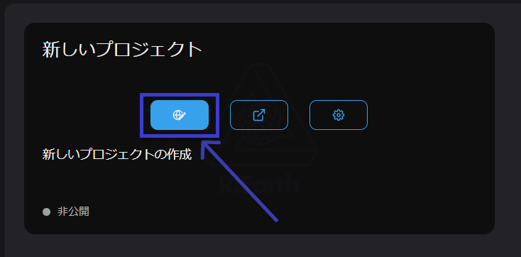

# 新規プロジェクトの作成

Re:Earthにログインすると、ダッシュボードというページが表示されます。この画面から、新しいプロジェクトを作成することができます。

①[新規プロジェクト]ボタンをクリックすると、

[新規プロジェクト作成] というウィンドウが表示されます。

②プロジェクト名を記入

③プロジェクト概要を記入

④サムネイル画像を選択

⑤[作成]ボタンをクリック

完了すると、プロジェクトリストに新しいプロジェクトカードが表示されます。

以上で、最初のRe:Earthプロジェクトが作成されました。ここでプロジェクトカードの編集ボタンをクリックすると、作成したプロジェクトの編集画面に移動することができます。

